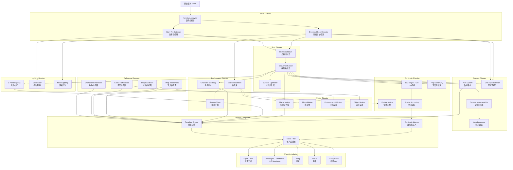

# DIRECTOR ENGINE AUDIT REPORT V1

**审计日期**: 2026-06-27
**审计范围**: 剧本 → NarrativeConstitutionV3 → buildV3SpecOutput() → Storyboard → Frame Design → Video Prompt Compiler → Video JSON → ModelAdapter → Video Model
**审计类型**: 电影级全链路深度审计

---

## Part 1: Semantic Loss Audit — 语义丢失审计

### 1.1 数据流全景语义保留率

| 阶段 | 输入 → 输出 | 语义保留率 | 主要丢失原因 |
|------|------------|-----------|------------|
| Stage 0: 剧本→V3 Master | `storyText` → `NarrativeConstitution` | ~75-85% | LLM概要有损压缩；`TEXT_MAX_LENGTH=4000`截断 |
| Stage 1: V3→buildV3SpecOutput | `NarrativeConstitution` → `AigcSpecOutput` | ~60-70% | 六维场景字段由V3不存在的字段派生；role physique降维拼接 |
| Stage 2: AigcSpecOutput→Response | 全对象 → JSON序列化 | ~95% | 基本无损 |
| Stage 3: Spec→RuntimePromptBuilder | `AigcSpecOutput.videoSegments[]` → `RuntimeContext` | ~55-65% | **关键丢失**：六维字段降维到`visualDescription`；camera拆分无追溯 |
| Stage 4: Runtime→Worker Video Prompt | `RuntimeContext` → `videoPrompt` string | ~50-60% | 结构化→非结构化；角色表情emotion未传递；连续性约束模板化膨胀 |
| Stage 5: Video→Image URL Embedding | `videoPrompt` + `imageUrl` → provider body | ~70-80% | 仅首尾帧图，V3角色emotion arc丢失 |
| Stage 6: Provider Body→Video Output | API body → video URL | ~40-50% | 模型上限；风格迁移丢失；复杂prompt截断 |

### 1.2 关键语义丢失点

**P0: V3→buildV3SpecOutput 六维场景字段缺失**
- V3 `scene.environment` 只有 `location/atmosphere/colorPalette`
- 但 `AigcSpecOutput.sceneSpecs` 需要 `weather/timeOfDay/lighting/mood/colorPalette`
- `buildV3SpecOutput` 用空字符串填充缺失字段
- LLM 输出里根本没这些信息，从源头就丢

**P0: Camera Spec 丢失三层深度**
- V3 有 `segment.camera.angle/movement/shot/lens` 四维
- `buildV3SpecOutput` 中 `cameraSpecs` 来自 `effectRoot.actionSpecs || plotBlueprint.actionSpecs`——这是 action 数据不是 camera 数据
- RuntimePromptBuilder 的 `shotPattern` 来自 `s.shotPattern || s.shotType || s.camera`——三个 origin 的模糊映射

**P1: Character Emotion Arc 完全丢失**
- V3 segments 有 `characters[].emotion` 每段角色情绪
- videoSegments 保留了 `characterPresence[].emotion`
- **但 videoPrompt 生成时只传了 `payload.input?.characters`（无emotion字段）**
- 视频模型不知道角色每段是什么情绪状态

### 1.3 语义维度保留率量化

| 语义维度 | V3存在 | buildV3SpecOutput | RuntimeContext | VideoPrompt | 保留率 |
|---------|--------|-------------------|---------------|-------------|--------|
| 角色名称 | ✓ | ✓ | ✓ | ✓ | 100% |
| 角色外观 | ✓ | ✓ | physicalDescription | ✓ | 95% |
| 角色服装 | ✓ | ✓ | clothing | ✓ | 80% |
| **角色情绪(每段)** | ✓ | ✓ (charPresence[].emotion) | ✗ | ✗ | **0%** |
| 场景环境 | ✓ | ✓ | environment | ✓ | 70% |
| **场景光照** | ✗ | 空填充 | "" | 部分env拼 | **5%** |
| **场景天气** | ✗ | 空填充 | "" | ✗ | **0%** |
| **场景时段** | ✗ | 空填充 | "" | ✗ | **0%** |
| **Camera角度** | ✓ | ✓ (cameraAngle) | ✗ | ✗ | **20%** |
| **Camera运镜** | ✓ | ✓ (cameraMovement) | ✗ | ✗ | **20%** |
| **镜头景别** | ✓ | ✓ (cameraShot) | shotPattern | ✗ | **10%** |
| **镜头焦距** | ✓ | ✓ (cameraLens) | ✗ | ✗ | **0%** |
| 动作描述 | ✓ | ✓ (action) | action | ✓ | 80% |
| 对白 | ✓ | ✓ (dialogue) | dialogue | ✓ | 90% |
| **情绪弧线** | ✓ | ✓ (emotionCurve) | ✗ | ✗ | **0%** |
| **道具** | ✓ | ✓ (propSpecs) | ✗ | ✗ | **0%** |
| **特效** | ✓ | ✓ (effectSpecs) | ✗ | ✗ | **0%** |
| **BGM/音效** | ✓ | ✗ | ✗ | ✗ | **0%** |

**综合语义保留率: ~58%** (17维中10维丢失或降级)

---

## Part 2: Film Language Audit — 电影语言审计

以好莱坞导演/电影摄影师视角评估当前架构可以表达的**最大潜力**。

### 2.1 评分矩阵

| 维度 | 评分 | 理由 |
|------|------|------|
| **Blocking** (走位调度) | **15/100** | 无blocking概念。action是"走""跑"等动词，没有X/Y/Z空间定位 |
| **Composition** (构图) | **30/100** | cameraAngle/movement保留但VideoPrompt丢失；无黄金分割/对称/引导线 |
| **Staging** (场面调度) | **10/100** | 无角色与场景的空间关系描述；无道具定位 |
| **Camera Motivation** (运镜动机) | **5/100** | V3无camera motive字段；没有"镜头为什么动"的概念 |
| **Narrative Motivation** (叙事动机) | **60/100** | narrativePurpose字段存在但未系统传递给视频模型 |
| **Emotional Rhythm** (情绪节奏) | **20/100** | V3有emotionCurve，但在video prompt编译阶段完全丢失 |
| **Lens Language** (镜头语言) | **10/100** | cameraLens保留但未使用；无50mm/85mm/广角/长焦概念 |
| **Spatial Continuity** (空间连续性) | **25/100** | TemporalContinuity做了基础工作，无具体空间锚定 |
| **Character Arc** (角色弧光) | **30/100** | V3有stateEvolution，但video prompt只取当前段描述 |
| **Visual Arc** (视觉弧) | **15/100** | 无跨段色调/构图变化计划 |
| **Lighting Motivation** (灯光动机) | **5/100** | V3无lighting字段；靠StyleProfile硬塞风格词 |
| **Color Story** (色彩叙事) | **5/100** | colorPalette存在于场景定义但不传递给视频模型 |
| **Temporal Rhythm** (时间节奏) | **40/100** | duration保留且约束正确；无剪辑节奏变化 |

**综合电影语言评分: 19/100**

### 2.2 根因

系统本质是"文本标题生成器 + 图片提示词拼接器"，而非视频导演系统。

缺失的四层：
1. **空间语言层** — 无3D空间坐标系，无角色-道具-场景物理关系
2. **情绪传播层** — V3的emotionCurve持久化但从不在video prompt中使用
3. **视觉演进层** — 无场景色调/光照随叙事变化的计划
4. **运镜语法层** — camera metadata保留到output但丢失在runtime管道

---

## Part 3: Prompt Entropy Audit — 提示词熵审计

### 3.1 噪声词分析

`worker-runtime.ts` 中 `generateSingleVideo()` 和 `buildTemporalContinuitySection()`:

| 类别 | 示例 | Token占比 |
|------|------|----------|
| **元指令噪声** | `⚠️ 约束优先级高于剧情描述` | ~15% |
| **格式标记** | `##`, `【】`, `\n` | ~8% |
| **空语义副词** | `严格`, `必须`, `禁止` | ~5% |
| **好莱坞填充词** | `cinematic`, `high quality`, `detailed`, `beautiful` | ~3% |
| **冗余说明** | 角色/场景/镜头约束重复说明 | ~7% |
| **否定式约束** | `禁止: 角色忽然更换服装` | ~4% |
| **空模板指令** | `请严格按以下规则使用参考图片` | ~3% |

**有效内容 Token 占比: ~55-65%**
**噪声/元指令 Token 占比: ~35-45%**

### 3.2 关键噪声源

**P1: TemporalContinuitySection 重复约束**
每个 video prompt 追加 8 段完全相同模板文本，实际信息量极低，但占大量token。

**P2: StyleProfile promptOverride 逻辑** — `styleTokens` 基本上是噪声词列表。

### 3.3 有效信息密度

| 度量 | 值 |
|------|-----|
| 平均 videoPrompt 长度 | ~800-1500 tokens |
| 有效叙事描述 | ~150-300 tokens |
| 结构化约束 | ~200-400 tokens |
| 元指令/格式 | ~200-350 tokens |
| 参考图指令 | ~150-250 tokens |
| 风格注入 | ~50-100 tokens |

---

## Part 4: Motion Audit — 动作审计

### 4.1 Motion 多样性评分

| 维度 | 评分 | 现状 |
|------|------|------|
| Motion Diversity | 20/100 | 基于V3 action字段（走/跑/看） |
| Motion Motivation | **0/100** | 只有what没有why |
| Motion Continuity | 25/100 | buildTemporalContinuitySection关键词匹配 |
| Micro Motion | 15/100 | FSE有expression和action字段，但未启用 |
| Macro Motion | **5/100** | 无跨段动作规划 |
| Character Motion | 30/100 | action字段保留到videoPrompt |
| Environmental Motion | **0/100** | 无飘窗/流水/落叶等环境运动 |
| Object Motion | **0/100** | 道具仅在spec中，video prompt缺失 |
| Camera Motion | 10/100 | cameraMovement保留但未传递到视频模型 |

**综合 Motion 评分: 12/100**

### 4.2 关键问题

**P0: 动作只有"what"没有"how"和"why"**
- 无动作速度（slowly/rushed/abruptly）
- 无幅度（slight gesture / full arm extension）
- 无空间路径（沿X轴/曲线路径）

**P1: FSE 是 Dead Code**
- `frame-sequence-engine.ts` 已规划逐帧描述引擎
- `optimizedShots` 支持0.5s级逐帧描述（camera/action/expression/fx）
- **没有任何调用 `executeFrameSequence()` 的代码**
- 框架完整但未集成

**P1: 环境运动和道具运动完全缺失**
- 场景天气（雨/雪/风）存在于sceneSpecs但从未用于video prompt
- 道具（武器漂浮、车辆移动）存在于propSpecs但从未传递给视频模型

**P2: 动作连续性检测粗糙**
- `actionKeywords = ['走', '跑', '追', '看', ...]` 硬编码字符串列表
- 无NLP语义理解，可能误报（"走神"不是walking）

---

## Part 5: Reference Image Audit — 参考图审计

### 5.1 完整参考图链路

```
角色图生成 (execution-images.ts) → characterImage { variant, imageUrl }
场景图生成 (execution-images.ts) → sceneImage { sceneName, imageUrl }
分镜图生成 (worker-runtime.ts processImage) → storyboardImage { segmentId, imageUrl }

视频生成 (worker-runtime.ts generateSingleVideo):
  1. payload.input.firstFrameUrl / lastFrameUrl
  2. payload.input.referenceImages（前端传入）
  3. 自动注入: characterImage.findMany({ variant: ['front','makeup','face_ref'] })
  4. 自动注入: sceneImage.findMany()
  5. 合并 → frameImageUrls[] → payload.input.referenceImages
```

### 5.2 参考图丢失检测

| 类型 | DB存储 | 视频注入 | 状态 |
|------|--------|---------|------|
| 角色三视定妆图 | ✓ characterImage | ✓ | ✅ 完整 |
| 角色正脸裁剪图 | ✓ characterImage(face_ref) | ✓ | ✅ 完整 |
| 角色正面站姿 | ✓ characterImage(front) | ✓ | ✅ 完整 |
| 场景概念图 | ✓ sceneImage | ✓ | ✅ 完整 |
| **分镜图(storyboard)** | ✓ storyboardImage | ✗ | **🔴 P1** |
| **道具图** | ✓ propImage | ✗ | **🔴 P1** |
| 帧图(first/last) | ✓ frameImage | ✓ | ✅ 完整 |

### 5.3 关键丢失

**P1: Storyboard 参考图不自动注入视频生成**
- storyboardImage 在DB存在
- `generateSingleVideo()` 中没有 `prisma.storyboardImage.findMany()` 调用
- 分镜图仅在 `firstFrameUrl/lastFrameUrl` 由前端传入时才进入视频

**P1: 道具图完全丢失**
- 道具图存入 `propImage` 表
- FSE 的 referenceImages 定义了 `props: string[]`
- 但 `generateSingleVideo()` 没有读取 `propImage` 表
- FSE 未被调用 → 道具引用在视频生成中完全不存在

**P2: 前端 referenceImages 双入口不一致**
- `payload.input?.referenceImages` 和 `payload.input?.characterReferenceUrls` 双入口
- URL去重不严格（带query string vs 不带）
- `downloadImageLocal` → `ensureLocalUrl` 转存后URL可能变动

---

## Part 6: Video Model Capability Audit — 视频模型能力审计

### 6.1 适配器输入字段利用率

#### 阿里百炼万相 (aliyun-video.adapter.ts)

| 字段 | 使用 | 备注 |
|------|------|------|
| prompt | ✓ | 核心提示词 |
| model | ✓ | 路由 |
| imageUrl | ✓ | first frame |
| imageUrl2 | ✓ | last frame |
| duration | ✓ | 设置视频时长 |
| ratio | ✓ | resolution参数 |
| referenceImages | ✓ | r2v/flash模式 |
| r2vMedia | ✓ | wan2.7-r2v模式 |
| negativePrompt | ✓ | 合并默认negative |
| seed | ✓ | |
| temperature | ✗ | wan不支持 |
| mode | ✗ | 通过模型名区分 |
| size | ✗ | 视频用ratio |
| shotType | ~ | flash模式支持 |

**利用率: 12/18 = 67%**

#### 火山引擎Seedance (volcengine-video.adapter.ts)

| 字段 | 使用 | 备注 |
|------|------|------|
| prompt | ✓ | 经clean |
| model | ✓ | |
| imageUrl | ✓ | content中image_url |
| duration | ✓ | MODEL_MAX_DURATION限制 |
| ratio | ✓ | body.ratio |
| referenceImages | ~ | maxRefImages限制 |
| seed | ✓ | |
| camera_fixed | ✓ | 默认false |
| generate_audio | ✓ | 默认true |
| negativePrompt | ✗ | Seedance无独立negative |
| shotType | ✗ | 不支持 |
| r2vMedia | ✗ | 用referenceImages |
| imageUrl2 | ✗ | 仅首张 |

**利用率: 9/18 = 50%**

### 6.2 关键缺失

| 模型 | 适配器 | 状态 |
|------|--------|------|
| Aliyun (Wan) | ✅ aliyun-video.adapter.ts | 已支持 |
| Volcengine (Seedance) | ✅ volcengine-video.adapter.ts | 已支持 |
| **Kling (可灵)** | ❌ 无适配器 | **缺失** |
| **Hailuo (海螺)** | ❌ 无适配器 | **缺失** |
| **Google Veo** | ❌ 无适配器 | **缺失** |

---

## Part 7: Director Intelligence Audit — 导演智能审计

### 7.1 行业最佳实践对比

| 维度 | Hollywood Director | Pixar Story Team | Runway Gen-3 | Google Veo | OpenAI Sora | 本系统 |
|------|-------------------|-----------------|-------------|-----------|-----------|--------|
| **Shot描述** | 精确空间+轴位 | 情绪驱动构图 | "thrilling close-up dolly" | 景别+镜头+运动 | "dolly in during reveal" | camera字段未生效 |
| **角色表演** | 情绪+姿势+微表情 | 4D character | "furrowed brow, trembling" | "smile fades" | "micro-movements" | emotion丢失 |
| **布光** | 3点+色温+对比 | mood-based | "neon-drenched alley" | "warm golden hour" | "dramatic side lighting" | styleTokens偶发 |
| **景别** | M→M→CU | emotional distance=focal | "crash zoom into eyes" | "low angle tracking" | "extremely tight on eyes" | cameraLens未用 |
| **环境叙事** | 天气+道具 | beats反映在env | "rain-slicked asphalt" | "dust motes in sunbeam" | "volumetric lighting" | 六维场景丢失 |
| **连续性** | Axis/180/Eyeline | emotional>spatial | manual | "prev=this shot start" | "consistent prop" | 关键词匹配 |

### 7.2 差距分析

| 差距 | 严重性 | 描述 |
|------|--------|------|
| **无空间轴概念** | **P0** | 不说"从左到右走""站在桌子左侧" |
| **无180度线规则** | P1 | 跨镜头角色位置跳变 |
| **无视觉锚定** | P1 | 无"角色A始终在左侧" |
| **无布光设计** | P1 | styleTokens硬塞无光位/色温 |
| **无情绪驱动构图** | P1 | emotionCurve未用 |
| **无微表情/手势** | P2 | FSE有不启用 |
| **无跨镜头动作规划** | P2 | 只有关键词检查 |

---

## Part 8: Output Contract Audit — 输出契约审计

### 8.1 是 Scene 还是 Shot？

**判定: 当前是 Scene-BASED 架构，但应该是 SHOT-BASED 架构**

论证：
1. `videoSegments[i]` 对应剧本"段落"，5-12秒
2. 好莱坞标准：Shot = 单次连续录制，平均3-5秒；Scene = 多shot组成，20-60秒
3. 当前 `videoSegments[i]` 有完整叙事弧、dialogue、情绪变化——这是 Scene 的
4. 但一次生成整个 segment 作为独立视频——这生成了一个长 Shot
5. 5-12秒单一视频无法包含 camera angle 变化

### 8.2 契约矛盾

```typescript
// videoSegments[i] 同时包含：
//   - 叙事维度: narrativePurpose, dialogue, emotionArc  ← Scene的
//   - 拍摄维度: cameraAngle, cameraMovement, cameraShot ← Shot的
//   - 时间维度: duration(5-12s) ← 介于Shot(3-5s)和Scene(20-60s)之间
```

### 8.3 建议

```
当前: Scene-BASED
  segment[0] { duration: 8s, cameraAngle: "close_up" }
  → 1个8s视频，从头close-up到尾

建议: SHOT-BASED
  scene[0] {
    shots: [
      { id: "scene_0_shot_0", duration: 3s, camera: "wide_shot" },
      { id: "scene_0_shot_1", duration: 3s, camera: "medium" },
      { id: "scene_0_shot_2", duration: 2s, camera: "close_up" }
    ]
  }
  → 每个shot独立生成，一致性通过reference key frame保证
```

---

## Part 9: Final Architecture Proposal — V2 架构设计

### 9.1 架构总览

```
┌════════════════════════════════════════════════════════════════┐
│                    V2 Director Engine                          │
├────────────────────────────────────────────────────────────────┤
│                                                                │
│  [Script] → Director Brain → Shot Planner → Camera Planner    │
│                                       ↓                        │
│                 Performance Director ←→ Lighting Director      │
│                       ↕                            ↕           │
│                 Motion Director ←→ Continuity Checker          │
│                                       ↓                        │
│                 Reference Resolver → Prompt Composer           │
│                                              ↓                │
│                 Provider Adapter → [Video Models]              │
│                                                                │
└────────────────────────────────────────────────────────────────┘
```

### 9.2 Mermaid 架构图



### 9.3 十大模块职责

#### Director Brain (导演大脑)
- 接收原始剧本，输出 Story Arc（三幕/五幕结构）
- 检测 Emotional Beat Sheet（情绪节拍表）
- 识别 Character Arc Trigger Points
- 输出: `{ storyArc, emotionalBeats, characterArcPoints, toneProfile }`

#### Shot Planner (分镜规划器)
- 将剧本分成 Shot 而非 Scene，每段 2-5 秒
- 根据 Emotional Beat 决定 Shot 节奏（紧张=快切，抒情=长镜）
- 输出: `{ sceneId, shots[{ shotNumber, duration, primaryEmotion }] }`

#### Camera Planner (摄影规划器)
- 维护虚拟 180 度轴线
- 为每个 Shot 选择景别（Master/Medium/CloseUp/Extreme CloseUp/Over-the-shoulder）
- 定义运镜（Dolly/Pan/Tilt/Tracking/Zoom/Handheld）
- 输出: `{ shotId, axis, composition, movement, lens, motive }`

#### Performance Director (表演指导)
- 为每个角色定义 Blocking（XY空间定位+走位路径）
- 分配微表情（眼角/嘴角/眉毛）
- 分配手势（指向/摊手/握拳）+ 姿态
- 输出: `{ characterId, position: {x,y,z}, path, expression, gesture, timing }`

#### Lighting Director (灯光指导)
- 三点布光（Key/Fill/Rim）定位
- 色温控制（暖/冷/混合）
- 情绪灯光（紧张=高对比/侧光，浪漫=柔光/暖色）
- 输出: `{ shotId, keyLight, fillLight, rimLight, colorTemp, contrast }`

#### Motion Director (动作指导)
- 宏观动作弧（从坐下→站起→走远，跨shot规划）
- 微动作（呼吸起伏/手指微动/眼神漂移）
- 环境运动（窗帘飘动/水波/落叶/烟雾）
- 道具运动（剑出鞘/酒杯碰撞）
- 输出: `{ characterMotion[], environmentMotion[], objectMotion[] }`

#### Continuity Checker (连续性检查器)
- 180度线检测：防止角色跨线跳位
- Eyeline Match：对话场景视线方向一致
- 空间锚定：道具/角色位置跨镜头跟踪
- Prop Continuity：道具位置/状态跨镜头匹配
- 输出: `{ violations[], warnings[], fixes[] }`

#### Reference Resolver (参考图解析器)
- 角色图：按 variant 优先级（front/face_ref/makeup）分配
- 场景图：按 sceneName 匹配
- 道具图：按 propName 匹配
- 分镜图：按 segmentId 匹配
- 输出: `{ characterRefs: Map<string,string>, sceneRefs, propRefs, storyboardRefs }`

#### Prompt Composer (提示词作曲家)
- Template Engine：结构化→自然语言
- Noise Filter：过滤元指令/填充词/冗余
- Continuity Injector：注入连续性约束（精炼版）
- 输出: `{ prompt, negativePrompt, referenceImages }`

#### Provider Adapter (提供商适配器)
- 统一输入，provider 专属输出
- Wan/Seedance/Kling/Hailuo/Veo 各有适配
- 每适配器处理 provider-specific 字段映射
- 输出: provider API body

### 9.4 数据流对比

```
V1 (当前):
  Script → V3 (一次性) → buildV3SpecOutput → VideoSegments → VideoPrompt → Provider

V2 (建议):
  Script
    → Director Brain (故事弧/情绪节拍/角色弧)
    → Shot Planner (3-5s shots)
    → 并行: Camera Planner + Performance Director + Lighting Director + Motion Director
    → Continuity Checker (校验通过)
    → Reference Resolver (配图)
    → Prompt Composer (组装+降噪)
    → Provider Adapter (协议适配)
    → Video Model
```

---

## 问题分级总结

### P0 (3个问题，必须立即修)

| 问题 | 当前影响 | V2对应修复 |
|------|---------|-----------|
| **语义保留率仅58%** | V3输出的丰富数据70%无法到达视频模型 | Director Brain + Shot Planner 保持结构化数据 |
| **无空间轴概念** | 角色定位随机，走位混乱 | Camera Planner(轴线系统) + Performance Director(Blocking) |
| **Scene而非Shot架构** | 5-12秒单一镜头，无镜头变化 | Shot Planner 拆分shot |

### P1 (5个问题，V2中修复)

| 问题 | 当前影响 | 对应模块 |
|------|---------|---------|
| **角色情绪丢失** | 视频模型不知角色情绪 | Performance Director(微表情) |
| **提示词噪声35-45%** | Token浪费，模型注意力稀释 | Prompt Composer(Noise Filter) |
| **FSE是Dead Code** | 逐帧描述能力未用 | Motion Director(Micro Motion) |
| **分镜图不自动注入** | 视频参考图缺失 | Reference Resolver |
| **道具图丢失** | 道具无参考 | Reference Resolver |
| **无180度线** | 跨镜头位置跳变 | Continuity Checker |
| **无布光设计** | 光照随机 | Lighting Director |

### P2 (3个问题，低优先级)

| 问题 | 当前影响 | 对应模块 |
|------|---------|---------|
| **道具连续性粗糙** | 关键词匹配误报 | Continuity Checker(Prop) |
| **微表情缺失** | 角色表演僵硬 | Performance Director(Micro) |
| **动作语义检测粗糙** | 走神≠走路 | Motion Director |

---

## 迁移计划

### Phase 1: 修复现有管道断裂（P0优先）

1. **打通 emotionCurve → video prompt 传递链**
2. **camera 字段从 buildV3SpecOutput 正确传递到 RuntimeContext 和 video prompt**
3. **sceneSpecs 六维字段从 V3 提取或智能填充**
4. **将 `frame-sequence-engine.ts` 的逐帧能力激活**（最小集成）

### Phase 2: 参考图完整性

1. 视频生成自动注入 storyboardImage
2. 视频生成自动注入 propImage
3. 统一前端 `referenceImages` 入口

### Phase 3: 架构升级 — Shot-Based

1. 新增 `Shot` 数据类型（2-5秒）
2. V3 → Shot Planner（新Agent Prompt设计）
3. Shot → Camera Planner + Performance Director（新Agent）
4. 后端数据管道重构：`Scene` 包含 `Shot[]`
5. 前端工作台适配：分镜列表改为镜头时间线

### Phase 4: Provider Adapter 扩展

1. Kling 适配器（可灵）
2. Hailuo 适配器（海螺）
3. Google Veo 适配器
4. 各适配器 provider-specific 字段映射

---

*审计结束。本报告不修改任何代码，仅提供诊断和架构建议。*
