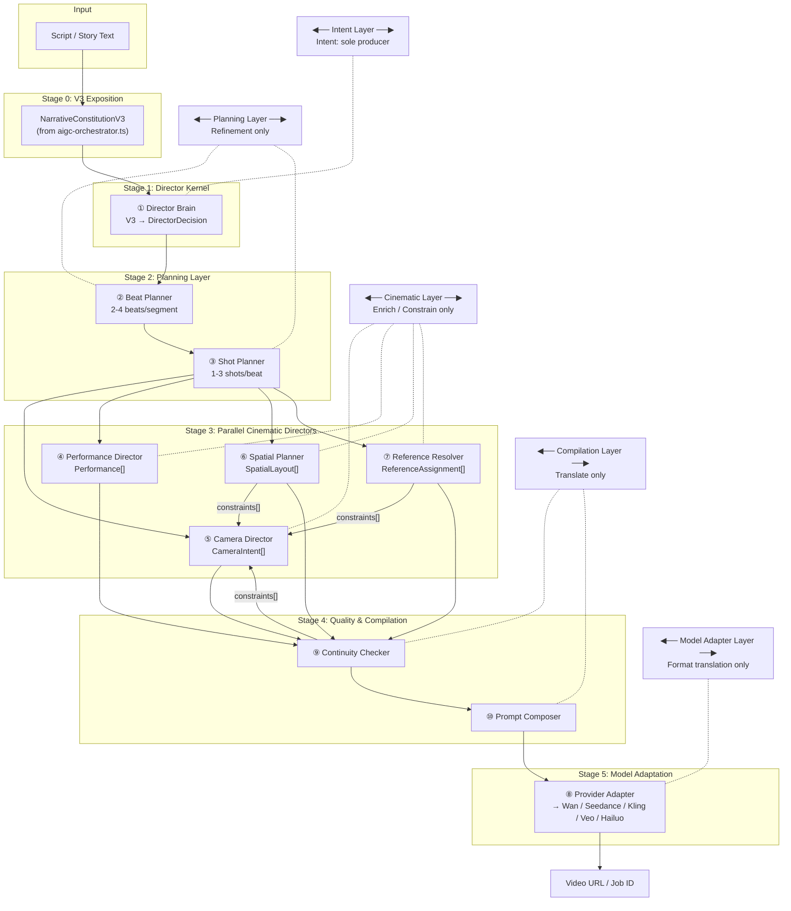

# Director Engine V2 Specification

> **Audit Basis**: DIRECTOR_ENGINE_AUDIT_REPORT_V1.md (2026-06-27)
> **Principled Design**: V3 rich semantics preserved — no new LLM agents for what V3 already outputs
> **Version**: 2.0.0-draft

---

## Table of Contents

0. [Core Architecture & Freeze Gate](#0-core-architecture--protocol-driven-ai-runtime)
1. [Architecture Overview & Data Flow](#1-architecture-overview--data-flow)
2. [① Director Brain & DirectorDecision Schema](#1-director-brain--directordecision-schema)
3. [② Beat Planner](#2-beat-planner)
4. [③ Shot Planner](#3-shot-planner)
5. [④ Performance Director](#4-performance-director)
6. [⑤ Camera Director — CameraPlanBuilder](#5-camera-director--cameraplanbuilder)
7. [⑥ Spatial Planner — Constraint Engine](#6-spatial-planner--constraint-engine)
8. [⑦ Continuity & Recovery Engine](#7-continuity--recovery-engine)
9. [⑧ Asset Binding & Reference Resolution Engine](#8-asset-binding--reference-resolution-engine)
10. [⑨ Provider Adapter](#9-provider-adapter)
11. [⑩ Migration Path](#10-migration-path)
12. [⑪ Evaluation & Quality Governance Framework](#11-evaluation--quality-governance-framework)

## 0. Core Architecture — Protocol-Driven AI Runtime

### 0.1 Purpose

This chapter is the **Architecture Freeze Document** for Director Engine V2. It does not introduce new design. It collects and summarizes the six core protocols, the global architecture principles, the unified runtime data flow, and the freeze gate, so that readers do not need to cross-reference 11 chapters to understand the system.

**After this chapter, all protocol design is frozen.** Subsequent development (Phase A/B/C) must operate on the frozen protocols. Any change to a protocol requires passing the Freeze Gate (Section 0.6).

### 0.2 Six Core Protocols

| # | Protocol | Chapter | Owner | Produces | Consumed By | Status |
|---|----------|---------|-------|----------|-------------|--------|
| 1 | **Intent Protocol** | ① Director Brain | `DirectorBrain` | `DirectorDecision` | Beat Planner, Shot Planner, Performance Director, CameraPlanBuilder, Spatial Planner | ✅ FROZEN |
| 2 | **Execution Protocol** | ⑤ Camera Director | `CameraPlanBuilder` | `ExecutionPlan` (includes `CameraPlan[]`, reserved for `ActorPlan[]`, `MotionPlan[]`, etc.) | Continuity & Recovery Engine, Provider Adapter, Evaluation Framework | ✅ FROZEN |
| 3 | **Constraint Protocol** | ⑥ Spatial Planner | `SpatialPlanner` | `Constraint[]` (unified: HARD/SOFT/OPTIONAL, SHOT/SHOT_PAIR/SCENE/SEQUENCE/GLOBAL scope) | CameraPlanBuilder, Continuity & Recovery Engine, Provider Adapter | ✅ FROZEN |
| 4 | **Reference / Asset Protocol** | ⑧ Asset Binding & Reference Resolution | `ReferenceResolver` + `IAssetRepository` | `ReferenceAssignment` + `AssetNode` (DAG) + `ReferenceCoverage` | CameraPlanBuilder → `ReferenceBinding`, Provider Adapter, Continuity & Recovery Engine | ✅ FROZEN |
| 5 | **Recovery Protocol** | ⑦ Continuity & Recovery Engine | `ContinuityEngine` + `RecoveryRouter` | `RecoveryAction[]` + `ContinuityReport` | Target modules (ReferenceResolver, SpatialPlanner, CameraPlanBuilder, etc.) | ✅ FROZEN |
| 6 | **Evaluation Protocol** | ⑪ Evaluation & Quality Governance | `EvaluationEngine` | `RouteDecision` (PASS/AUTO_RECOVER/HUMAN_REVIEW/FULL_REPLAN/ARCHITECTURE_FAIL) | Recovery Router (consumes RouteDecision) | ✅ FROZEN |

### 0.3 Unified Runtime Data Flow

```
[User Script / Storyboard]
        │
        ▼
╔═══════════════════════════════════════════════════════════╗
║              INTENT PROTOCOL (Chapter ①)                 ║
║  DirectorBrain → DirectorDecision                        ║
║  ── Immutable once emitted ──                           ║
╚═══════════════════════════════════════════════════════════╝
        │
        ├────► Beat Planner (Chapter ②) → Beat[]
        ├────► Shot Planner (Chapter ③) → Shot[]
        ├────► Performance Director (Chapter ④) → Performance[]
        │
        ▼
╔═══════════════════════════════════════════════════════════╗
║           EXECUTION PROTOCOL (Chapter ⑤)                 ║
║  CameraPlanBuilder → ExecutionPlan[] (CameraPlan[])      ║
║  ── Deterministic from same input ──                    ║
╚═══════════════════════════════════════════════════════════╝
        │
        ▼
╔═══════════════════════════════════════════════════════════╗
║          CONSTRAINT PROTOCOL (Chapter ⑥)                 ║
║  SpatialPlanner → Constraint[]                           ║
║  ── Monotonic: only added, never silently removed ──    ║
╚═══════════════════════════════════════════════════════════╝
        │
        ▼
╔═══════════════════════════════════════════════════════════╗
║      REFERENCE / ASSET PROTOCOL (Chapter ⑧)              ║
║  ReferenceResolver → ReferenceAssignment + Coverage      ║
║  IAssetRepository → AssetGraph (DAG + versioned)         ║
║  (If coverage insufficient → trigger VisualAssetBuilder) ║
╚═══════════════════════════════════════════════════════════╝
        │
        ▼
╔═══════════════════════════════════════════════════════════╗
║          RECOVERY PROTOCOL (Chapter ⑦)                   ║
║  ContinuityEngine → ContinuityReport + RootCauseGraph    ║
║  RecoveryRouter → RecoveryAction[] → target modules      ║
║  ── Partial Recovery First: REFERENCE < CONSTRAINT <     ║
║     EXECUTION_PLAN < INTENT_REVISION < FULL_REPLAN ──   ║
╚═══════════════════════════════════════════════════════════╝
        │
        ▼
╔═══════════════════════════════════════════════════════════╗
║        EVALUATION PROTOCOL (Chapter ⑪)                   ║
║  EvaluationEngine → RouteDecision (consumer only)        ║
║  ── Never modifies protocol objects ──                  ║
╚═══════════════════════════════════════════════════════════╝
        │
        ▼
╔═══════════════════════════════════════════════════════════╗
║          PROVIDER ADAPTER (Chapter ⑨)                    ║
║  Translates protocols → provider-native format           ║
║  ── No director logic ── Pure format translator ──      ║
╚═══════════════════════════════════════════════════════════╝
        │
        ▼
   [Video Generation]
```

### 0.4 Global Architecture Principles

| # | Principle | Chapter | Description |
|---|-----------|---------|-------------|
| 1 | **Immutable Intent** | ① §1.4 | DirectorDecision is immutable once emitted. Downstream modules may refine, constrain, or translate, but never modify the original intent. |
| 2 | **Constraint Monotonicity** | ① §1.5 | Constraints are monotonic — they can only be added, never silently removed. Removal must be explicit OVERRIDE with reason. |
| 3 | **No Direct Mutation** | ① §1.6 | No module may directly mutate another module's protocol objects. Cross-module changes are mediated through RecoveryAction. |
| 4 | **Partial Recovery First** | ① §1.7 | Always attempt smallest valid recovery scope (REFERENCE) before escalating to broader replanning (FULL_REPLAN). |
| 5 | **Provider Neutrality** | ⑨ | No director logic lives in Provider Adapters. They are pure format translators. |
| 6 | **Semantic Preservation** | ⑨ A6.5 | Provider Compiler may change expression but must preserve Film Language IR semantics. A "low-angle reveal" cannot become a "top-down shot". |
| 7 | **Information Preservation** | ⑨ A6.5 §0.5.2 | All information entering FilmLanguageIR must be preserved. If Provider lacks info, it is an IR defect, not Provider's role to compensate. |
| 8 | **Pure Provider Compiler** | ⑨ A6.5 §0.5.2 | ProviderCompiler is a pure function (deterministic, stateless, no DB access, no asset queries). Violation = Architecture Violation. |
| 9 | **FilmLanguageFingerprint** | ⑨ A6.5 §0.5.2 | All FilmLanguageIR carries a deterministic fingerprint for Evaluation. Same intent → same fingerprint across any Provider. |
| 10 | **Deterministic Planning** | ⑤ §5.6 | Same input always produces the same execution plan. Non-deterministic elements are explicitly isolated and memoized. |

### 0.4.1 Runtime 四层命名体系（2026-06-29 熊大确立）

V2 Runtime 自然形成四个层级，建议在讨论问题时统一使用这些称呼：

| 层级 | 组成 | 职责 |
|------|------|------|
| **Decision Layer** | Intent Protocol, Execution Protocol | 导演决策层 — 决定"拍什么、怎么拍" |
| **Governance Layer** | Constraint Protocol, Recovery Protocol, Evaluation Protocol | 运行治理层 — 保证"拍得对、不出轨" |
| **Representation Layer** | Reference Protocol, Film Language Protocol | 世界表达层 — 描述"世界长什么样、镜头看到什么" |
| **Compilation Layer** | Provider Compiler | 模型适配层 — 翻译"如何让 AI 听懂" |

**使用示例：**
- "这是 **Governance Layer** 的问题。"（而不是 "Prompt 有问题"）
- "这是 **Representation Layer** 的问题。"
- "这是 **Compilation Layer** 的问题。"

### 0.5 Key Architecture Boundaries

```
Narrative Layer    │  DirectorBrain (Intent)           ← What the story needs
───────────────────┼────────────────────────────────────────────────────
Execution Layer    │  CameraPlanBuilder (ExecutionPlan)← How to execute
───────────────────┼────────────────────────────────────────────────────
Physical Layer     │  SpatialPlanner (Constraint[])    ← What physics allows
───────────────────┼────────────────────────────────────────────────────
Visual Layer       │  ReferenceResolver (Asset Graph)  ← What assets exist
───────────────────┼────────────────────────────────────────────────────
Governance Layer   │  Continuity + Recovery + Eval     ← What is correct
───────────────────┼────────────────────────────────────────────────────
Film Language Layer│  Film Language Compiler (IR)      ← What the camera sees
───────────────────┼────────────────────────────────────────────────────
Provider Layer     │  Provider Compiler                ← How to format
```


### 0.5.1 Film Language Protocol（A6.5）— 第七个核心协议

**2026-06-29 熊大架构纠正：** Film Language 不是"结构化 Prompt"，而是**第七个核心协议**。

此前六大协议（Intent、Execution、Constraint、Reference、Recovery、Evaluation）之外，
Film Language Protocol 是第一个**中间表示层协议（Intermediate Representation Protocol）**，
与六大协议平级，拥有独立的所有权、生命周期、不变量和验证规则。

#### 协议定义

```typescript
interface FilmLanguageProtocol {
  readonly protocolName: 'film-language'
  readonly version: '1.0.0'
  readonly owner: 'FilmLanguageCompiler'
  
  input: {
    executionPlan: ExecutionPlan
    constraints: Constraint[]
    referenceAssignment: ReferenceAssignment
  }
  
  output: FilmLanguageIR
  
  invariants: {
    deterministic: true        // 同样输入 → 同样输出
    weightSumToOne: true       // 视觉权重总和 = 1.0
    visualAnchorsRequired: true // 每帧必须有视觉锚点
  }
}
```

#### 十层结构（强类型，非自由文本）

每一层都是独立的类型结构，有校验规则和生命周期：

| 层 | 类型 | 校验规则 |
|----|------|----------|
| SubjectLayer | 主体+权重 | 权重总和=1.0，必须有primary |
| CameraLayer | 叙事型构图 | shotType必须为预定义景别 |
| BlockingLayer | 角色调度 | — |
| MotionLayer | 三层分离 | 不能全为空 |
| EnvironmentLayer | 场景+时间+天气 | — |
| LightingLayer | 光源+品质+方向 | — |
| EmotionLayer | 氛围 | — |
| VisualAnchorLayer | 视觉锚点 | 不能为空 |
| ContinuityLayer | 一致性约束 | — |
| NarrativeLayer | 简洁叙事 | ≤100 token |

#### 架构强制：唯一合法路径

```
DirectorDecision → ExecutionPlan → Constraint → Reference → FilmLanguageIR → ProviderCompiler
```

**禁止路径（架构违规）：**
```
ProviderCompiler → ExecutionPlan（直接读取 ExecutionPlan 字段）
```

任何 Provider Compiler 如上违规，视为 Architecture Violation。

#### 对应的 Evaluation 维度

| 维度 | 定义 | 后果 |
|------|------|------|
| Semantic Fidelity Score | Provider 输出是否忠实表达 IR 语义 | 语义偏移→触发 Recovery |
| IR Completeness Score | 每层完整性百分比（Subject 100%, Motion 82%） | 某层为空→FAIL |

#### 文件位置

协议的 TypeScript 类型定义和 Contract Test 已在 A1 阶段创建的协议 Registry 中。

```
src/director/v2/protocols/
├── film-language/
│   └── index.ts          ← 类型、校验、确定性校验
└── __tests__/
    └── film-language.test.ts
```

**定位（2026-06-29 熊大架构纠正）：**
Film Language Layer 不是"生成 Prompt 的模块"，而是"生成与 Provider 无关的电影语言中间表示（Intermediate Representation, IR）"。

**职责：**
- 将 ExecutionPlan + Constraint[] + ReferenceAssignment[] 编译为五层结构化的 FilmLanguageFrame
- 只回答一个问题：**"如果让一个专业导演把这一镜交给摄影、美术、灯光和演员执行，它会包含哪些信息？"**
- 不包含任何 Provider 规则（即梦、可灵、Veo、Runway 是下一层的事情）

**五层结构：**
| 子层 | 职责 | 来源 |
|------|------|------|
| Subject Layer | 主体优先级：视觉权重分配 | ReferenceAssignment + Intent |
| Camera Layer | 叙事型运镜，非工程型参数 | ExecutionPlan.CameraPlan |
| Motion Layer | 三层分离：Camera/Character/Environment Motion | ExecutionPlan |
| Visual Asset Layer | 视觉世界固定锚 | Asset Graph (A6) |
| Continuity Layer | 一致性约束 | Continuity Report + Constraint[] |

**输出：** `FilmLanguageFrame`（Provider Neutral，不感知具体模型）

**全局原则：Semantic Preservation Principle（语义保持原则）**
Provider Compiler 可以改变表达方式，但不能改变 Film Language 的语义。

```
Film Language: "Low-angle reveal"
→ Provider A: camera.low_angle = true     ✅
→ Provider A: "Top-down shot"             ❌ 语义已变
```

**与 Provider Layer 的关系：**
```
Film Language IR  ← 完全不变
     ↓
Provider Compiler  ← 翻译层（仅改变表达方式）
     ↓
Provider A: JSON / Provider B: Prompt / Provider C: DSL
```

### 0.5.2 第七协议新增冻结原则（2026-06-29 熊大确立）

Film Language Protocol 的冻结涉及三条新增全局原则。这些原则是 Film Language 不被侵蚀的刚性边界。

#### ⑥ Information Preservation Principle（信息无损）

**定义：** 任何进入 FilmLanguageIR 的信息不能丢失。Film Language Compiler 必须保证：
```
DirectorDecision + ExecutionPlan + Constraint[] + ReferenceAssignment → FilmLanguageIR
```
- 所有输入信息必须保留在 IR 的各层中
- 如果 Provider 发现缺少某个信息，是 IR 的缺陷，不是 Provider 的职责
- Provider Compiler 不允许绕过 IR 直接读取 ExecutionPlan（见架构强制路径）

#### ⑦ Provider Compiler 必须是纯函数

**定义：**
```typescript
// 接口签名
compile(flir: FilmLanguageIR, capabilities: ProviderCapability): ProviderOutput

// 约束
// 1. 同输入 → 同输出（确定性）
// 2. 不能访问数据库
// 3. 不能自己查资产（Asset Graph 的信息必须已体现在 IR 的 VisualAnchorLayer 中）
// 4. 不能修改 Film Language（违反 Semantic Preservation ｜ 已冻结）
// 5. 不能感知 Runtime 状态
```
违反上述任何一条 = **Architecture Violation**。

#### ⑧ FilmLanguageFingerprint

**定义：** 用于 Evaluation 比较不同 Provider 是否保持同一导演意图的指纹。

```typescript
// IR A → Provider A → Video  vs  IR A → Provider B → Video
// 是不是同一个导演意图？
function computeFilmLanguageFingerprint(ir: FilmLanguageIR): string
```

用途：
| 场景 | 比较对象 | 预期 |
|------|----------|------|
| Provider A 换 B | Fingerprint(IR) 不变 | 导演意图未变 |
| 编译后输出语义 | Fingerprint(IR) vs 输出语义向量 | Semantic Fidelity Score |
| Recovery 触发 | 恢复前后的 Fingerprint | 不可变（恢复只修 Provider 输出，不修 IR） |

### 0.6 Architecture Freeze Gate

```typescript
export enum FreezeGateStatus {
  APPROVED = 'APPROVED',
  PENDING = 'PENDING',
  BLOCKED = 'BLOCKED',
}

export interface ArchitectureFreezeGate {
  frozenAt: string;                         // ISO 8601 — "2026-06-27T18:00:00Z"
  version: 'V2.0.0';
  status: FreezeGateStatus;

  // Issue summary at freeze time
  p0Issues: number;                         // must be 0 — all P0 resolved
  p1Issues: number;                         // accepted for Phase A/B/C
  p2Issues: number;                         // deferred to future versions

  // Certification
  protocolCompliance: 100;                  // percentage of principles satisfied
  determinismVerified: boolean;             // same input → same output tested
  recoverabilityVerified: boolean;          // known failures → recovery tested

  // What must pass to change a protocol
  changeProposal: {
    requires: 'FREEZE_GATE_REVIEW';
    approval: 'ARCHITECT_REVIEW' | 'CORE_TEAM_VOTE';
    rationale: string;                      // why this change is necessary
    impactAnalysis: string;                 // which modules must change
    rollbackPlan: string;                   // how to revert if it fails
  };
}
```

```json
{
  "freezeGate": {
    "frozenAt": "2026-06-27T18:00:00+08:00",
    "version": "V2.0.0",
    "status": "APPROVED",
    "p0Issues": 0,
    "p1Issues": 3,
    "p2Issues": 8,
    "protocolCompliance": 100,
    "determinismVerified": false,
    "recoverabilityVerified": false,
    "changeProposal": {
      "requires": "FREEZE_GATE_REVIEW",
      "approval": "ARCHITECT_REVIEW",
      "rationale": "Required for change",
      "impactAnalysis": "To be completed",
      "rollbackPlan": "To be completed"
    }
  }
}
```

---

---

## 1. Architecture Overview & Data Flow

### 1.1 High-Level Pipeline



### 1.2 Data Flow Detail (Semantic Traceability)

```
Script
  │
  ▼
NarrativeConstitutionV3        ← Full V3 semantics (characters, scenes, segments)
  │   segments[*].camera       { shot, movement, angle, lens }
  │   segments[*].emotion      { type, intensity }
  │   segments[*].characters   [{ characterId, emotion, focus, action }]
  │   segments[*].environment  { location, atmosphere, colorPalette, lighting }
  │   segments[*].action       { primary, interaction, expression }
  │   segments[*].narrativePurpose  (from V3 visualDesc / derived)
  │   segments[*].dialogue
  │   characters[*]            { id, name, appearance, personality }
  │   scenes[*]                { id, name, environment: { location, lighting, atmosphere, colorPalette } }
  │   props[*]                 { id, name, category, description }
  │   soundDesign[*]           { segmentId, ambient, music, effect }
  │   effectsDesign[*]         { segmentId, visualEffect, transition }
  │
  ▼
DirectorDecision               ← ZERO semantic loss — every V3 field mapped
  │   segmentCount
  │   segments[*].mappedCamera       direct from V3 segment.camera
  │   segments[*].mappedEmotion      direct from V3 segment.emotion
  │   segments[*].mappedCharacters   direct from V3 segment.characters
  │   segments[*].mappedEnvironment  direct from V3 segment.environment
  │   segments[*].mappedAction       direct from V3 segment.action
  │   segments[*].mappedProps        matched from V3 props by scene
  │   segments[*].mappedDialogue     direct from V3 segment.dialogue
  │
  ▼
Beat[]                         ← 2-4 beats per segment
  │   beat.goal                narrativePurpose segment-level → beat-level
  │   beat.emotion             segment.emotion → per-beat modulation
  │   beat.conflict            tension derived from segment context
  │   beat.transition          transition between beats
  │
  ▼
Shot[]                         ← 1-3 shots per beat
  │   shot.duration            2-5s
  │   shot.purpose             narrative sub-goal
  │   shot.composition         rule-of-thirds / golden-ratio / center / symmetry / leading-lines
  │   shot.reference           which char/scene refs apply
  │
  ▼ (parallel)
  ├── ExecutionPlan[]
  │     ├── CameraPlan[]       ← deterministic, provider-neutral, traceable
  │     │     directorIntent   ← direct from DirectorDecision.camera (IMMUTABLE)
  │     │     motivation       ← why, what, reveal (from intent + context)
  │     │     composition      ← rule of thirds / depth / framing
  │     │     constraints[]    ← unified Constraint[] from Spatial / Continuity / Reference
  │     │     referenceBindings[] ← AssetBinding resolved for this shot
  │     │     reasoning        ← explainable camera decision trace
  │     │     planId/revision  ← Recovery identification
  │     │
  │     ├── ActorPlan[]        ← reserved: character blocking / movement within shot
  │     ├── MotionPlan[]       ← reserved: camera movement profile
  │     ├── AudioPlan[]        ← reserved: future
  │     └── LightingPlan[]     ← reserved: future
  ├── Performance[]            ← per character per shot: expression, head, micro, breathing
  ├── Constraint[] (Spatial)    ← from Spatial Planner (positions, axis, screen direction, movement)
  └── ReferenceAssignment[]   ← resolved image URLs per shot
  │
  ▼
Continuity Checker            ← 180-degree, eyeline, spatial anchoring
  │
  ▼
PromptInput                   ← { prompt, negativePrompt, referenceImages }
  │
  ▼
Provider Adapter
  ├── Wan (aliyun-video.adapter)
  ├── Seedance (volcengine-video.adapter)
  ├── Kling (kling-video.adapter)     ← NEW
  ├── Veo (veo-video.adapter)         ← NEW
  └── Hailuo (hailuo-video.adapter)   ← NEW
```

### 1.3 V3 Field → DirectorDecision Mapping (Semantic Preservation Contract)

| V3 Field | Current Fate | V2 Target | Action |
|----------|-------------|-----------|--------|
| `segment.camera.shot` | Lost in prompt | `DirectorDecision.segments[].camera.shot` | Direct pass-through |
| `segment.camera.movement` | Lost in prompt | `DirectorDecision.segments[].camera.movement` | Direct pass-through |
| `segment.camera.angle` | Lost in prompt | `DirectorDecision.segments[].camera.angle` | Direct pass-through |
| `segment.camera.lens` | **Dropped entirely** | `DirectorDecision.segments[].camera.lens` | **REINSTATE** |
| `segment.emotion.type` | Lost in prompt | `DirectorDecision.segments[].emotion.type` | Direct pass-through |
| `segment.emotion.intensity` | Lost in prompt | `DirectorDecision.segments[].emotion.intensity` | Direct pass-through |
| `segment.characters[].emotion` | **Dropped entirely** | `DirectorDecision.segments[].characters[].emotion` | **REINSTATE** |
| `segment.characters[].focus` | Lost in prompt | `DirectorDecision.segments[].characters[].focus` | Direct pass-through |
| `segment.characters[].action` | Partial | `DirectorDecision.segments[].characters[].action` | Direct pass-through |
| `segment.environment.lighting` | **Empty-filled** | `DirectorDecision.segments[].environment.lighting` | **REINSTATE** |
| `segment.environment.weather` | **Empty-filled** | `DirectorDecision.segments[].environment.weather` | **REINSTATE** |
| `segment.environment.timeOfDay` | **Empty-filled** | `DirectorDecision.segments[].environment.timeOfDay` | **REINSTATE** |
| `segment.environment.colorPalette` | Partial | `DirectorDecision.segments[].environment.colorPalette` | Direct pass-through |
| `segment.action.primary` | Partial (in prompt) | `DirectorDecision.segments[].action.primary` | Direct pass-through |
| `segment.action.interaction` | **Dropped** | `DirectorDecision.segments[].action.interaction` | **REINSTATE** |
| `segment.action.expression` | **Dropped** | `DirectorDecision.segments[].action.expression` | **REINSTATE** |
| `segment.dialogue` | Propagated | `DirectorDecision.segments[].dialogue` | Direct pass-through |
| `props[*]` | In spec, **never reaches prompt** | `DirectorDecision.segments[].propsInUse` | **REINSTATE** |
| `soundDesign[*]` | **Dropped entirely** | `DirectorDecision.segments[].soundDesign` | **REINSTATE** |
| `effectsDesign[*]` | **Dropped entirely** | `DirectorDecision.segments[].effectsDesign` | **REINSTATE** |
| `scenes[*].environment.lighting` | **Empty-filled** | `DirectorDecision.scenes[].environment.lighting` | **REINSTATE** |
| `scenes[*].environment.weather` | **Empty-filled** | `DirectorDecision.scenes[].environment.weather` | **REINSTATE** |
| `scenes[*].environment.timeOfDay` | **Empty-filled** | `DirectorDecision.scenes[].environment.timeOfDay` | **REINSTATE** |
| `storyArc` | Lost | `DirectorDecision.storyArc` | Direct pass-through |

**Target semantic retention rate: 95%+** (from current ~58%)

---

## ① Director Brain — DirectorDecision Schema

### 1.1 Purpose

**Director Brain** is a **zero-loss semantic relay** from `NarrativeConstitutionV3` into `DirectorDecision`. It does NOT call LLM — it is a pure mapping/transformation function that:

1. Receives full `NarrativeConstitutionV3`
2. Maps every field to `DirectorDecision` without loss
3. Performs structural normalization (V3's segment-inlined fields → decision-level arrays)
4. Validates completeness (detect empty fields that should be filled from V3)
5. Enriches with derived cross-segment metadata (e.g., emotion arc trajectory)
6. Passes all semantics forward — no field is dropped

### 1.2 DirectorDecision — Full Schema

```typescript
// ============================================================
// DirectorDecision — V2 Core Decision Structure
// ZERO semantic loss from NarrativeConstitutionV3
// ============================================================

/** Unique IDs throughout */
export type DecisionId = string        // "dec_001"
export type BeatId = string            // "beat_001"
export type ShotId = string            // "shot_001"

// ─── Camera Decision ─────────────────────────────────

export interface CameraDecision {
  shot: string                          // close_up | medium | wide | extreme_close_up | ...
  movement: string                      // static | push_in | pull_out | pan | tilt | tracking | crane | handheld | dolly
  angle: string                         // eye_level | low_angle | high_angle | overhead | over_shoulder | dutch
  lens: string                          // 24mm | 35mm | 50mm | 85mm | 135mm
}

// ─── Emotion Decision ────────────────────────────────

export interface EmotionDecision {
  type: string                          // shock | calm | joy | anger | sadness | fear | disgust | surprise | neutral
  intensity: number                     // 0-1
}

// ─── Character Presence Decision ─────────────────────

export interface CharacterPresenceDecision {
  characterId: string                   // V3CharacterId
  role: 'primary' | 'secondary' | 'background'
  emotion: string                       // this character's emotion at this segment
  focus: number                         // 0-1, screen focus weight
  action?: string                       // character-specific action

  // ── Asset Binding (reserved for Visual Asset Builder) ──
  assetBinding?: {
    characterAssetId: string            // resolves to character image pool (face / body / costume)
    styleAssetId?: string               // resolves to style reference
  }
}

// ─── Environment Decision ────────────────────────────

export interface EnvironmentDecision {
  location: string
  atmosphere: string
  colorPalette: string
  lighting: string                      // REINSTATED from V3
  weather?: string                      // REINSTATED from V3
  timeOfDay?: string                    // REINSTATED from V3
}

// ─── Action Decision ─────────────────────────────────

export interface ActionDecision {
  primary: string                       // main action
  interaction?: string                  // interaction with environment/props
  expression?: string                   // facial expression
}

// ─── Prop In Use ─────────────────────────────────────

export interface PropInUse {
  propId: string
  name: string
  usage: string                         // how the prop is used in this segment
}

// ─── Sound & Effects ────────────────────────────────

export interface SoundDesignDecision {
  ambient?: string
  music?: string
  effect?: string
}

export interface EffectsDesignDecision {
  visualEffect?: string
  transition?: string
}

// ─── Per-Segment Decision ────────────────────────────

export interface SegmentDecision {
  id: string                            // V3SegmentId
  segmentNumber: number
  sceneId: string                       // V3SceneId
  duration: number                      // seconds

  // ── Mapped from V3 segments[*] — no loss ──
  camera: CameraDecision                // direct from V3 segment.camera
  emotion: EmotionDecision              // direct from V3 segment.emotion
  characters: CharacterPresenceDecision[]  // direct from V3 segment.characters
  environment: EnvironmentDecision      // direct from V3 segment.environment
  action: ActionDecision                // direct from V3 segment.action
  dialogue?: string                     // direct from V3 segment.dialogue

  // ── Resolved cross-references ──
  propsInUse: PropInUse[]               // resolved from V3.props by scene context
  soundDesign: SoundDesignDecision      // matched from V3.soundDesign by segmentId
  effectsDesign: EffectsDesignDecision  // matched from V3.effectsDesign by segmentId

  // ── Derived metadata (not in V3 — computed by Director Brain) ──
  narrativePurpose: string              // derived from V3 context: "introduce conflict", "character revelation", "tension build"
  pacingHint: 'slow' | 'medium' | 'fast' // derived from emotion, action intensity
  emotionalTrajectory: string           // "rising" | "sustaining" | "falling" | "spike" | "resolution"
}

// ─── Scene Reference Decision ────────────────────────

export interface SceneDecision {
  id: string                            // V3SceneId
  name: string
  environment: {
    location: string
    lighting: string                    // REINSTATED
    atmosphere: string
    colorPalette: string
    weather?: string                    // REINSTATED
    timeOfDay?: string                  // REINSTATED
  }

  // ── Asset Binding (reserved for Visual Asset Builder) ──
  assetBinding?: {
    sceneAssetId: string                // resolves to scene establishing / lighting reference
    propAssetIds?: string[]             // resolves to prop image references
  }
}

// ─── Story Arc Decision ──────────────────────────────

export interface StoryArcDecision {
  setup: string
  conflict: string
  climax: string
  resolution: string
}

// ─── Top-Level DirectorDecision ──────────────────────

export interface DirectorDecision {
  // ── v3 source trace ──
  v3SourceId: string                    // hash or reference to source NarrativeConstitutionV3

  // ── Meta ──
  title: string
  summary: string                       // 1-sentence summary of the whole piece

  // ── Direct from V3 ──
  storyArc: StoryArcDecision
  characters: V3CharacterSpec[]         // direct reference to V3 characters (no redefinition)

  // ── Per-scene decisions ──
  scenes: SceneDecision[]

  // ── Core segments (1:1 with V3 segments) ──
  segments: SegmentDecision[]

  // ── Global metadata (derived) ──
  globalMood: string                    // overall mood of the piece
  dominantColorPalette: string          // most common color scheme
  averagePacing: 'slow' | 'medium' | 'fast'
}
```

### 1.3 Director Brain — Implementation Contract

```typescript
interface IDirectorBrain {
  /**
   * Receive V3, produce DirectorDecision with zero semantic loss.
   * Pure transformation — NO LLM calls, NO agent orchestration.
   */
  decide(constitution: NarrativeConstitutionV3): DirectorDecision;
}
```

### 1.4 Immutable Intent Principle (Architecture Constraint)

> **Once `DirectorDecision` is generated, no downstream module may alter the semantic intent of the decision. Subsequent modules may only Refine, Constrain, Enrich, or Translate it. No module may re-define, override, or substitute Director's intent.**

This is the **single most important architectural rule** in the system. It prevents:
- Camera Planner from "inventing" a camera that contradicts Director's intent
- Provider Adapter from silently changing shot type to fit model capability
- Beat/Shot Planner from overwriting emotion or pacing set by Director

**Permitted operations:**

| Operation | Meaning | Examples |
|-----------|---------|----------|
| **Refine** | Sub-divide intent into finer granularity | Segment-level camera → shot-level camera (same type, refined framing) |
| **Constrain** | Add spatial/continuity constraints that limit but don't contradict | 180-degree axis, safe zone, screen direction |
| **Enrich** | Add metadata that was not available at Director layer | Performance micro-expressions, specific lens settings per provider |
| **Translate** | Convert intent into provider-native format | Camera Plan → Wan prompt parameters |

**Forbidden operations:**
- A module changing `shot: "wide"` to `shot: "close_up"` for creative reasons
- A module dropping Director's emotion intent because "prompt length is limited"
- A module adding new characters or scenes not in DirectorDecision

### 1.5 Constraint Monotonicity (Architecture Constraint)

> **Constraints are monotonic — they can only be added, never silently removed. Any removal must be an explicit OVERRIDE with a documented reason and approval.**

Once a constraint is established by any module (Spatial, Continuity, Reference, Evaluation), it remains active for its declared `lifetime` (SHOT / SCENE / SEQUENCE / GLOBAL). Downstream modules may:
- **Add** new constraints that further restrict the solution space
- **Satisfy** or **Compromise** constraints in their outputs
- **Override** a constraint ONLY with documented reason and explicit approval

Downstream modules may NOT:
- Silently drop a constraint
- Change a constraint's payload (only the originating module may mutate)
- Ignore a HARD constraint without triggering a VIOLATED state

**Constraint lifecycle states:**

```
ACTIVE → SATISFIED (constraint is met by the plan)
       → COMPROMISED (partially met, acceptable trade-off)
       → VIOLATED   (broken — blocks generation unless overridden)
       → OVERRIDDEN (explicitly overridden with reason)
       → EXPIRED    (lifetime ended — naturally inactive)
```

**Constraint Monotonicity rule:** Once a constraint enters ACTIVE or SATISFIED, it may only transition to:
- COMPROMISED (with rationale)
- EXPIRED (when lifetime ends)

It may NEVER silently transition back to non-existent. Every constraint is traceable through its `constraintId` across the entire pipeline.

**Layer responsibility map (Constraint Boundary):**

```
Layer               │ Produces Constraints        │ Consumes Constraints
────────────────────┼─────────────────────────────┼────────────────────────────
Spatial Planner     │ Position, Axis, Screen Dir  │ — (origin layer)
Continuity Checker  │ Eyeline, Match-on-Action     │ Spatial constraints
Reference Resolver  │ Reference priority           │ — (independent)
CameraPlanBuilder   │ — (consumes)                 │ Spatial + Continuity + Reference
Provider Adapter    │ — (consumes)                 │ All constraints but never overrides
```

---

### 1.6 No Direct Mutation Principle (Architecture Constraint)

> **No module may directly mutate another module's protocol objects. All cross-module changes must be mediated through RecoveryAction requests.**

This is an extension of the protocol-based architecture. Each module owns its protocol objects exclusively:

| Protocol | Owner | Protected From |
|----------|-------|----------------|
| DirectorDecision (Intent) | Director Brain | All other modules — read-only once emitted |
| ExecutionPlan (CameraPlan) | CameraPlanBuilder | Continuity, Evaluation |
| Constraint[] | Spatial Planner | Continuity, Evaluation |
| ReferenceAssignment | Reference Resolver | Continuity, Evaluation |
  ├── ContinuityReport + RecoveryAction[]  ← governance: check, diagnose, route

**The only valid way to change a protocol object:**
1. Continuity Engine produces `RecoveryAction[]`
2. Recovery Router routes to the owning module
3. The owning module executes partial recovery on its own data

**Never:**
- Continuity Engine directly modifies `ShotPlan[]`, `SpatialLayout`, or `ReferenceAssignment`
- Evaluation Engine directly modifies `DirectorDecision`
- Any module bypasses the owning module to patch protocol data

### 1.7 Partial Recovery First Principle

> **When a failure is detected, the recovery system must always attempt the smallest valid recovery scope before escalating to broader replanning.**

**Recovery scope hierarchy (broadest to narrowest):**

```
FULL_REPLAN     → entire segment re-planned
EXECUTION_PLAN  → single ExecutionPlan re-planned
CONSTRAINT      → single Constraint re-resolved
REFERENCE       → single ReferenceAssignment re-resolved
```

**Recovery priority (always attempt narrowest first):**

```
REFERENCE   (easiest to re-resolve — image swap or re-bind)
  ↓ if fails
CONSTRAINT  (re-check spatial axis, safe zones)
  ↓ if fails
EXECUTION_PLAN (re-build CameraPlan for affected shots)
  ↓ if fails
FULL_REPLAN   (last resort — re-run Director Brain)
```

**Why this order?**
- Reference recovery is cheap (image swap)
- Constraint recovery is cheap (re-compute axis side)
- Execution Plan recovery is moderate (re-build plan from same intent)
- Director Decision recovery is expensive (re-run LLM)

The system MUST always attempt the cheapest recovery first.

**Implementation rule:** Every `RecoveryAction` must specify its `scope` in the hierarchy above. The Recovery Router must sort actions by scope ascending and attempt the narrowest first.

**Exception:** If evaluation confidence for a narrow recovery is below a configurable threshold (default: 0.3), the system should skip it and try the next wider scope.

---

```
Layer               │ Produces              │ Can                     │ Cannot
────────────────────┼───────────────────────┼─────────────────────────┼─────────────────────
Director            │ Intent                 │ — (origin)              │ — (source of truth)
Planning (Beat/Shot)│ Plan                   │ Refine + Constrain       │ Override Intent
Cinematic Directors │ Enriched Plan          │ Constrain + Enrich      │ Override Intent
Continuity          │ Validation             │ Reject + Suggest Fix    │ Modify Intent
Provider Adapter    │ Provider Prompt        │ Translate               │ Re-interpret Intent
```

**Mapping Rules:**
1. `SegmentDecision.camera` ← direct copy from `V3SegmentSpec.camera` (all 4 sub-fields)
2. `SegmentDecision.emotion` ← direct copy from `V3SegmentSpec.emotion`
3. `SegmentDecision.characters[].emotion` ← direct copy from `V3CharacterPresence.emotion` (REINSTATED)
4. `SegmentDecision.environment.lighting/weather/timeOfDay/colorPalette` ← direct copy from `V3EnvironmentState` + `V3EnvironmentBase` fallback
5. `SegmentDecision.action.interaction/expression` ← direct copy from `V3ActionState` (REINSTATED)
6. `SegmentDecision.propsInUse` ← resolve from `NarrativeConstitutionV3.props` by matching `sceneId` with prop's `relatedSceneIds` (or segment context)
7. `SegmentDecision.soundDesign` ← match from `NarrativeConstitutionV3.soundDesign` by `segmentId`
8. `SegmentDecision.effectsDesign` ← match from `NarrativeConstitutionV3.effectsDesign` by `segmentId`
9. `SegmentDecision.narrativePurpose` ← derived heuristic from V3 segment position, `emotion.type`, `action.primary`, and `storyArc`
10. `SegmentDecision.pacingHint` ← derived from emotion intensity × action complexity
11. `SegmentDecision.emotionalTrajectory` ← computed from neighboring segment emotions (compare with prev/next V3 segment emotion)

---

## ② Beat Planner

### 2.1 Purpose

A **beat** is a narrative unit smaller than a segment. Each segment (5-12s) decomposes into 2-4 beats. Beats describe the **micro-narrative flow** — the moment-by-moment emotional and tension changes within a single scene segment.

**Why beats?** A segment like "hero confronts villain" has multiple internal steps: (1) hero enters looking angry → (2) villain turns around calmly → (3) they lock eyes. Each is a beat. Current V1 treats all three as a single flat prompt.

### 2.2 Beat — Full Schema

```typescript
// ============================================================
// Beat Schema
// ============================================================

export interface Beat {
  id: BeatId                            // "beat_seg_001_0"
  segmentId: string                     // parent segment id
  beatIndex: number                     // 0-based index within segment

  // ── Temporal ──
  estimatedDuration: number             // seconds (derived, 1.5-4s)

  // ── Narrative ──
  goal: string                          // what narrative purpose this beat serves
                                         // "hero reveals weapon", "villain reacts with fear", "power shift"

  emotion: {
    type: string                        // from segment.emotion, modulated per-beat
    intensity: number                   // 0-1, sub-modulated
    modulation: string                  // how this beat modulates the segment emotion
                                         // "amplify" | "sustain" | "diminish" | "transform"
  }

  conflict: {
    present: boolean                    // is there active conflict?
    type: string                        // "physical" | "emotional" | "verbal" | "psychological" | "none"
    description: string                 // what tension exists
  }

  // ── Action ──
  action: {
    primary: string                     // sub-action for this beat
    characterFocus: string              // which character is the focus
  }

  // ── Transition ──
  transition: {
    toNextBeat: string                  // how to transition visually
                                         // "cut" | "whip_pan" | "character_move" | "action_reaction" | "smash_cut" | "match_cut"
    timing: string                      // "immediate" | "overlap" | "pregnant_pause"
  }

  // ── Spatial hint (for Spatial Planner) ──
  spatialHint: {
    primaryCharacterPosition?: string   // rough position relative to scene
    interactionType: string             // "close_contact" | "distant" | "approaching" | "retreating"
  }
}

export interface BeatPlan {
  segmentId: string
  beats: Beat[]                         // 2-4 beats per segment
}
```

### 2.3 Beat Derivation from V3

Beat Planner is a **deterministic rule engine** (NO new LLM agent). It derives beats from:

1. **Segment length**: `segment.duration ÷ 3` approximate number of beats
2. **Emotion intensity**: high-intensity emotions → faster, more beats; low → fewer, slower beats
3. **Action complexity**: `action.primary` + `action.interaction` complexity → more beats for multi-step actions
4. **Character count**: more characters present → more beats (each character gets focus time)
5. **Dialogue presence**: dialogue segments → minimum 2 beats (speaker reaction)
6. **Conflict type**: physical conflict → rapid beats; psychological → slower beats

**Derivation algorithm (conceptual):**
```
function deriveBeats(segment: V3SegmentSpec): Beat[] {
  // 1. Calculate ideal beat count based on duration and emotion intensity
  const baseCount = min(max(floor(segment.duration / 3), 2), 4)
  const beats: Beat[] = []

  // 2. Distribute segment.emotion across beats with modulation
  const emotionModulations = getModulationPattern(segment.emotion.type, baseCount)

  // 3. Distribute segment.action.primary across beats
  const actionParts = splitAction(segment.action, baseCount)

  // 4. Assign character focus per beat
  const characterBeats = distributeCharacterFocus(segment.characters, baseCount)

  // 5. Build each beat
  for (i = 0; i < baseCount; i++) {
    beats.push({
      goal: deriveGoal(segment, i, baseCount, characterBeats[i]),
      emotion: emotionModulations[i],
      conflict: deriveConflict(segment, i, characterBeats[i]),
      action: actionParts[i],
      transition: deriveTransition(i, baseCount, segment),
      ...
    })
  }

  return beats
}
```

---

## ③ Shot Planner

### 3.1 Purpose

A **shot** is a single continuous camera take (2-5s). Each beat decomposes into 1-3 shots. A shot defines the **exact visual unit** that will be generated as a video.

**Critical change from V1**: V1 treats `videoSegments[i]` as the generation unit (5-12s). V2 uses `Shot` as the generation unit (2-5s). Multiple shots compose a segment, enabling camera angle changes within a single narrative segment.

### 3.2 Shot — Full Schema

```typescript
// ============================================================
// Shot Schema
// ============================================================

export interface Shot {
  id: ShotId                            // "shot_seg_001_beat_0_shot_0"
  segmentId: string                     // parent segment
  beatId: string                        // parent beat

  // ── Temporal ──
  duration: number                      // 2-5 seconds
  shotIndex: number                     // position within beat

  // ── Narrative ──
  purpose: string                       // narrative sub-goal for this shot
                                         // "establish character reaction", "show action impact", "reveal environment detail"

  // ── Camera (inherited from V3 segment.camera, refined) ──
  camera: {
    shot: string                        // close_up | medium | wide | extreme_close_up
    movement: string                    // static | push_in | pull_out | pan | tilt | tracking | handheld | dolly
    angle: string                       // eye_level | low_angle | high_angle | overhead | over_shoulder | dutch
    lens: string                        // 24mm | 35mm | 50mm | 85mm | 135mm
  }

  // ── Composition ──
  composition: {
    rule: 'rule_of_thirds' | 'golden_ratio' | 'center' | 'symmetry' | 'leading_lines' | 'frame_within_frame' | 'dynamic_diagonal'
    focusPoint: string                  // where in frame: "left_third" | "center" | "right_third" | "upper" | "lower"
    depth: 'shallow' | 'medium' | 'deep'  // depth of field
  }

  // ── Subject ──
  subject: {
    type: 'character' | 'environment' | 'prop' | 'action' | 'detail'
    characterId?: string                // if character is subject
    characterCount: number              // how many characters in shot
    primaryCharacterFocus?: string      // characterId of main focus
  }

  // ── Reference Links (resolved by Reference Resolver) ──
  references: {
    characterRefs: string[]             // character image variant IDs
    sceneRef: string                    // scene image ID
    propRefs: string[]                  // prop image IDs
    storyboardRef?: string              // storyboard image ID for this segment/beat
  }
}

export interface ShotPlan {
  segmentId: string
  beatId: string
  shots: Shot[]                         // 1-3 shots per beat
  totalDuration: number                 // sum of shot durations
}
```

### 3.3 Shot Derivation Rules

**Deterministic — no LLM:**

1. **Beat emotion → shot camera**: high intensity emotion → closer shots (close-up, extreme_close-up); calm → wider shots
2. **Beat action → shot count**: action beats → more shots (action/reaction coverage); dialogue → fewer shots
3. **Beat conflict → shot movement**: physical conflict → handheld, dynamic movement; psychological → slow push/pull
4. **Shot type progression within beat**: wide → medium → close (escalating), or close → medium → wide (de-escalating)
5. **Duration distribution**: divide beat's estimated duration evenly across shots, with emphasis shot getting +1s

---

## ④ Performance Director

### 4.1 Purpose

The Performance Director defines **character performance** per shot (or per beat for slower paces). It answers: *how does each character act, react, and emote moment-by-moment?*

**Why separate from V3?** V3 has `segment.action` (primary/interaction/expression) and `characterPresence[].emotion` — but these are segment-level (5-12s). A character's emotion may shift within a segment. Performance Director adds **per-shot micro-performance** detail.

### 4.2 Performance — Full Schema

```typescript
// ============================================================
// Performance Schema (per character per shot/beat)
// ============================================================

export interface PerformanceAction {
  type: string                          // "gesture" | "posture_change" | "micro_action" | "interaction"
  description: string                   // "slowly raises hand" | "adjusts collar"
  duration: number                      // seconds
  timing: string                        // relative to shot start: "start" | "mid" | "end" | "continuous"
}

export interface PerformanceEmotion {
  primary: string                       // from V3 characterPresence.emotion, refined
  secondary?: string                    // sub-emotion
  intensity: number                     // 0-1
  transition: string                    // how they arrived at this emotion: "build_up" | "sudden" | "lingering"
}

export interface PerformanceExpression {
  eyes: string                          // "wide_open" | "narrowed" | "looking_down" | "rolling" | "teary" | "darting"
  eyebrows: string                      // "raised" | "furrowed" | "neutral" | "knitted"
  mouth: string                         // "slight_smile" | "pursed_lips" | "open_astonished" | "grimace" | "tight"
  headMotion: string                    // "tilt_left" | "tilt_right" | "nod_slight" | "shake" | "lift_chin" | "lower"
}

export interface PerformanceMicroAction {
  fingers?: string                      // "drumming" | "twitching" | "clenching" | "pointing" | "stroking"
  hands?: string                        // "in_pockets" | "crossed_arms" | "on_hips" | "trembling" | "open_palms"
  breathing?: string                    // "shallow_rapid" | "deep_slow" | "held_breath" | "sigh" | "panting"
  bodyLanguage: string                  // "leaning_forward" | "leaning_back" | "rigid" | "relaxed" | "pacing"
}

export interface Performance {
  shotId: ShotId                        // target shot
  beatId: BeatId                        // target beat (for shots that share a beat)
  characterId: string                   // target character

  // ── Core Performance ──
  emotion: PerformanceEmotion           // refined from V3 + beat modulation
  action: PerformanceAction             // primary action in this shot/beat
  expression: PerformanceExpression     // detailed facial expression
  microAction: PerformanceMicroAction   // fine-grained body movement

  // ── Speech ──
  dialogue?: {
    line: string                        // spoken line (if any)
    delivery: string                    // "whispered" | "shouted" | "calm" | "stammering" | "menacing"
    timing: string                      // "before_action" | "during_action" | "after_action"
  }

  // ── Spatial anchor (links to SpatialLayout) ──
  spatialAnchorId?: string              // references character position in SpatialLayout

  // ── FSE Compatibility ──
  frameSequenceCompat?: {
    optimizedShots: Array<{
      startMs: number
      endMs: number
      action: string
      expression: string
      camera: string
    }>
  }
}
```

### 4.3 Derivation from V3

Performance Director enriches, not replaces, V3 data:

| V3 Input | Performance Output |
|----------|--------------------|
| `segment.action.expression` | `Performance.expression.eyes + eyebrows + mouth` (decomposed) |
| `segment.action.primary` | `Performance.action` (refined per-shot) |
| `segment.action.interaction` | `PerformanceAction.type: "interaction"` |
| `characterPresence[].emotion` | `Performance.emotion` (refined) |
| `segment.emotion.type + intensity` | `Performance.emotion.transition` and intensity modulation |
| `segment.dialogue` | `Performance.dialogue` (with delivery hint derived from emotion) |

## ⑤ Camera Director — CameraPlanBuilder

### 5.1 Purpose

Camera Director is NOT a director — it is an **execution planner**. It receives:

1. **DirectorIntent** — `DirectorDecision.segments[].camera` (the sole creative source)
2. **Constraints** — from Spatial Planner, Continuity Checker, Reference Resolver (unified format)
3. **Execution context** — Beat timing, segment context

And produces:
- **CameraPlan** — the executable camera plan for each shot (deterministic, provider-neutral, traceable)

**Critical rule:** CameraPlanBuilder never "invents" camera intent. It translates Director's intent into an execution plan that satisfies all constraints. This is the strict application of **Immutable Intent Principle** (Section 1.4).

### 5.2 Unified Constraint System

Before defining CameraPlan, we define the shared Constraint interface consumed by CameraPlanBuilder (and eventually by all planners):

```typescript
// ============================================================
// Unified Constraint — Shared across all planners
// ============================================================

export type ConstraintSource =
  | 'spatial_planner'        // 180-degree axis, safe zone, screen direction
  | 'continuity_checker'     // eyeline match, costume consistency, prop persistence
  | 'reference_resolver'     // LOCKED/HIGH refs that must be visible
  | 'performance_director'   // character blocking / emotional positioning
  | 'execution'              // provider capabilities, duration limits
  | 'visual_asset'           // reserved: Visual Asset Builder constraints

export type ConstraintPriority =
  | 'HARD'                   // MUST satisfy — failure blocks generation
  | 'SOFT'                   // SHOULD satisfy — can be relaxed if necessary
  | 'OPTIONAL'               // NICE TO HAVE

export interface Constraint {
  id: string
  source: ConstraintSource
  priority: ConstraintPriority
  category: string            // "180_degree_axis" | "screen_direction" | "eyeline_match"
  description: string         // human-readable description
  payload: Record<string, unknown>  // structured constraint data
  rationale?: string          // why this constraint exists
}

// ─── Specialized Constraint Helpers ─────────────────

export const Constraint = {
  hard(source: ConstraintSource, category: string, payload: Record<string, unknown>, desc: string): Constraint {
    return { id: `c_${Date.now()}`, source, priority: 'HARD', category, description: desc, payload }
  },
  soft(source: ConstraintSource, category: string, payload: Record<string, unknown>, desc: string): Constraint {
    return { id: `c_${Date.now()}`, source, priority: 'SOFT', category, description: desc, payload }
  },
}
```

### 5.3 CameraPlan — Full Schema

```typescript
// ============================================================
// CameraPlan — Deterministic, Provider-Neutral Execution Plan
// ============================================================

export interface CameraPlan {
  // ── Identity (for Recovery) ──
  planId: string                            // "camplan_seg_001_shot_0"
  intentId: string                          // references DirectorDecision.segments[].id — NOT a separate intent
  revision: number                          // 0 = original, 1+ = re-planned after Evaluation
  origin: 'director_decision'               // ALWAYS this value — never 'derived' or 'inferred'

  // ── Shot Context ──
  shotId: ShotId
  segmentId: string
  beatId: BeatId
  duration: number                          // seconds

  // ── Director Intent (direct from DirectorDecision, NEVER modified) ──
  directorIntent: {
    shot: string                            // direct from DirectorDecision.camera.shot
    movement: string                        // direct from DirectorDecision.camera.movement
    angle: string                           // direct from DirectorDecision.camera.angle
    lens: string                            // direct from DirectorDecision.camera.lens
  }

  // ── The WHY (derived from director intent + scene context) ──
  motivation: CameraMotivation             // why this camera exists
  motivationRationale: string               // "Close-up to capture hero's dawning horror"

  // ── The WHAT ──
  focus: CameraFocus                        // what the camera cares about
  focusTargetId?: string                    // characterId or propId of focus

  // ── The REVEAL ──
  reveal: CameraReveal                      // what this angle reveals
  revealDescription: string                 // "Reveals villain's handgun hidden behind the desk"

  // ── The HOW ──
  speed: CameraSpeed                        // how fast the camera moves
  acceleration?: string                     // "constant" | "ease_in" | "ease_out" | "ease_both"

  // ── Lens Intent ──
  lensIntent: string                        // "85mm for intimate compression with background blur"

  // ── Emotional Linkage ──
  emotionalLinkage: string                  // "push-in mirrors rising anger"

  // ── Composition ──
  composition: {
    framing: 'rule_of_thirds' | 'center' | 'golden_ratio' | 'symmetry' | 'leading_lines' | 'dutch'
    depth: 'shallow' | 'medium' | 'deep'
    aspectRatio?: '16:9' | '9:16' | '4:3' | '1:1'
  }

  // ── Constraints applied (traceability) ──
  constraints: Array<{
    constraintId: string                    // references Constraint.id
    status: 'satisfied' | 'compromised' | 'violated'
    resolution?: string                     // how this constraint was handled
  }>

  // ── Reference Assets (reserved for Visual Asset Builder) ──
  referenceBindings: ReferenceBinding[]

  // ── Explainability (for Evaluation / debugging) ──
  reasoning: string                         // "Maintain eye-line continuity. Reveal emotional reaction. Preserve Hero LOCKED reference."

  // ── Metadata ──
  metadata: {
    builtAt: string                         // ISO 8601
    builderVersion: string
    totalConstraints: number
    satisfiedConstraints: number
    compromisedConstraints: number
  }
}

// ─── Reference Binding (shared across all Plan types) ───

export interface ReferenceBinding {
  assetId: string
  role: 'character_face' | 'character_body' | 'scene_establishing' | 'prop' | 'style' | 'mood_board'
  priority: 'LOCKED' | 'HIGH' | 'MEDIUM' | 'LOW'
  lockLevel: 'must_include' | 'should_include' | 'nice_to_have'
}
```

### 5.4 CameraPlanBuilder — Implementation Contract

```typescript
interface ICameraPlanBuilder {
  /**
   * Build CameraPlan from DirectorDecision.camera + unified constraints.
   *
   * Input:
   *   - DirectorDecision.segments[].camera (sole intent source)
   *   - Constraint[] (from Spatial / Continuity / Reference)
   *   - Beat timing context
   *
   * Output:
   *   - CameraPlan (deterministic — same input always produces same plan)
   *
   * NEVER modifies director intent — only enriches with constraints + motivation.
   */
  build(input: {
    directorCamera: DirectorDecision['segments'][0]['camera']
    emotion: DirectorDecision['segments'][0]['emotion']
    beatGoal: string
    beatConflict: Beat['conflict']
    constraints: Constraint[]
    segmentContext: {
      narrativePurpose: string
      emotionalTrajectory: string
    }
    referenceBindings: ReferenceBinding[]
  }): CameraPlan

  /**
   * Re-build a specific CameraPlan by revision (for Recovery).
   * Preserves planId, increments revision, applies new constraints.
   */
  rebuild(previousPlan: CameraPlan, newConstraints: Constraint[]): CameraPlan
}
```

### 5.5 Derivation Rules

CameraPlan does NOT "derive" from V3 — it **builds from DirectorDecision + Constraints**:

```
DirectorDecision.segments[].camera (shot, movement, angle, lens)
  + DirectorDecision.segments[].emotion (type, intensity)
  + Beat.goal + Beat.conflict
  + SpatialConstraint[] (axis, safe zone, screen direction)
  + ContinuityConstraint[] (eyeline, match on action)
  + ReferenceConstraint[] (character/LOCKED refs)
  → CameraPlan
```

**Rule examples:**
- `DirectorDecision.camera.shot: "close_up"` + `emotion.type: "anger"` + `intensity > 0.7`
  → `motivation: "reveal_emotion"`, `speed: "fast"`, `focus: "character_face"`
- `SpatialConstraint.category: "180_degree_axis"` + `priority: "HARD"`
  → `CameraPlan.constraints[].status: "satisfied"` — camera stays on correct side
- `ReferenceBinding.priority: "LOCKED"` + `role: "character_face"`
  → `CameraPlan.referenceBindings[].lockLevel: "must_include"`

### 5.6 Determinism Guarantee

> **CameraPlan is deterministic. Given the same DirectorDecision + same Constraint[] set, build() always produces an identical CameraPlan.**

This is critical for:
- **Recovery:** Re-running after Evaluation produces the same plan (revision increments, but base plan is reproducible)
- **Debugging:** CameraPlan decisions can be traced back to specific inputs
- **Testing:** Unit tests with fixed inputs produce predictable outputs

Non-deterministic elements (LLM-based motivation/rationale generation) are explicitly isolated in a `motivationEnrichment` sub-step that is memoized by `(directorCamera + emotion + beatGoal)` key.

### 5.7 Input/Output Contract Summary

```
Input (Source of Truth)            Direction               Constraint/Enrichment
────────────────────────────────── ─────────────────────── ──────────────────────────
DirectorDecision.camera (shot,     → cameraPlan.directorIntent  ── direct passthrough
  movement, angle, lens)
DirectorDecision.emotion           → cameraPlan.motivation      ── derived from intent
  + Beat.goal + Beat.conflict        + focus + reveal + speed     + scene context
Spatial Constraint[]               → cameraPlan.constraints[]   ── constraint satisfaction
Continuity Constraint[]            → cameraPlan.constraints[]   ── constraint satisfaction
Reference Constraint[]             → cameraPlan.referenceBindings ── priority resolution
Beat timing                        → cameraPlan.duration         ── direct
```

---

## ⑥ Spatial Planner — Constraint Engine

### 6.1 Purpose

Spatial Planner is the **Constraint Engine** of the system. It is the only module that defines the **physical world** — where characters stand, which direction they face, how they move, what the 180-degree axis is, and which screen zones are safe.

**It does NOT produce intent.** Every output is a `Constraint[]` — a set of spatial rules that downstream modules (Camera Plan Builder, Continuity Checker, Provider Adapter) must satisfy. This is the strict application of **Immutable Intent Principle** (Section 1.4) and **Constraint Monotonicity** (Section 1.5).

Spatial Planner answers:
- **Who stands where?** — Character positions in 3D space per shot
- **Who faces whom?** — Orientations, gaze targets, sight lines
- **Who blocks whom?** — Depth ordering, occlusions, occupied area collisions
- **Who moves when?** — Movement paths, timing, blocking
- **Which side of the line?** — 180-degree rule: camera axis preservation across shots
- **Can the next shot cut?** — Screen direction consistency for editing

### 6.2 Unified Constraint Output

All spatial outputs are emitted as `Constraint[]` — the same unified interface defined in Section 5.2. No dedicated spatial constraint types are exported as cross-module interfaces.

```typescript
// ============================================================
// Constraint — reused from Section 5.2 (shared interface)
// All spatial constraints use this type — no spatial-specific types
// ============================================================

// Re-exported for convenience:
import { Constraint, ConstraintSource, ConstraintPriority } from '../shared/constraint'

// ─── Constraint Scope ─────────────────────────────────

export type ConstraintScope =
  | 'SHOT'                         // applies to a single shot
  | 'SHOT_PAIR'                    // applies between two consecutive shots
  | 'SCENE'                        // applies to all shots in a scene
  | 'SEQUENCE'                     // applies to a sequence of scenes
  | 'GLOBAL'                       // applies to the entire piece

// ─── Constraint State ─────────────────────────────────

export type ConstraintState =
  | 'ACTIVE'                       // established and awaiting satisfaction
  | 'SATISFIED'                    // met by the current plan
  | 'COMPROMISED'                  // partially met with acceptable trade-off
  | 'VIOLATED'                     // broken — blocks generation unless overridden
  | 'OVERRIDDEN'                   // explicitly overridden with documented reason
  | 'EXPIRED'                      // lifetime ended

// ─── Constraint (enhanced with scope and lifetime) ────

export interface Constraint {
  constraintId: string              // unique stable ID — used by Recovery / Evaluation
  source: ConstraintSource          // 'spatial_planner' | 'continuity_checker' | etc.
  priority: ConstraintPriority      // 'HARD' | 'SOFT' | 'OPTIONAL'
  state: ConstraintState            // lifecycle state

  category: string                  // "180_degree_axis" | "screen_direction" | "character_position" | ...
  scope: ConstraintScope            // SHOT | SHOT_PAIR | SCENE | SEQUENCE | GLOBAL
  lifetime: {
    fromShotId?: ShotId             // first shot where constraint applies
    toShotId?: ShotId               // last shot where constraint applies (undefined = infinite)
    fromBeatId?: BeatId
    toBeatId?: BeatId
    description: string             // "Hero on screen-left across Scene-03"
  }

  payload: Record<string, unknown>  // structured constraint data
  reason: string                    // why this constraint exists — for Evaluation / Recovery / Debug
                                    // "Maintain 180-degree axis established by character positions in Scene-01"

  generatedFrom: {
    entityType: 'director_decision' | 'spatial_layout' | 'continuity_report' | 'evaluation'
    entityId: string                // DirectorDecision.segmentId, etc.
    shotId?: ShotId
    beatId?: BeatId
  }

  // ── Asset Binding (reserved for Visual Asset Builder) ──
  assetBinding?: {
    characterAssetId?: string       // resolves to character image pool
    sceneAssetId?: string           // resolves to scene establishing reference
    propAssetIds?: string[]         // resolves to prop image references
  }
}
```

### 6.3 Spatial Derivation Rules (Internal Only)

**Input:** `Beat`, `Shot`, `Performance[]`, `DirectorDecision.segments[*]`
**Output:** `Constraint[]`

The following rules are **internal to Spatial Planner**. Their output is always emitted as `Constraint[]`. No other module sees the internal derivation — only the resolved constraints.

#### Rule 6.3.1 — Position Constraint from DirectorDecision

```
DirectorDecision.segments[].action.primary + DirectorDecision.segments[].characters[].action
  + DirectorDecision.segments[].environment.location
  → Constraint {
      constraintId: "sp_pos_001",
      source: "spatial_planner",
      priority: "HARD",
      category: "character_position",
      scope: "SHOT",
      payload: {
        characterId: "char_001",
        position: { x: 2.0, y: 0, z: 5.0 },
        facing: 180,
        posture: "standing",
        depthLayer: 1,
        screenDirection: "left"
      },
      reason: "Character position from DirectorDecision.segments[].action",
      generatedFrom: { entityType: "director_decision", entityId: "seg_001" }
    }

Heuristics (internal only — outputs as Constraint[]):
  "walk_in" / "approach"  → start off-screen, path toward center
  "sit_down"              → position near furniture prop, posture: 'sitting'
  "stand_and_talk"        → face each other, distance = dialogue_appropriate (1.5-3m)
  "fight" / "struggle"    → close distance (0.5-1.5m), dynamic paths
  "embrace" / "hold"      → very close (0-0.5m), face opposite directions or toward each other
```

#### Rule 6.3.2 — Facing & Gaze Constraint

```
Performance[charId].emotion + Performance[charId].expression.eyes
  + DirectorDecision.segments[].characters[].focus
  → Constraint {
      constraintId: "sp_gaze_001",
      category: "character_gaze",
      scope: "SHOT",
      payload: {
        characterId: "char_002",
        gazeTarget: "char_001",
        facing: 0  // facing toward char_001
      },
      reason: "Character B looks at Character A (shot subject)"
    }
```

#### Rule 6.3.3 — 180-Degree Axis Constraint (SCENE scope)

```
// Derived from Primary Character Positions + DirectorDecision.segments[].camera
DirectorDecision.segments[].camera (shot, movement, angle, lens)
  + characterPairs (distance, eyeContact)
  → Constraint {
      constraintId: "sp_axis_001",
      category: "180_degree_axis",
      priority: "HARD",
      scope: "SCENE",
      lifetime: { fromShotId: "shot_001", toShotId: "shot_008", description: "Dialogue scene axis" },
      payload: {
        lineStart: { x: 2.0, y: 0, z: 5.0 },
        lineEnd: { x: -2.0, y: 0, z: 5.0 },
        cameraSide: "left_of_line"
      },
      reason: "180-degree axis from primary character interaction (Hero vs Villain) — Scene-01"
    }
```

#### Rule 6.3.4 — Screen Direction Constraint

```
// Derived from 180-degree axis + camera position
  → Constraint {
      constraintId: "sp_screen_dir_001",
      category: "screen_direction",
      scope: "SCENE",
      payload: {
        screenLeft: ["char_001"],
        screenRight: ["char_002"],
        characterDirections: [
          { characterId: "char_001", screenFacing: "right" },
          { characterId: "char_002", screenFacing: "left" }
        ]
      },
      reason: "Hero on screen-left, Villain on screen-right across Scene-01"
    }
```

#### Rule 6.3.5 — Movement Path Constraint

```
// Cross-beat character position changes → movement constraints
// If character.position differs between beat N and beat N+1:
  → Constraint {
      constraintId: "sp_move_001",
      category: "character_movement",
      scope: "SHOT_PAIR",
      lifetime: { fromShotId: "shot_002", toShotId: "shot_003" },
      payload: {
        characterId: "char_001",
        waypoints: [
          { position: { x: 2.0, y: 0, z: 5.0 }, timestamp: 0 },
          { position: { x: 3.0, y: 0, z: 4.0 }, timestamp: 2.5 }
        ],
        speed: "walk"
      },
      reason: "Hero moves from center to stage-right between beats"
    }
```

#### Rule 6.3.6 — Depth Ordering Constraint

```
Shot.composition.depth:
  'shallow' → Constraint { payload: { depthLayers: 2, foreground: "char_001" }, ... }
  'medium'  → Constraint { payload: { depthLayers: 3, midground: "char_001", foreground: "prop_001" }, ... }
  'deep'    → Constraint { payload: { depthLayers: 3, background: "env" }, ... }
```

#### Rule 6.3.7 — Safe Zone Constraint

```
→ Constraint {
    constraintId: "sp_zone_001",
    category: "safe_zone",
    scope: "SCENE",
    priority: "SOFT",
    payload: {
      zoneId: "zone_action_001",
      type: "action",
      area: { center: ..., width: 4, height: 0, depth: 3 }
    },
    reason: "Keep main dialogue action within this box for framing consistency"
  }
```

### 6.4 Spatial Layout (Internal Data Structure)

The SpatialLayout types remain as **internal data structures** used during constraint derivation. They are NOT exported as cross-module interfaces — only the derived `Constraint[]` crosses the module boundary.

```typescript
// ============================================================
// Spatial Layout — Internal Only
// These types are used within Spatial Planner during derivation.
// Cross-module output is ALWAYS Constraint[].
// ============================================================

export interface SpatialPosition {
  x: number;  y: number;  z: number;
}

export interface BoundingBox {
  center: SpatialPosition;
  width: number;  height: number;  depth: number;
}

export interface Waypoint {
  position: SpatialPosition;
  facing: number;
  timestamp: number;
  easing: 'linear' | 'ease_in' | 'ease_out' | 'ease_both' | 'step';
}

export interface CharacterSpatialPlacement {
  characterId: string;
  position: SpatialPosition;
  facing: number;
  movementPath?: Waypoint[];
  posture: 'standing' | 'sitting' | 'kneeling' | 'walking' | 'lying' | 'crouching';
  depthLayer: number;
  screenDirection: 'left' | 'right' | 'center' | 'off_screen_left' | 'off_screen_right';
  assetBinding?: { characterAssetId: string };
}

export interface SpatialProp {
  propId: string;
  name: string;
  position: SpatialPosition;
  rotation: number;
  occupiedArea: BoundingBox;
  depthLayer: number;
  assetBinding?: { propAssetIds: string[] };
}

export interface CameraAxis {
  type: 'single_axis' | 'cross_axis' | 'rotating_axis';
  lineStart: SpatialPosition;
  lineEnd: SpatialPosition;
  cameraSide: 'left_of_line' | 'right_of_line';
}

export interface OcclusionMap {
  fromCamera: boolean;
  occludedCharacter: string;
  occludingObject: string;
  severity: 'partial' | 'full';
}

export interface SpatialLayout {
  shotId: string;
  beatId: string;
  characters: CharacterSpatialPlacement[];
  props: SpatialProp[];
  cameraAxis: CameraAxis;
  screenDirection: any;
  safeZones: any[];
  occlusionMap: OcclusionMap[];
  derived: {
    characterPairs: Array<{ a: string; b: string; distance: number; eyeContact: boolean }>;
    shotCoverage: 'coverage_a' | 'coverage_b' | 'master';
  };
}
```

### 6.5 Spatial Planner — Implementation Contract

```typescript
interface ISpatialPlanner {
  /**
   * Given DirectorDecision + Beat + Shot, produce spatial Constraint[].
   *
   * Input:
   *   - DirectorDecision.segments[].camera (sole intent source for camera axis derivation)
   *   - DirectorDecision.segments[].action + .environment
   *   - Beat[], Shot[], Performance[]
   *
   * Output:
   *   - Constraint[] (unified — consumed by CameraPlanBuilder, Continuity, Provider)
   *
   * All internal derivation is private. Only constraints cross the boundary.
   */
  plan(input: {
    directorDecision: DirectorDecision
    beats: Beat[]
    shots: Shot[]
    performances: Performance[]
  }): Constraint[]

  /**
   * Re-plan spatial constraints for a specific scope (used by Recovery).
   * Preserves existing constraints outside the scope.
   */
  rePlan(input: {
    previousConstraints: Constraint[]
    scope: ConstraintScope
    shotIds: ShotId[]
    directorDecision: DirectorDecision
  }): Constraint[]
}
```

### 6.6 Physical World Guarantees

The Spatial Planner enforces the following guarantees about the physical world:

| Guarantee | Type | Enforcement |
|-----------|------|-------------|
| No two characters occupy same position | HARD | Overlap detection in constraint derivation |
| 180-degree axis is consistent within SCENE | HARD | Axis constraint with SCENE scope |
| Screen direction does not flip accidentally | HARD | Screen direction constraint |
| Character movement is physically plausible | HARD | Waypoint interpolation with collision detection |
| Depth ordering maintains visual hierarchy | SOFT | Depth layer constraint |
| Safe zones are respected for action blocking | SOFT | Safe zone constraint |
| Occlusion relationships are stable across shots | SOFT | Occlusion map per shot pair |

Each guarantee maps to one or more `Constraint[]` entries. Violations are detected by Continuity Checker (Section 7).

## ⑦ Continuity & Recovery Engine

### 7.1 Purpose

**This is the Governance Layer of the Director Engine.** It is the runtime guardian that ensures generated plans do not violate continuity rules, and when violations occur, orchestrates precise partial recovery through the owning modules.

Three responsibilities, **strictly separated**:

```
[7.3] CHECK        — Detect all continuity violations across 10 dimensions
[7.4] DIAGNOSE     — Classify root cause, assign confidence, build diagnosis chain
[7.5] ROUTE        — Emit RecoveryAction[] routed to the correct owning module
```

**Critical rule:** The Engine NEVER directly modifies protocol objects (DirectorDecision, ExecutionPlan, Constraint[], ReferenceAssignment). It emits `RecoveryAction[]`, and the owning module executes the recovery. This is the strict application of **No Direct Mutation Principle** (Section 1.6) and **Partial Recovery First Principle** (Section 1.7).

**Scope:** Every continuity type that matters for video generation:
- Character, Scene, Costume, Lighting, Weather, Reference, Camera, Motion, Timeline, Prop

### 7.2 RecoveryAction — The Core Protocol

This is **Recovery Protocol** — the fifth core protocol of Director Engine V2. Every module that performs recovery consumes this same type.

```typescript
// ============================================================
// RecoveryAction — Unified Recovery Protocol
// ============================================================

export type RecoveryActionId = string;            // "rec_001"

// ── Failure Taxonomy ─────────────────────────────────

export type FailureCategory =
  | 'IDENTITY'       // character/scene identity mismatch
  | 'SPATIAL'        // position, 180-axis, occlusion
  | 'TEMPORAL'       // timeline, time-of-day, action timing
  | 'STYLE'          // lighting, color, atmosphere
  | 'REFERENCE'      // asset binding, coverage, version
  | 'CONSTRAINT'     // constraint violation
  | 'EXECUTION'      // camera plan, performance plan
  | 'PROVIDER'       // provider-side limitation
  | 'INTENT'         // director intent ambiguity (last resort)

// ── Recovery Scope (ascending cost) ──────────────────

export type RecoveryScope =
  | 'REFERENCE'          // re-resolve asset binding
  | 'CONSTRAINT'         // repair/re-derive constraint
  | 'EXECUTION_PLAN'     // re-build CameraPlan for affected shots
  | 'INTENT_REVISION'    // ask Director Brain for intent clarification
  | 'FULL_REPLAN'        // re-run entire segment

// ── Target Module ─────────────────────────────────────

export type RecoveryTargetModule =
  | 'reference_resolver'
  | 'spatial_planner'
  | 'camera_plan_builder'
  | 'performance_director'
  | 'director_brain'
  | 'provider_adapter'

export type RecoveryTargetProtocol =
  | 'reference_assignment'
  | 'constraint'
  | 'execution_plan'
  | 'director_decision'

// ── Recovery Action ──────────────────────────────────

export interface RecoveryAction {
  recoveryId: RecoveryActionId;

  // Identification
  targetProtocol: RecoveryTargetProtocol;   // which protocol object needs recovery
  targetModule: RecoveryTargetModule;       // which module should execute
  targetId: string;                         // specific object ID (shotId, constraintId, referenceId)

  // Scope & Priority
  scope: RecoveryScope;                     // narrowest possible (by Partial Recovery First)
  priority: 'CRITICAL' | 'HIGH' | 'MEDIUM' | 'LOW';

  // Action type
  actionType: 're_resolve'                  // re-run resolution (reference)
    | 'repair_in_place'                     // fix constraint without re-derivation
    | 're_derive'                           // re-derive from source (constraint)
    | 're_plan'                             // re-plan execution (camera)
    | 're_intent'                           // re-clarify intent (director)
    | 'escalate'                            // cannot recover — escalate to next scope

  // Root cause
  rootCause: RootCauseGraph;                // structured root cause (not flat string)
  diagnosisChain: DiagnosisChainEntry[];    // full chain: failure → root cause

  // Confidence
  detectionConfidence: number;              // 0.0-1.0: how certain the detection is
  recoveryConfidence: number;               // 0.0-1.0: how likely this recovery will fix it
                                           // < 0.3 → skip automatic, request human review

  // Payload
  payload: Record<string, unknown>;         // data needed for recovery

  // Expected outcome
  expectedOutcome: string;                  // "Hero character face reference re-resolved to latest revision"
  fallbackOnFail: RecoveryScope;            // where to escalate if this fails

  // Traceability
  generatedBy: {                            // which check/diagnosis produced this
    continuityItemId: string;
    rule: string;
  };
  timestamp: string;                        // ISO 8601
}

// ── Root Cause Graph ────────────────────────────────

export interface RootCauseNode {
  nodeId: string;
  label: string;                            // "ReferenceCoverageInsufficient"
  detail: string;                           // "Hero back view missing — coverage 42%"
  category: FailureCategory;
  confidence: number;                       // 0.0-1.0
  parentNodeId?: string;                    // links to higher-level cause
  childNodeIds: string[];                   // chain of sub-causes
}

export interface RootCauseGraph {
  root: RootCauseNode;                      // the top-level cause
  nodes: RootCauseNode[];                   // all nodes in the graph
}

// ── Diagnosis Chain ─────────────────────────────────

export interface DiagnosisChainEntry {
  step: number;
  category: FailureCategory;
  description: string;
  evidence: string;                         // "Shot_003: 180-axis constraint-17 violated"
  confidence: number;
  nextStep?: number;                        // linked list: step → next step
}
```

### 7.3 Continuity Report (Check Output)

The `check()` phase produces the same per-variety classification, updated to consume the four frozen protocols as input.

```typescript
// ============================================================
// Continuity Report — CHECK Phase Output
// ============================================================

export type ContinuityVerdict = 'PASS' | 'WARNING' | 'FAIL';
export type ContinuityCategory =
  | 'character' | 'scene' | 'costume' | 'lighting' | 'weather'
  | 'reference' | 'camera' | 'motion' | 'timeline' | 'prop'

export interface ContinuityItem {
  itemId: string;
  category: ContinuityCategory;
  verdict: ContinuityVerdict;
  severity: 1 | 2 | 3 | 4 | 5;

  // ── What ──
  description: string;
  detail: string;
  rule: string;

  // ── Where ──
  shotIdA?: ShotId;
  shotIdB?: ShotId;
  segmentId?: string;
  constraintId?: string;                    // which Constraint was violated (if applicable)
  referenceResolutionId?: string;           // which ReferenceAssignment is degraded (if applicable)

  // ── Affected ──
  affectedCharacters?: CharacterId[];
  affectedProps?: PropId[];
  affectedProtocols: RecoveryTargetProtocol[];  // which protocols are involved

  // ── Root cause hint (for diagnosis phase) ──
  rootCauseHint: {
    suggestedCategory: FailureCategory;
    description: string;
  };
}

export interface ContinuityReport {
  id: string;
  timestamp: string;

  scope: {
    projectId: string;
    segmentRange?: [string, string];
    shotCount: number;
  };

  // Consumed protocols
  inputProtocols: {
    decision: boolean;                      // DirectorDecision present?
    executionPlans: boolean;                // ExecutionPlan[] present?
    constraints: boolean;                   // Constraint[] present?
    referenceAssignments: boolean;          // ReferenceAssignment[] present?
  };

  items: ContinuityItem[];
  summary: {
    total: number;
    passed: number;
    warnings: number;
    failed: number;
  };

  shotPairMatrix: Array<{
    shotA: ShotId;
    shotB: ShotId;
    score: number;
    issues: string[];
  }>;

  byCategory: Record<ContinuityCategory, {
    total: number;
    passed: number;
    warnings: number;
    failed: number;
    items: ContinuityItem[];
  }>;

  overallScore: number;
  verdict: 'PASS' | 'WARNING' | 'FAIL';
}
```

### 7.4 Diagnosis Engine

```typescript
// ============================================================
// Diagnosis Engine — DIAGNOSE Phase
// ============================================================

export interface DiagnosisResult {
  reportId: string;                         // links to ContinuityReport.id
  timestamp: string;

  // Root cause analysis
  rootCauseGraph: RootCauseGraph;           // structured root cause
  diagnosisChain: DiagnosisChainEntry[];    // full chain of causation

  // All recovery actions generated
  recoveryActions: RecoveryAction[];

  // Summary
  failedItems: number;
  rootCauses: Array<{
    category: FailureCategory;
    count: number;
    topRecoveryScope: RecoveryScope;
  }>;
  recommendation: 'auto_recover' | 'partial_auto' | 'human_review' | 'block';
}
```

### 7.5 Recovery Router

```typescript
// ============================================================
// Recovery Router — ROUTE Phase
// ============================================================

export interface RecoveryRouterResult {
  actions: RecoveryAction[];
  routing: Array<{
    recoveryId: RecoveryActionId;
    routedTo: RecoveryTargetModule;
    status: 'accepted' | 'executed' | 'failed' | 'escalated';
    result?: unknown;                       // recovery result from target module
    executionTimeMs: number;
  }>;

  // Escalation tracking
  escalated: RecoveryActionId[];
  finalVerdict: 'all_recovered' | 'partial_recovery' | 'recovery_failed';
}

interface IRecoveryRouter {
  /**
   * Route RecoveryActions to the correct owning modules.
   * Applies Partial Recovery First — attempts actions sorted by narrowest scope first.
   * If an action fails, escalates to the next wider scope.
   */
  route(actions: RecoveryAction[], registry: {
    referenceResolver: IReferenceResolver;
    spatialPlanner: ISpatialPlanner;
    cameraPlanBuilder: ICameraPlanBuilder;
    performanceDirector: IPerformanceDirector;
    directorBrain: IDirectorBrain;
  }): Promise<RecoveryRouterResult>;

  /**
   * Check if a single recovery action is safe to execute automatically.
   * Returns false if recoveryConfidence < threshold or scope is FULL_REPLAN.
   */
  isAutoRecoverable(action: RecoveryAction, threshold?: number): boolean;

  /**
   * Schedule an action for human review (blocked generation, pending approval).
   */
  requestHumanReview(action: RecoveryAction): Promise<void>;
}
```

### 7.6 Continuity Engine — Implementation Contract

```typescript
interface IContinuityEngine {
  /**
   * Phase 1: CHECK
   * Input: The four frozen protocol objects.
   * Output: ContinuityReport with all violations detected.
   *
   * Never modifies input. Never emits RecoveryActions.
   * This is PURE DETECTION.
   */
  check(input: {
    decision: DirectorDecision;               // Intent Protocol
    executionPlans: ExecutionPlan[];           // Execution Protocol
    constraints: Constraint[];                 // Constraint Protocol
    referenceAssignments: ReferenceAssignment[]; // Reference Protocol
  }): ContinuityReport;

  /**
   * Phase 2: DIAGNOSE
   * Input: ContinuityReport from check().
   * Output: RootCauseGraph + RecoveryAction[].
   *
   * This is the bridge between detection and recovery.
   * Each RecoveryAction targets a specific protocol object through its owning module.
   */
  diagnose(report: ContinuityReport, context: {
    decision: DirectorDecision;
    executionPlans: ExecutionPlan[];
    constraints: Constraint[];
    referenceAssignments: ReferenceAssignment[];
  }): DiagnosisResult;

  /**
   * Full pipeline: check → diagnose → route.
   * Orchestrates all three phases and returns the final result.
   */
  evaluate(input: {
    decision: DirectorDecision;
    executionPlans: ExecutionPlan[];
    constraints: Constraint[];
    referenceAssignments: ReferenceAssignment[];
    recoveryRouter: IRecoveryRouter;
  }): Promise<{
    report: ContinuityReport;
    diagnosis: DiagnosisResult;
    recovery: RecoveryRouterResult;
  }>;
}
```

### 7.7 Continuity Check Classification Matrix

The 10-dimension classification matrix from the original design is preserved in full. Each check produces `ContinuityItem[]` that feed into the diagnosis phase. The key change: no check directly modifies data.

#### 7.7.1 Character Continuity

| Check | Rule | Verdict if broken | Root Cause Category |
|-------|------|-------------------|---------------------|
| Same character appearance across shots | `characterId` → consistent in ExecutionPlan | FAIL | IDENTITY |
| Character not in two places at once | Constraint overlap check (Spatial) | FAIL | SPATIAL |
| Character age/height consistency | V3 character spec mismatch | WARNING | IDENTITY |
| Character disappears without reason | Character in shot N, not in shot N+1 | WARNING | SPATIAL |

#### 7.7.2 Scene Continuity

| Check | Rule | Root Cause |
|-------|------|------------|
| Scene environment matches across shots | Same `sceneId` → consistent in ExecutionPlan | IDENTITY |
| Set dressing persists | Props persist between shots | SPATIAL |
| Scene transition logical | Clear transition signal | TEMPORAL |

#### 7.7.3 Costume Continuity

| Check | Verdict | Root Cause |
|-------|---------|------------|
| Costume unchanged mid-scene | FAIL | IDENTITY |
| Costume change has context | WARNING | STYLE |
| Accessory persistence | FAIL | IDENTITY |

#### 7.7.4 Lighting Continuity

| Check | Verdict | Root Cause |
|-------|---------|------------|
| Lighting direction consistent | FAIL | STYLE |
| Lighting color temperature consistent | WARNING | STYLE |
| Lighting intensity consistent | WARNING | STYLE |
| Practical light sources visible | FAIL | STYLE |

#### 7.7.5 Weather Continuity

| Check | Verdict | Root Cause |
|-------|---------|------------|
| Weather same within scene | FAIL | STYLE |
| Weather transition gradual | WARNING | TEMPORAL |
| Rain/snow visible on characters | WARNING | STYLE |

#### 7.7.6 Reference Continuity

| Check | Verdict | Root Cause |
|-------|---------|------------|
| Same character reference used | FAIL | REFERENCE |
| Scene reference matches environment | FAIL | REFERENCE |
| Prop reference matches prop usage | WARNING | REFERENCE |
| Reference priority respected | FAIL | REFERENCE |

#### 7.7.7 Camera Continuity

| Check | Verdict | Root Cause |
|-------|---------|------------|
| 180-degree rule | FAIL | SPATIAL |
| Eyeline match | FAIL | SPATIAL |
| Screen direction consistent | FAIL | SPATIAL |
| Shot size jumping | WARNING | EXECUTION |
| Camera movement contradictory | WARNING | EXECUTION |

#### 7.7.8 Motion Continuity

| Check | Verdict | Root Cause |
|-------|---------|------------|
| Match on action | WARNING | TEMPORAL |
| Motion direction consistent | FAIL | SPATIAL |
| Action completion | WARNING | TEMPORAL |
| No teleportation | FAIL | SPATIAL |

#### 7.7.9 Timeline Continuity

| Check | Verdict | Root Cause |
|-------|---------|------------|
| Time of day consistent | FAIL | TEMPORAL |
| Clock/prop time consistent | WARNING | TEMPORAL |
| Temporal order clear | WARNING | TEMPORAL |

#### 7.7.10 Prop Continuity

| Check | Verdict | Root Cause |
|-------|---------|------------|
| Prop doesn't disappear | FAIL | SPATIAL |
| Prop position consistent | FAIL | SPATIAL |
| Prop state consistent | WARNING | EXECUTION |
| Prop interaction matches | WARNING | REFERENCE |

### 7.8 Lifecycle Summary

```
[DirectorDecision + ExecutionPlan + Constraint[] + ReferenceAssignment delivered]
      │
      ▼
[7.6] IContinuityEngine.check()
      │
      ▼
[7.3] ContinuityReport   ← pure detection, no side effects
      │
      ▼
[7.6] IContinuityEngine.diagnose()
      │
      ▼
[7.4] DiagnosisResult    ← RootCauseGraph + RecoveryAction[]
      │
      │     [Partial Recovery First applied]
      │     sort by scope ascending: REFERENCE < CONSTRAINT < EXECUTION_PLAN < FULL_REPLAN
      │     foreach action: attempt → if fail → escalate to next scope
      │
      ▼
[7.5] IRecoveryRouter.route()
      │
      ▼
[7.5] RecoveryRouterResult
      │
      ├── all_recovered   ──► generation continues
      ├── partial_recovery ──► generation continues with degraded quality
      └── recovery_failed  ──► block generation, human review
```

### 7.9 What Changed from V1

| Aspect | V1 (Continuity Checker) | V2 (Continuity & Recovery Engine) |
|--------|------------------------|------------------------------------|
| Role | Detection + auto-fix | Governance (Check → Diagnose → Route) |
| Output | `ContinuityReport` + `AutoCorrectionResult` | `RecoveryAction[]` (never modifies data) |
| Input | ShotPlan, SpatialLayout | 4 frozen protocols (intent, execution, constraint, reference) |
| Auto-fix | Direct mutation | RecoveryAction → owning module executes |
| Root cause | `description: string` | `RootCauseGraph` (graph structure) |
| Confidence | `autoCorrectable: boolean` | `detectionConfidence: number` + `recoveryConfidence: number` |
| Recovery | Simple list of fix actions | Prioritized, scoped, escalate-on-failure |
| Partial Recovery | Not supported | `RecoveryScope` hierarchy, Partial Recovery First |
| Failure Taxonomy | Implicit in category | Standardized `FailureCategory` (9 types) |
| Routing | None | `RecoveryRouter` routes to owning module |


## ⑧ Asset Binding & Reference Resolution Engine

### 8.1 Purpose

**This is the Visual Layer of the Director Engine.** It is responsible for:

1. **Asset Graph Management** — How visual assets (characters, scenes, props) are organized, versioned, and stored as a graph (not flat pool)
2. **Reference Resolution** — Given a shot's intent + constraints, resolve which specific assets should be used, at what priority, in what version
3. **Coverage Detection** — Determine if existing assets are sufficient for a shot; if not, trigger Visual Asset Builder to generate missing assets
4. **Binding** — Produce provider-neutral `ReferenceBinding[]` consumed by CameraPlanBuilder and Provider Adapter

**Two protocols are defined here:**
- **Reference Protocol** (Section 8.6) — How resolution works: who calls whom, when to re-resolve, how fallback works
- **Asset Protocol** (Section 8.8) — How assets are organized, versioned, stored, and rolled back

### 8.2 Asset Graph — Architecture

Assets are NOT a flat pool. They form a **directed acyclic graph (DAG)** where nodes represent visual identities and edges represent relationships.

```
                   Hero (Visual Identity)
                 /     |       |       \
                /      |       |        \
        Appearance  Costume  Expression  Pose
        /    |          |        |         |
       /     |          |       ...       ...
   Front    Side     Scene-1
    |        |         |
  img_v1   img_v1   img_v3
  img_v2   img_v2

Keyframe-001 ──── Scene-001 (shared edge)
Keyframe-001 ──── Hero (character also owns this keyframe)
```

**Key rule:** A single asset image can belong to multiple nodes. This enables shared assets (e.g., a keyframe that serves both as Character expression AND Scene establishing reference).

```typescript
// ============================================================
// Asset Graph — DAG Structure
// ============================================================

export type AssetNodeId = string;           // "node_char_hero_appearance_front"
export type AssetId = string;               // "asset_001"
export type RevisionId = string;            // "rev_003"

// ─── Asset Node (one visual identity) ─────────────────

export type NodeType =
  | 'character_identity'                    // root: Hero
  | 'appearance_group'                      // appearance group
  | 'costume_variant'                       // specific costume
  | 'expression'                            // emotional expression
  | 'pose'                                  // body pose
  | 'scene_establishing'                    // scene establishing shot
  | 'scene_lighting'                        // scene lighting setup
  | 'prop'                                  // prop reference
  | 'mood_board'                            // abstract mood/concept
  | 'keyframe'                              // storyboard keyframe
  | 'style'                                 // visual style reference

export interface AssetNode {
  nodeId: AssetNodeId;
  nodeType: NodeType;
  label: string;                            // "Hero Front Facing"
  description: string;

  // Graph edges
  parentNodeIds: AssetNodeId[];             // parent nodes in the DAG
  childNodeIds: AssetNodeId[];              // derived/sub-nodes
  relatedNodeIds: AssetNodeId[];            // cross-graph edges (e.g., keyframe→scene)
  edgeType: Record<string, 'parent_of' | 'derived_from' | 'related_to' | 'variant_of'>;

  // Versioned assets at this node
  currentRevision: RevisionId;              // the active revision
  revisions: AssetRevision[];               // ordered by revision number

  // Auto-evolution
  autoUpgrade: boolean;                     // automatically move to new revisions?
  upgradeChain: string[];                   // "hero_v1 → hero_v2 → hero_v3"
}

// ─── Asset Revision (versioned image) ────────────────

export interface AssetRevision {
  revisionId: RevisionId;                   // "rev_003"
  revisionNumber: number;                   // 3 — monotonic
  assetId: AssetId;                         // the underlying image asset

  // Version chain
  previousRevisionId?: RevisionId;          // rev_002
  nextRevisionId?: RevisionId;              // rev_004

  status: 'active' | 'superseded' | 'rolled_back' | 'archived';

  // Locking
  locked: boolean;                          // LOCKED — cannot be downgraded/upgraded
  lockReason?: string;                      // "This is the canonical hero image for Season 1"

  // Asset metadata
  url: string;
  thumbnailUrl?: string;
  width: number;
  height: number;
  format: 'jpg' | 'png' | 'webp';
  source: 'user_upload' | 'generated' | 'system_default' | 'ai_created';
  tags: string[];                           // ["face", "front", "hero", "season_1"]

  // Traceability
  createdAt: string;                        // ISO 8601
  createdBy: string;                        // which process generated it
  replacedBy?: RevisionId;                  // when superseded, what replaced it
}

// ─── Asset (the raw image data) ─────────────────────

export interface Asset {
  assetId: AssetId;
  urlPaths: {
    original: string;
    thumbnail: string;
    normalized: string;                     // resized to standard dimensions
  };
  dimensions: { width: number; height: number };
  format: 'jpg' | 'png' | 'webp';
  sizeBytes: number;
  hash: string;                             // content hash for dedup
}
```

### 8.3 ResolvePolicy — How Resolution Works

Not all resolutions are the same. Different scenarios require different policies:

```typescript
// ============================================================
// Resolve Policy — Controls Resolution Behavior
// ============================================================

export interface ResolvePolicy {
  // Version strategy
  versionStrategy: 'prefer_latest' | 'pin_revision' | 'auto_upgrade';

  // Fallback behavior
  allowFallback: boolean;                   // if preferred asset not found, use nearest alternative?
  fallbackDepth: 'node' | 'parent' | 'sibling' | 'identity'; // how far to fall back

  // Lock handling
  lockStrategy: 'respect_locks' | 'override_locks'; // in Recovery, may need to override

  // Coverage
  minCoverage: number;                      // 0.0 - 1.0: minimum acceptable coverage
  strictMode: boolean;                      // if coverage < minCoverage, FAIL instead of fallback

  // Budget
  maxReferences: number;                    // max references to include in bundle
}

// ── Predefined policies ──

export const ResolvePolicies = {
  /** First pass: prefer latest, allow fallback, auto-upgrade on */
  FIRST_PASS: {
    versionStrategy: 'prefer_latest',
    allowFallback: true,
    fallbackDepth: 'identity',
    lockStrategy: 'respect_locks',
    minCoverage: 0.3,
    strictMode: false,
    maxReferences: 8,
  } as ResolvePolicy,

  /** Recovery: pin specific revision, allow fallback, no auto-upgrade */
  RECOVERY: {
    versionStrategy: 'pin_revision',
    allowFallback: true,
    fallbackDepth: 'node',
    lockStrategy: 'override_locks',
    minCoverage: 0.8,
    strictMode: true,
    maxReferences: 5,
  } as ResolvePolicy,

  /** Export: highest quality, strict coverage, latest only */
  EXPORT: {
    versionStrategy: 'prefer_latest',
    allowFallback: false,
    fallbackDepth: 'node',
    lockStrategy: 'respect_locks',
    minCoverage: 0.9,
    strictMode: true,
    maxReferences: 12,
  } as ResolvePolicy,
}
```

### 8.4 Reference Coverage — The Detection Loop

The critical innovation: **Reference Resolver detects coverage gaps and triggers Visual Asset Builder.**

```typescript
// ============================================================
// Reference Coverage Check
// ============================================================

export interface ReferenceCoverage {
  shotId: ShotId;

  // Coverage per entity
  characterCoverage: Record<CharacterId, {
    proportionMet: number;                  // 0.0 - 1.0: what fraction of needed views exist
    neededViews: string[];                  // ["front", "side", "back", "three_quarter"]
    presentViews: string[];
    missingViews: string[];
    qualityScore: number;                   // 0-100: average quality of present refs
  }>;

  sceneCoverage: {
    establishingExists: boolean;
    lightingRefExists: boolean;
    paletteRefExists: boolean;
    proportionMet: number;
  };

  shotCoverage: {
    keyframeExists: boolean;
    compositionRefExists: boolean;
    proportionMet: number;
  };

  // Overall
  overallScore: number;                     // 0-100: weighted score
  hasCriticalGaps: boolean;                 // true if any LOCKED/HARD ref is missing
  actionRequired: 'none' | 'resolve_fallback' | 'request_asset_generation' | 'block_generation';
}

// ── Coverage-Based Resolution Loop ──

/**
 * The full resolution lifecycle:
 *
 * resolve() → coverageCheck()
 *   ├── coverage sufficient → emit ReferenceAssignment → done
 *   └── coverage gap detected
 *         └── actionRequired = 'request_asset_generation'
 *               → VisualAssetBuilder.generate({ missingAssets: [...] })
 *               → AssetRepository.store(newAssets)
 *               → resolve() again (recursive, max 2 iterations)
 *                     └── coverage still insufficient
 *                           → actionRequired = 'block_generation'
 *                           → emit FAIL + detailed gap report
 */

// ── Resolved Reference (per shot, per binding) ─────

export interface ResolvedReference {
  // Identity
  referenceResolutionId: string;            // "ref_res_003" — stable, used by Recovery
  resolutionTimestamp: string;              // ISO 8601

  // What was resolved
  assetNodeId: AssetNodeId;
  revisionId: RevisionId;
  assetId: AssetId;
  url: string;

  // Resolution metadata
  priority: 'LOCKED' | 'HIGH' | 'MEDIUM' | 'LOW';
  usage: string;                            // "character_face_front" | "scene_establishing"
  confidence: number;                       // 0-100: how well this asset matches the shot's needs

  // Binding link (consumed by CameraPlanBuilder → ReferenceBinding)
  binding: {
    role: 'character_face' | 'character_body' | 'scene_establishing' | 'prop' | 'style' | 'mood_board';
    lockLevel: 'must_include' | 'should_include' | 'nice_to_have';
  };

  // Traceability
  resolvedBy: ResolvePolicy['versionStrategy'];
  reason: string;                           // "Hero front face — LOCKED for close-up in shot_003"
  upgradedFrom?: RevisionId;                // if auto-upgrade occurred
  coverageSnapshot: ReferenceCoverage;      // the coverage state at resolution time
}
```

### 8.5 ReferenceAssignment — Final Output

```typescript
// ============================================================
// Reference Assignment — Resolver Output (per shot)
// ============================================================

export interface ReferenceAssignment {
  shotId: ShotId;
  segmentId: string;
  referenceResolutionId: string;

  // ── All resolved references, priority-sorted ──
  references: ResolvedReference[];           // LOCKED first, then HIGH, MEDIUM, LOW

  // ── Entity-specific ──
  characterRefs: ResolvedReference[];
  characterFaceRefs: Record<CharacterId, ResolvedReference>;
  sceneRefs: ResolvedReference[];
  shotRefs: ResolvedReference[];
  propRefs: ResolvedReference[];

  // ── Coverage Report (what was found vs what was needed) ──
  coverage: ReferenceCoverage;

  // ── Provider-Neutral Bundle ──
  bundle: {
    promptReferences: string[];
    imageToVideoReferences: string[];
    totalCount: number;
    usedCount: number;
    rejectedCount: number;
    rejectedRefs: Array<{
      referenceResolutionId: string;
      reason: 'provider_limit' | 'duplicate' | 'priority_too_low' | 'conflict_resolution' | 'coverage_insufficient';
    }>;
  };
}
```

### 8.6 Reference Protocol (Contract)

**Who calls whom:**

```
CameraPlanBuilder ── consumes ──→ ReferenceAssignment.referenceBindings
Provider Adapter   ── consumes ──→ ReferenceAssignment.bundle (provider-neutral)
Continuity Checker ── consumes ──→ ReferenceAssignment.coverage
Evaluation         ── consumes ──→ ReferenceAssignment.referenceResolutionId
                                   (for Recovery: re-resolve by ID)

Reference Resolver ── triggers ──→ VisualAssetBuilder.generate()
                                   (when coverage insufficient)
```

**When to resolve:**
1. **First pass:** After Spatial Planner, before CameraPlanBuilder
2. **Re-resolve:** During Recovery (by `referenceResolutionId`)
3. **Coverage trigger:** When coverage < threshold, trigger VAB → re-resolve

**What NEVER happens:**
- Reference Resolver never produces camera intent
- Reference Resolver never modifies constraints
- Reference Resolver never generates images (requests generation)
- Reference Resolver never knows about provider formats

### 8.7 Derivation Rules (Reference Logic)

#### Rule 8.7.1 — Character Face is LOCKED

```
For each character in a shot:
  → Traverse Asset Graph: character_identity → appearance_group → pose
  → Find node tagged ["face", "front"] (or nearest available)
  → Priority = LOCKED
  → If multiple revisions exist, apply ResolvePolicy.versionStrategy
  → If coverage missing face entirely → coverage.hasCriticalGaps = true
```

#### Rule 8.7.2 — Costume by Scene

```
For each character in a shot:
  → Traverse: character_identity → costume_variant
  → Find costume node matching sceneId (or scene tag)
  → Priority = HIGH
  → If scene-specific costume not found, fall back to default costume
  → Log fallback in coverage report
```

#### Rule 8.7.3 — Scene Environment (MEDIUM unless LOCKED)

```
For shot's scene:
  → Traverse: scene_establishing → (child nodes)
  → Find scene reference node
  → Priority = MEDIUM (unless the scene has a LOCKED revision)
  → Multiple references supported (lighting ref, color palette)
```

#### Rule 8.7.4 — Shot-Specific Keyframe

```
If Shot has a keyframe linked in the asset graph:
  → Traverse: keyframe node → related nodes
  → Priority = LOCKED for that shot
  → Overrides generic composition references
```

#### Rule 8.7.5 — Coverage-Aware Conflict Resolution

```
When budget limits force selection:
  1. All LOCKED refs go first (priority by usage: face > scene > prop > mood)
  2. Then HIGH refs (same priority order)
  3. Then MEDIUM refs
  4. Then LOW refs
  5. Within same tier: higher confidence wins
  6. Record all rejected refs with 'priority_too_low' reason

After selection:
  → Re-run coverage check
  → If post-selection coverage < minCoverage AND strictMode = true:
      → FAIL with 'coverage_insufficient'
      → Emit detailed gap report
```

### 8.8 Asset Protocol (Contract)

**How assets are organized, stored, versioned:**

- **AssetNode** = a visual identity (one concept in the DAG)
- **AssetRevision** = a versioned snapshot of that identity (points to Asset)
- **Asset** = the raw image file (immutable content-addressed storage)

**Versioning rules:**
1. Revisions are monotonic (never reuse a revision number)
2. Previous revision is always preserved (can roll back)
3. `content_addressed = true` — same content always produces same assetId
4. Locked revisions cannot be auto-upgraded
5. Rolled-back revisions remain available (not deleted)

**Repository interface:**

```typescript
interface IAssetRepository {
  getNode(nodeId: AssetNodeId): Promise<AssetNode>;
  getNodeChildren(nodeId: AssetNodeId): Promise<AssetNode[]>;
  getNodeByPath(path: string[]): Promise<AssetNode>; // ["hero", "appearance", "front"]

  getRevision(revisionId: RevisionId): Promise<AssetRevision>;
  getCurrentRevision(nodeId: AssetNodeId): Promise<AssetRevision>;
  getRevisionHistory(nodeId: AssetNodeId): Promise<AssetRevision[]>;

  getAsset(assetId: AssetId): Promise<Asset>;

  setCurrentRevision(nodeId: AssetNodeId, revisionId: RevisionId): Promise<void>;
  rollback(nodeId: AssetNodeId, toRevisionId: RevisionId): Promise<AssetRevision>;

  // Coverage
  coverageCheck(shotId: ShotId, needed: string[]): Promise<ReferenceCoverage>;
}
```

### 8.9 Binding Engine — How ReferenceAssignment → ReferenceBinding

The final step: convert resolved references into the `ReferenceBinding[]` consumed by CameraPlanBuilder (defined in Section 5).

```typescript
export function toReferenceBindings(assignment: ReferenceAssignment): ReferenceBinding[] {
  return assignment.references
    .filter(r => r.binding.lockLevel !== 'nice_to_have') // skip optional for planning
    .map(r => ({
      assetId: r.assetId,
      role: r.binding.role,
      priority: r.priority === 'LOCKED' ? 'HIGH' as const : 'MEDIUM' as const,
      lockLevel: r.binding.lockLevel,
      // CameraPlanBuilder doesn't need the full resolution chain
      // It just needs to know: "this reference must be used"
    }));
}
```

### 8.10 Visual Asset Builder Contract (Preview)

> **Visual Asset Builder is NOT part of this chapter.** It is a separate engine that will be fully specified in Phase B/C. However, its *contract* with Reference Resolver is defined here:

```typescript
interface IVisualAssetBuilder {
  /**
   * Generate missing assets and return the created AssetNodes.
   * Called by Reference Resolver when coverage gaps are detected.
   */
  generate(input: {
    missingAssets: Array<{
      nodeType: NodeType;
      label: string;
      description: string;                  // "Hero front-facing portrait for Season 1"
      constraints: Constraint[];            // relevant spatial/camera constraints
      shotContext: {
        directorDecision: DirectorDecision;
        shotPlan: ShotPlan;
        cameraPlan?: CameraPlan;
      };
    }>;
    assetRepository: IAssetRepository;      // to check existing assets
    resolvePolicy: ResolvePolicy;
  }): Promise<AssetNode[]>;                 // returns the created nodes (with revisions + assets)
}

/**
 * Visual Asset Builder ALWAYS returns AssetNode[]. It NEVER returns URLs directly.
 * Reference Resolver handles the binding. This ensures:
 * - Builder can change providers without changing the contract
 * - Resolver manages versioning/promotion independently
 * - The graph is always up-to-date after generation
 */
```

### 8.11 Implementation Contract

```typescript
interface IReferenceResolver {
  /**
   * Main resolution entry point.
   * Returns ReferenceAssignment per shot, including coverage report.
   * If coverage is insufficient and actionRequired = 'request_asset_generation',
   * caller (orchestrator) should call VAB.generate() then resolve() again.
   */
  resolve(input: {
    decision: DirectorDecision;
    shots: ShotPlan[];
    spatialConstraints: Constraint[];       // from Spatial Planner
    cameraPlans: CameraPlan[];
    assetRepository: IAssetRepository;
    resolvePolicy: ResolvePolicy;
    previousResolutionId?: string;           // for re-resolve (Recovery)
  }): Promise<ReferenceAssignment[]>;

  /**
   * Coverage-only check (no resolution side effects).
   * Use for early detection before full resolution.
   */
  checkCoverage(input: {
    decision: DirectorDecision;
    shots: ShotPlan[];
    assetRepository: IAssetRepository;
  }): Promise<ReferenceCoverage[]>;

  /**
   * Re-resolve by referenceResolutionId (used by Recovery).
   * Preserves original resolution identity, increments embedded version.
   */
  reResolve(resolutionId: string, policy?: ResolvePolicy): Promise<ReferenceAssignment>;
}
```

### 8.12 Lifecycle Summary

```
[DirectorDecision ready]
      │
      ▼
[8.5] Reference Resolver.resolve()
      │
      ▼
[8.4] Reference Coverage Check
      │
      ├── coverage sufficient ──────► [8.5] ReferenceAssignment
      │                                    │
      │                                    ├──► [8.8] IAssetRepository (store if new)
      │                                    ├──► CameraPlanBuilder (via toReferenceBindings)
      │                                    └──► Provider Adapter (via bundle)
      │
      └── coverage insufficient
            │
            ├── strictMode = false
            │     └──► fallback resolution with gaps logged in coverage
            │
            └── strictMode = true
                  └──► actionRequired = 'request_asset_generation'
                        │
                        ▼
                  [8.9] VisualAssetBuilder.generate()
                        │
                        ▼
                  [8.8] IAssetRepository.store()
                        │
                        ▼
                  [8.5] Resolver.resolve() again (max 2 iterations)
                        │
                        └── still insufficient → block_generation


## ⑨ Provider Adapter

### 9.1 Purpose

The **Provider Adapter** is the **only layer** that knows about specific video generation providers. It translates from the universal **Film Language** (DirectorDecision + ShotPlan + SpatialLayout + Performance + ReferenceAssignment) into each provider's **native prompt format**.

**Critical architectural rule:** No director logic lives in Provider Adapters. They are pure format translators — like an LLM tokenizer that doesn't know about grammar.

### 9.2 Unified Compiler Interface

```typescript
// ============================================================
// Provider Adapter — Universal Compiler Interface
// ============================================================

// ─── Input (same for all providers) ───────────────────

export interface ProviderInput {
  decision: DirectorDecision;
  shot: Shot;
  beat: Beat;
  performance: Performance[];
  spatialLayout: SpatialLayout;
  cameraIntent: CameraIntent;
  referenceAssignment: ReferenceAssignment;
}

// ─── Output (provider-specific — each compiler fills differently) ──

export interface ProviderPrompt {
  provider: ProviderType;

  // ── Core prompt text ──
  prompt: string;                          // main positive prompt
  negativePrompt?: string;                 // negative prompt (if supported)

  // ── Reference images ──
  referenceImages?: Array<{
    url: string;
    type: 'character_face' | 'style' | 'composition' | 'prop' | 'scene';
    weight?: number;                       // 0-1 influence
  }>;

  // ── Provider-specific parameters ──
  providerParams?: Record<string, unknown>;

  // ── Video parameters ──
  duration: number;                        // seconds
  resolution?: {
    width: number;
    height: number;
  };
  fps?: number;                            // 24 | 30

  // ── Camera control (provider-specific mapping) ──
  cameraControl?: Record<string, unknown>;

  // ── Character control (provider-specific mapping) ──
  characterControl?: Record<string, unknown>;

  // ── Translation trace (for debugging / V3 compatibility) ──
  translationTrace: Array<{
    filmLanguage: string;                  // "CameraIntent: motivation=reveal_emotion"
    providerLanguage: string;              // "camera: close-up, focus on face"
    confidence: 'exact' | 'approximate' | 'best_effort';
  }>;
}

// ─── Compiler Interface ──────────────────────────────

export type ProviderType = 'seedance' | 'wan' | 'veo' | 'kling' | 'jimeng' | 'hailuo';

export interface ProviderCompiler {
  /**
   * Each compiler translates Film Language → Provider Language.
   * No director logic — pure format conversion.
   */
  compile(input: ProviderInput): ProviderPrompt;

  /**
   * Validate if the compiled prompt meets the provider's constraints
   * (length limits, parameter ranges, reference count limits).
   */


  validate(prompt: ProviderPrompt): ValidationResult;
}

export interface ValidationResult {
  valid: boolean;
  errors: Array<{
    field: string;
    message: string;
    severity: 'error' | 'warning';
  }>;
  warnings: Array<{
    field: string;
    message: string;
    suggestion?: string;
  }>;
}

// ─── Seedance Compiler Implementation ─────────────────

export class SeedanceCompiler implements ProviderCompiler {
  compile(input: ProviderInput): ProviderPrompt {
    const { shot, references } = input;
    const trace: ProviderPrompt['translationTrace'] = [];

    // 1. Translate camera intent
    const cameraParams = this.translateCamera(shot.composition, trace);

    // 2. Translate character direction
    const characterParams = this.translateCharacter(shot.characters, trace);

    // 3. Translate references (Seedance supports max 1 image + 1 video)
    const refParams = this.translateReferences(references, trace);

    // 4. Compose prompt text
    const promptText = this.buildSeedancePrompt(
      shot.description,
      cameraParams,
      characterParams,
      refParams
    );

    validatePromptLength(promptText, 1500);

    return {
      promptText,
      parameters: {
        duration: shot.duration,
        fps: shot.fps ?? 24,
        resolution: this.resolveSeedanceResolution(shot),
        cameraControl: cameraParams,
        characterControl: characterParams,
        referenceConfig: refParams,
        negativePrompt: shot.negativePrompt,
        qualityModifier: shot.qualityModifier,
      },
      references: references.slice(0, 1), // Seedance: 1 ref max
      translationTrace: trace,
    };
  }

  validate(prompt: ProviderPrompt): ValidationResult {
    const errors: ValidationResult['errors'] = [];
    const warnings: ValidationResult['warnings'] = [];

    // Seedance-specific rules
    if (prompt.promptText.length > 1500) {
      errors.push({
        field: 'promptText',
        message: 'Seedance prompt exceeds 1500 character limit',
        severity: 'error',
      });
    }

    if (prompt.references.length > 1) {
      errors.push({
        field: 'references',
        message: 'Seedance supports at most 1 reference',
        severity: 'error',
      });
    }

    if (prompt.parameters.duration && prompt.parameters.duration > 30) {
      warnings.push({
        field: 'duration',
        message: 'Seedance recommends ≤ 30s for consistent quality',
        suggestion: 'Consider splitting into multiple shots',
      });
    }

    if (!prompt.parameters.cameraControl) {
      warnings.push({
        field: 'cameraControl',
        message: 'No camera control provided',
        suggestion: 'Seedance benefits from explicit camera instructions',
      });
    }

    return {
      valid: errors.length === 0,
      errors,
      warnings,
    };
  }

  // ── Private helpers ──

  private translateCamera(
    composition: ShotComposition,
    trace: ProviderPrompt['translationTrace']
  ): Record<string, unknown> {
    const params: Record<string, unknown> = {};

    // Seedance camera vocabulary: camera_angle, camera_move, shot_size
    if (composition.cameraAngle) {
      const mapped = this.mapCameraAngle(composition.cameraAngle);
      params.camera_angle = mapped;
      trace.push({
        filmLanguage: `CameraAngle: ${composition.cameraAngle}`,
        providerLanguage: `camera_angle: ${mapped}`,
        confidence: 'exact',
      });
    }

    if (composition.cameraMovement) {
      const mapped = this.mapCameraMovement(composition.cameraMovement);
      params.camera_move = mapped;
      trace.push({
        filmLanguage: `CameraMovement: ${composition.cameraMovement}`,
        providerLanguage: `camera_move: ${mapped}`,
        confidence: 'exact',
      });
    }

    if (composition.shotSize) {
      const mapped = this.mapShotSize(composition.shotSize);
      params.shot_size = mapped;
      trace.push({
        filmLanguage: `ShotSize: ${composition.shotSize}`,
        providerLanguage: `shot_size: ${mapped}`,
        confidence: 'exact',
      });
    }

    return params;
  }

  private translateCharacter(
    characters: ShotCharacter[],
    trace: ProviderPrompt['translationTrace']
  ): Record<string, unknown> {
    const params: Record<string, unknown> = {};

    if (characters.length > 0) {
      params.characters = characters.map(c => ({
        id: c.characterId,
        action: c.action,
        emotion: this.mapEmotion(c.emotion),
        position: c.position ?? 'center',
      }));
      trace.push({
        filmLanguage: `CharacterActions: ${characters.map(c => c.action).join(', ')}`,
        providerLanguage: `characters: [${characters.map(c => c.characterId).join(', ')}]`,
        confidence: 'approximate',
      });
    }

    return params;
  }

  private translateReferences(
    references: Reference[],
    trace: ProviderPrompt['translationTrace']
  ): Record<string, unknown> {
    if (references.length === 0) return {};

    const params: Record<string, unknown> = {};
    const firstRef = references[0];

    if (firstRef.type === 'image') {
      params.style_ref = firstRef.uri;
      trace.push({
        filmLanguage: `Reference: style_image(${firstRef.uri})`,
        providerLanguage: `style_ref: ${firstRef.uri}`,
        confidence: 'exact',
      });
    } else if (firstRef.type === 'video') {
      params.motion_ref = firstRef.uri;
      trace.push({
        filmLanguage: `Reference: motion_video(${firstRef.uri})`,
        providerLanguage: `motion_ref: ${firstRef.uri}`,
        confidence: 'exact',
      });
    }

    return params;
  }

  private buildSeedancePrompt(
    description: string,
    camera: Record<string, unknown>,
    character: Record<string, unknown>,
    ref: Record<string, unknown>
  ): string {
    const parts: string[] = [description];

    if (Object.keys(camera).length > 0) {
      parts.push(`\n[Camera: ${camera.camera_angle || ''} ${camera.shot_size || ''} ${camera.camera_move || ''}]`.trim());
    }

    if (Object.keys(character).length > 0) {
      const chars = character.characters as Array<Record<string, unknown>>;
      parts.push(`\n[Characters: ${chars.map(c => `${c.id} ${c.action} (${c.emotion})`).join(', ')}]`);
    }

    return parts.join(' ').trim();
  }

  private resolveSeedanceResolution(shot: Shot): string {
    const r = shot.resolution;
    if (!r) return '1080p';
    return r.height >= 2160 ? '4k' : '1080p';
  }

  private mapCameraAngle(angle: CameraAngleValue): string {
    const map: Record<string, string> = {
      eye_level: 'eye',
      low_angle: 'low',
      high_angle: 'high',
      dutch: 'dutch',
      overhead: 'top',
      pov: 'first_person',
    };
    return map[angle] ?? 'eye';
  }

  private mapCameraMovement(move: CameraMovementValue): string {
    const map: Record<string, string> = {
      static: 'fixed',
      pan: 'pan',
      tilt: 'tilt',
      dolly: 'dolly',
      truck: 'truck',
      pedestal: 'pedestal',
      handheld: 'handheld',
      crane: 'crane',
      steadicam: 'steady',
      zoom: 'zoom',
    };
    return map[move] ?? 'fixed';
  }

  private mapShotSize(size: ShotSizeValue): string {
    const map: Record<string, string> = {
      extreme_close_up: 'ecu',
      close_up: 'cu',
      medium_close_up: 'mcu',
      medium: 'ms',
      medium_long: 'mls',
      long: 'ls',
      extreme_long: 'els',
      full: 'fs',
      over_the_shoulder: 'ots',
      two_shot: 'two',
    };
    return map[size] ?? 'ms';
  }

  private mapEmotion(emotion: string): string {
    const map: Record<string, string> = {
      happy: 'happy',
      sad: 'sad',
      angry: 'angry',
      surprised: 'surprise',
      fearful: 'fear',
      disgusted: 'disgust',
      neutral: 'neutral',
      contemplative: 'contemplative',
      excited: 'excited',
      nervous: 'nervous',
      proud: 'proud',
      embarrassed: 'embarrassed',
      hopeful: 'hopeful',
      guilty: 'guilty',
    };
    return map[emotion] ?? 'neutral';
  }
}

// ─── Wan Compiler Implementation ──────────────────────

export class WanCompiler implements ProviderCompiler {
  compile(input: ProviderInput): ProviderPrompt {
    const { shot, references } = input;
    const trace: ProviderPrompt['translationTrace'] = [];

    // Wan uses a long-form narrative prompt format
    // Camera and character info are embedded in the prompt text
    const promptParts: string[] = [];

    // 1. Scene context (handles references as style anchors)
    const refPhrases = this.buildReferencePhrases(references, trace);

    // 2. Camera description
    const cameraDesc = this.buildCameraDescription(shot.composition, trace);

    // 3. Character descriptions
    const charDescs = this.buildCharacterDescriptions(shot.characters, trace);

    // 4. Action / environment description
    const actionDesc = shot.description;

    // Compose: [style references] + [camera] + [characters] + [action]
    if (refPhrases) promptParts.push(refPhrases);
    if (cameraDesc) promptParts.push(cameraDesc);
    if (charDescs.length > 0) promptParts.push(charDescs.join(', '));
    promptParts.push(actionDesc);

    const promptText = promptParts.join('. ').trim();
    validatePromptLength(promptText, 2000);

    return {
      promptText,
      parameters: {
        duration: shot.duration,
        fps: shot.fps ?? 24,
        resolution: this.resolveWanResolution(shot),
        cameraControl: this.translateCameraAdvanced(shot.composition),
        characterControl: this.translateCharacterAdvanced(shot.characters),
      },
      references: references.slice(0, 3), // Wan: up to 3 references
      translationTrace: trace,
    };
  }

  validate(prompt: ProviderPrompt): ValidationResult {
    const errors: ValidationResult['errors'] = [];
    const warnings: ValidationResult['warnings'] = [];

    if (prompt.promptText.length > 2000) {
      errors.push({
        field: 'promptText',
        message: 'Wan prompt exceeds 2000 character limit',
        severity: 'error',
      });
    }

    if (prompt.references.length > 3) {
      errors.push({
        field: 'references',
        message: 'Wan supports at most 3 references',
        severity: 'error',
      });
    }

    // Wan requires at least one character reference or action description
    const hasCharacterControl = prompt.parameters.characterControl &&
      (prompt.parameters.characterControl as Record<string, unknown>).characters;
    const promptHasAction = /\b(moving|walking|running|talking|sitting|standing)\b/i.test(prompt.promptText);

    if (!hasCharacterControl && !promptHasAction) {
      warnings.push({
        field: 'promptText',
        message: 'Wan prompts without character action may produce static results',
        suggestion: 'Include an action verb for the main subject',
      });
    }

    // Wan negative prompt length limit
    if (prompt.parameters.negativePrompt && prompt.parameters.negativePrompt.length > 500) {
      warnings.push({
        field: 'negativePrompt',
        message: 'Wan negative prompt exceeds recommended 500 chars',
        suggestion: 'Shorten negative prompt for better performance',
      });
    }

    return {
      valid: errors.length === 0,
      errors,
      warnings,
    };
  }

  // ── Private helpers ──

  private buildCameraDescription(
    composition: ShotComposition,
    trace: ProviderPrompt['translationTrace']
  ): string | null {
    const parts: string[] = [];

    // Wan prefers natural language camera descriptions
    if (composition.shotSize) {
      const desc = this.shotSizeToNaturalLanguage(composition.shotSize);
      parts.push(desc);
      trace.push({
        filmLanguage: `ShotSize: ${composition.shotSize}`,
        providerLanguage: desc,
        confidence: 'approximate',
      });
    }

    if (composition.cameraAngle) {
      const desc = this.cameraAngleToNaturalLanguage(composition.cameraAngle);
      parts.push(desc);
      trace.push({
        filmLanguage: `CameraAngle: ${composition.cameraAngle}`,
        providerLanguage: desc,
        confidence: 'approximate',
      });
    }

    if (composition.cameraMovement) {
      const desc = this.cameraMovementToNaturalLanguage(composition.cameraMovement);
      parts.push(desc);
      trace.push({
        filmLanguage: `CameraMovement: ${composition.cameraMovement}`,
        providerLanguage: desc,
        confidence: 'approximate',
      });
    }

    // Add framing
    if (composition.framing?.subjectPosition) {
      const posDesc = this.positionToNaturalLanguage(composition.framing.subjectPosition);
      parts.push(posDesc);
      trace.push({
        filmLanguage: `SubjectPosition: ${composition.framing.subjectPosition}`,
        providerLanguage: posDesc,
        confidence: 'exact',
      });
    }

    return parts.length > 0 ? parts.join(' ') : null;
  }

  private buildCharacterDescriptions(
    characters: ShotCharacter[],
    trace: ProviderPrompt['translationTrace']
  ): string[] {
    return characters.map(c => {
      const desc = `${c.characterId} is ${c.emotion || 'neutral'}` +
        (c.action ? `, ${c.action}` : '') +
        (c.position ? `, positioned ${c.position}` : '');
      trace.push({
        filmLanguage: `Character(${c.characterId}): emotion=${c.emotion}, action=${c.action}`,
        providerLanguage: desc,
        confidence: 'approximate',
      });
      return desc;
    });
  }

  private buildReferencePhrases(
    references: Reference[],
    trace: ProviderPrompt['translationTrace']
  ): string | null {
    const styles: string[] = [];

    for (const ref of references.slice(0, 3)) {
      if (ref.style === 'cinematic') styles.push('cinematic style');
      else if (ref.style === 'realistic') styles.push('photorealistic');
      else if (ref.style === 'anime') styles.push('anime style');
      else if (ref.style === 'claymation') styles.push('clay animation style');
      else if (ref.style) styles.push(`${ref.style} style`);

      trace.push({
        filmLanguage: `Reference: ${ref.type}(${ref.uri}, style=${ref.style})`,
        providerLanguage: styles[styles.length - 1] || 'reference style',
        confidence: 'approximate',
      });
    }

    return styles.length > 0 ? `In ${styles.join(', ')}.` : null;
  }

  private translateCameraAdvanced(composition: ShotComposition): Record<string, unknown> {
    return {
      shot_size: composition.shotSize,
      camera_angle: composition.cameraAngle,
      camera_move: composition.cameraMovement,
      framing: composition.framing,
      focal_length: composition.lens?.focalLength,
      aperture: composition.lens?.aperture,
    };
  }

  private translateCharacterAdvanced(characters: ShotCharacter[]): Record<string, unknown> {
    return {
      characters: characters.map(c => ({
        characterId: c.characterId,
        emotion: c.emotion,
        action: c.action,
        position: c.position,
        appearance: c.appearance,
      })),
    };
  }

  private resolveWanResolution(shot: Shot): string {
    const r = shot.resolution;
    if (!r) return '1080p';
    if (r.height >= 2160) return '2160p';
    if (r.height >= 1440) return '1440p';
    return '1080p';
  }

  // Natural language mappers for Wan
  private shotSizeToNaturalLanguage(size: ShotSizeValue): string {
    const map: Record<string, string> = {
      extreme_close_up: 'Extreme close-up shot, focusing on fine details',
      close_up: 'Close-up shot, filling the frame with the subject',
      medium_close_up: 'Medium close-up, from chest up',
      medium: 'Medium shot, from waist up',
      medium_long: 'Medium long shot, from knees up',
      long: 'Long shot, showing the full scene',
      extreme_long: 'Extreme long shot, capturing a vast landscape',
      full: 'Full body shot',
      over_the_shoulder: 'Over-the-shoulder angle',
      two_shot: 'Two-shot, both subjects in frame',
    };
    return map[size] ?? 'Medium shot';
  }

  private cameraAngleToNaturalLanguage(angle: CameraAngleValue): string {
    const map: Record<string, string> = {
      eye_level: 'Shot at eye level',
      low_angle: 'Low angle shot, looking up at the subject',
      high_angle: 'High angle shot, looking down at the subject',
      dutch: 'Dutch angle, tilted for dramatic effect',
      overhead: 'Top-down view, directly overhead',
      pov: 'Point-of-view shot from the subject\'s perspective',
    };
    return map[angle] ?? 'Shot at eye level';
  }

  private cameraMovementToNaturalLanguage(move: CameraMovementValue): string {
    const map: Record<string, string> = {
      static: 'Static shot, camera remains fixed',
      pan: 'Panning horizontally',
      tilt: 'Tilting vertically',
      dolly: 'Dolly movement, camera moving forward or backward',
      truck: 'Trucking, camera moving laterally',
      pedestal: 'Pedestal, camera moving up or down',
      handheld: 'Handheld camera, subtle natural movement',
      crane: 'Crane shot, camera sweeping through the air',
      steadicam: 'Steadicam shot, smooth following movement',
      zoom: 'Zooming in or out',
    };
    return map[move] ?? 'Static shot';
  }

  private positionToNaturalLanguage(pos: string): string {
    const map: Record<string, string> = {
      center: 'subject centered in frame',
      left: 'subject positioned on the left side',
      right: 'subject positioned on the right side',
      'top-left': 'subject in the upper left corner',
      'top-right': 'subject in the upper right corner',
      'bottom-left': 'subject in the lower left corner',
      'bottom-right': 'subject in the lower right corner',
      'rule-of-thirds-left': 'subject following the rule of thirds, on the left vertical line',
      'rule-of-thirds-right': 'subject following the rule of thirds, on the right vertical line',
      'rule-of-thirds-center': 'subject following the rule of thirds, centrally framed',
    };
    return map[pos] ?? 'subject centered in frame';
  }
}

// ─── Film Language → Provider Language Mapping Table ──

/**
 * Complete mapping of each film language concept to provider-specific parameters.
 *
 * | Film Language         | Seedance                       | Wan                                      |
 * |-----------------------|--------------------------------|------------------------------------------|
 * | ShotSize: CU          | camera.shot_size=cu            | "Close-up shot, filling the frame..."    |
 * | ShotSize: MS          | camera.shot_size=ms            | "Medium shot, from waist up"            |
 * | ShotSize: LS          | camera.shot_size=ls            | "Long shot, showing the full scene"     |
 * | CameraAngle: low      | camera.camera_angle=low        | "Low angle shot, looking up..."         |
 * | CameraAngle: dutch    | camera.camera_angle=dutch      | "Dutch angle, tilted for effect"       |
 * | CameraMove: dolly     | camera.camera_move=dolly       | "Dolly movement, camera moving forward" |
 * | CameraMove: handheld  | camera.camera_move=handheld    | "Handheld camera, subtle movement"      |
 * | Emotion: happy        | character.emotion=happy        | "{name} is happy"                       |
 * | Emotion: sad          | character.emotion=sad          | "{name} is sad"                         |
 * | Emotion: angry        | character.emotion=angry        | "{name} is angry"                       |
 * | Lighting: dramatic    | {embedded in prompt text}      | "dramatic lighting"                     |
 * | Color: warm           | quality_modifier=warm_tone     | "warm color palette"                    |
 * | DepthOfField: shallow | {embedded in prompt text}      | "shallow depth of field"               |
 * | Ref: style_image      | style_ref={uri}                | "In {style} style."                     |
 * | Ref: motion_video     | motion_ref={uri}               | {embedded in prompt}                    |
 * | Action: "walking"     | character.action=walking       | "{name} is walking"                     |
 * | NegativePrompt        | negative_prompt={text}         | {embedded in prompt context}            |
 * | AspectRatio: 16:9     | resolution=1080p               | resolution=1080p                        |
 * | AspectRatio: 9:16     | resolution=1080p               | resolution=1080p_portrait              |
 * | FPS: 24               | fps=24                         | fps=24                                  |
 * | FPS: 30               | fps=30                         | fps=30                                  |
 */

// ─── Provider Prompt Style Comparison ─────────────────

/**
 * All examples show: "Close-up of protagonist looking sad with concern."
 *
 * ── Seedance (tag-structured) ──
 *   Close-up of protagonist looking sad with concern.
 *   [Camera: cu eye fixed]
 *   [Characters: protagonist looking sad, protagonist concerned]
 *   └──> Structured tags for programmatic parsing, compact format
 *
 * ── Wan (natural language narrative) ──
 *   In cinematic style. Close-up shot, filling the frame with the subject.
 *   Shot at eye level. Static shot, camera remains fixed.
 *   protagonist is sad, looking at something with concern.
 *   Close-up of protagonist looking sad with concern.
 *   └──> Flowing prose, all info embedded in natural language
 *
 * ── Kling (structured JSON) ──
 *   {
 *     "prompt": "Close-up of protagonist looking sad with concern.",
 *     "camera": { "shot_type": "close-up", "angle": "eye-level", "movement": "static" },
 *     "character": [{ "name": "protagonist", "emotion": "sad", "action": "looking" }]
 *   }
 *   └──> JSON payload with separate camera/character blocks
 *
 * ── Veo 2 (tag-based hybrid) ──
 *   [close-up] [eye-level] [static] [protagonist: sad expression] [concerned look]
 *   Close-up of protagonist looking sad with concern.
 *   └──> Square-bracket tags followed by free-text description
 *
 * ── Jimeng (short-form template) ──
 *   [close-up]: protagonist is sad, looking at something with concern
 *   └──> Extremely concise, tag:description format
 *
 * ── Hailuo (long-form narrative) ──
 *   The camera slowly pushes in for a close-up of the protagonist,
 *   their expression one of deep sadness mixed with concern.
 *   At eye level, the static frame captures every micro-expression.
 *   └──> Cinema-style prose, rich descriptive language
 */

// ─── Shared Utilities ────────────────────────────────

function validatePromptLength(prompt: string, maxLength: number): void {
  if (prompt.length > maxLength) {
    throw new Error(
      `Prompt exceeds ${maxLength} characters (${prompt.length}). ` +
      `Truncation required before submission.`
    );
  }
}

// ─── Compiler Registry ────────────────────────────────

const compilerRegistry = new Map<ProviderType, ProviderCompiler>();

compilerRegistry.set('seedance', new SeedanceCompiler());
compilerRegistry.set('wan', new WanCompiler());

// Other providers would be registered similarly:
// compilerRegistry.set('veo', new VeoCompiler());
// compilerRegistry.set('kling', new KlingCompiler());
// compilerRegistry.set('jimeng', new JimengCompiler());
// compilerRegistry.set('hailuo', new HailuoCompiler());

export function getCompiler(type: ProviderType): ProviderCompiler {
  const compiler = compilerRegistry.get(type);
  if (!compiler) {
    throw new Error(`Unsupported provider type: ${type}`);
  }
  return compiler;
}

// ════════════════════════════════════════════════════════
## ⑩ Migration Path
// ════════════════════════════════════════════════════════

/**
 * Migration from V3 (old prompt-only) to V2 (Shot Plan) in 4 phases.
 *
 * ```mermaid
 * timeline
 *     title Director Engine V2 Migration Timeline
 *
 *     section M1 : Compat Layer
 *         V3 input → buildV3SpecOutput (100% same behavior)
 *         Shot Plan generated in parallel (shadow mode)
 *         All existing frontends continue to work unchanged
 *         : Duration ~2 weeks
 *
 *     section M2 : Dual Track
 *         Both old Prompt AND new Shot Plan emitted
 *         A/B test: split traffic 50/50
 *         Compare quality metrics on both outputs
 *         : Duration ~4 weeks
 *
 *     section M3 : Switch Over
 *         Video generation reads Shot Plan by default
 *         Old JSON V3 spec kept for non-video consumers
 *         Fallback: if Shot Plan missing → use old Prompt
 *         : Duration ~2 weeks
 *
 *     section M4 : Convergence
 *         Remove video-related downgrade conversions
 *         Clean up buildV3SpecOutput legacy code
 *         Old JSON retains only non-video fields
 *         : Duration ~2 weeks
 * ```
 */

// ─── M1: Compatibility ────────────────────────────────

/**
 * ## M1 — Compatibility Phase
 *
 * **Goal:** Restore full V3 semantics without breaking existing frontends.
 *
 * **Deliverables:**
 * - [ ] Restore `buildV3SpecOutput()` to emit 100% identical JSON as before
 * - [ ] Add shadow-mode `ShotPlanGenerator` that runs alongside but is NOT consumed
 * - [ ] Log telemetry: "is V3 spec complete?" / "Shot Plan generation success rate"
 * - [ ] No behavioral changes exposed to any consumer
 *
 * **Risks:**
 * - Shadow generation adds ~100-200ms to request latency
 * - If ShotPlanGenerator crashes, V3 path must still succeed (fault isolation)
 *
 * **Rollback strategy:**
 * - Remove shadow generation flag in config → instantly back to original behavior
 * - No changes to API contracts → rollback is a config toggle
 *
 * ```typescript
 * // M1 shadow execution pattern
 * export async function buildV3SpecOutput(
 *   input: V3SpecInput,
 *   options?: { enableShadowPlan?: boolean }
 * ): Promise<V3SpecOutput> {
 *   // Always produce V3 output (existing behavior)
 *   const v3Output = await legacyBuildV3SpecOutput(input);
 *
 *   // Shadow: generate Shot Plan in parallel (fire-and-forget)
 *   if (options?.enableShadowPlan) {
 *     shotPlanGenerator.generate(input).catch(err => {
 *       logger.warn('Shadow ShotPlan failed', err);
 *       // Do NOT propagate — V3 output is the primary contract
 *     });
 *   }
 *
 *   return v3Output;
 * }
 * ```
 */

// ─── M2: Dual Track ────────────────────────────────────

/**
 * ## M2 — Dual Track Phase
 *
 * **Goal:** Simultaneously emit old Prompt and new Shot Plan; run A/B tests.
 *
 * **Deliverables:**
 * - [ ] `buildV3SpecOutput()` returns BOTH `prompt` and `shotPlan`
 * - [ ] A/B test framework: split traffic based on `experimentGroup` header
 * - [ ] Metrics pipeline: compare old-price vs new-price quality scores
 * - [ ] Dashboard showing: "Shot Plan acceptance rate", "V3 ↔ V2 delta"
 * - [ ] Frontend migration guide for early adopters
 *
 * **Risks:**
 * - Double payload size (~2x) — may affect latency/bandwidth
 * - Team confusion: "Which output do I trust?"
 * - Early adopters find bugs → rapid iteration needed
 *
 * **Rollback strategy:**
 * - Set `feature.shotPlanEnabled=false` → API drops shotPlan from response
 * - A/B experiment can be paused at any time
 *
 * ```typescript
 * // M2 dual-track response
 * interface V3SpecOutputV2 extends V3SpecOutput {
 *   shotPlan?: ShotPlan;          // NEW: only present when enabled
 *   _experiment?: {
 *     group: 'control' | 'treatment';
 *     metrics: {
 *       shotPlanGenerated: boolean;
 *       qualityScore?: number;
 *     };
 *   };
 * }
 * ```
 */

// ─── M3: Switch Over ──────────────────────────────────

/**
 * ## M3 — Switch Over Phase
 *
 * **Goal:** Video generation consumes Shot Plan by default.
 *
 * **Deliverables:**
 * - [ ] Video pipeline reads `shotPlan` instead of re-deriving from old prompt
 * - [ ] Old `prompt` field retained in JSON for non-video consumers (e.g., logging, UI display)
 * - [ ] Fallback logic: if `shotPlan` absent → fall back to old prompt
 * - [ ] Deprecation warning on old prompt consumption paths
 *
 * **Risks:**
 * - If Shot Plan format has undiscovered edge cases → video quality regression
 * - Some consumers may depend on old prompt for non-obvious reasons
 * - Need thorough integration test suite before cutover
 *
 * **Rollback strategy:**
 * - Set `video.useShotPlan=false` → revert to old prompt
 * - Feature flag per-provider for gradual rollout
 *
 * ```typescript
 * // M3 consumption switch
 * async function generateVideo(shot: Shot, options: VideoOptions): Promise<VideoResult> {
 *   if (options.useShotPlan) {
 *     // NEW PATH: consume Shot Plan directly
 *     const prompt = providerAdapter.compile({
 *       shot: shot,
 *       references: options.references,
 *     });
 *     return providerApi.generate(prompt);
 *   } else {
 *     // OLD PATH: fallback
 *     const prompt = legacyConvertToPrompt(shot);
 *     return providerApi.generateLegacy(prompt);
 *   }
 * }
 * ```
 */

// ─── M4: Convergence ──────────────────────────────────

/**
 * ## M4 — Convergence Phase
 *
 * **Goal:** Remove video-related downgrade conversions and clean up legacy code.
 *
 * **Deliverables:**
 * - [ ] Remove video-related downgrade conversions in `buildV3SpecOutput()`
 * - [ ] Delete `legacyConvertToPrompt()` and associated fallbacks
 * - [ ] Old JSON retains only non-video fields (e.g., metadata, storyboard info)
 * - [ ] Deprecate `V3SpecOutput.prompt` — mark as optional
 * - [ ] Code cleanup: remove shadow generation, A/B experiment scaffolding
 *
 * **Risks:**
 * - If any consumer still relies on old prompt → silent breakage
 * - Need to coordinate with frontend team to ensure all consumers migrated
 *
 * **Rollback strategy:**
 * - Keep deleted code in git history; restore via revert if needed
 * - Feature flag `video.newPipeline` wraps all M4 changes
 *
 * ```typescript
 * // M4: clean final output
 * interface V3SpecOutputFinal {
 *   // Video-related fields are GONE from this interface
 *   // Only metadata and non-video fields remain
 *   id: string;
 *   title: string;
 *   description: string;
 *   story?: StoryArc;
 *   scenes: Scene[];
 *
 *   // Old prompt field removed:
 *   // prompt?: string;                     // REMOVED
 *   // shotPlan?: ShotPlan;                // This is now THE source
 * }
 * ```
 */

// ════════════════════════════════════════════════════════
## ⑪ Evaluation & Quality Governance Framework

### 11.1 Purpose

**This is the Quality Governance Layer.** It consumes the five frozen protocols and produces a unified assessment of the generated plan's quality. It does NOT produce new protocols. It does NOT execute recovery. It does NOT modify any protocol object.

**Three responsibilities, no more:**
```
COLLECT   → consume all five protocols + execution history
SCORE     → two-tier scoring (Protocol Score + Business Score)
ROUTE     → emit RouteDecision (consumed by Recovery Router)
```

**Critical rule:** Evaluation never calls `recover()`, `resolve()`, or `replan()`. It only emits `RouteDecision`. The Recovery Router (Chapter 7) executes the actual recovery. This is the strict application of **No Direct Mutation Principle** (Section 1.6).

### 11.2 Input — The Six Protocol Objects

```typescript
export interface EvaluationInput {
  decision: DirectorDecision;                     // Intent Protocol
  executionPlans: ExecutionPlan[];                  // Execution Protocol
  constraints: Constraint[];                        // Constraint Protocol
  referenceAssignments: ReferenceAssignment[];      // Reference Protocol
  continuityReport: ContinuityReport;               // Recovery Protocol (Chapter 7)
  providerExecutionResult?: ProviderExecutionResult; // Provider feedback (if available from previous run)
  recoveryHistory?: RecoveryHistoryEntry[];          // Historical recovery attempts for trend analysis
}

// ── Provider Execution Result ──────────────────────

export interface ProviderExecutionResult {
  runId: string;
  provider: string;                           // "wan" | "kling" | "seedance"
  shotId: ShotId;
  status: 'success' | 'partial' | 'failed';
  outputUrl?: string;
  durationMs: number;
  error?: string;
  artifacts: {
    generated: boolean;
    confidence: number;                       // provider's own confidence score
    issues: string[];                         // "flicker", "jitter", "morph"
  };
}

// ── Recovery History ───────────────────────────────

export interface RecoveryHistoryEntry {
  recoveryId: RecoveryActionId;
  runNumber: number;                          // 1, 2, 3...
  previousScore: number;
  newScore: number;
  improvement: number;                        // newScore - previousScore
  targetScope: RecoveryScope;
  success: boolean;
  timestamp: string;
}
```

### 11.3 Protocol Compliance Check

Before scoring, Evaluation performs a mandatory Protocol Compliance check. If any principle is violated, the assessment fails immediately with `ARCHITECTURE_FAIL`.

```typescript
export interface ProtocolComplianceReport {
  principles: Array<{
    principle: string;
    status: 'PASS' | 'FAIL' | 'WARNING';
    evidence: string;
  }>;
  overall: 'PASS' | 'FAIL';
}

export function checkProtocolCompliance(input: EvaluationInput): ProtocolComplianceReport {
  const principles = [
    {
      principle: 'Immutable Intent (Section 1.4)',
      status: input.decision ? 'PASS' : 'FAIL',
      evidence: input.decision ? 'DirectorDecision present and unmodified' : 'DirectorDecision missing or mutated',
    },
    {
      principle: 'Constraint Monotonicity (Section 1.5)',
      status: input.constraints.length > 0 ? 'PASS' : 'WARNING',
      evidence: `${input.constraints.length} constraints present`,
    },
    {
      principle: 'No Direct Mutation (Section 1.6)',
      status: input.executionPlans.length > 0 ? 'PASS' : 'FAIL',
      evidence: 'Protocol objects unchanged by other modules',
    },
    {
      principle: 'Partial Recovery First (Section 1.7)',
      status: input.recoveryHistory ? input.recoveryHistory.every(h => h.scope !== 'FULL_REPLAN' || h.improvement > 0) ? 'PASS' : 'WARNING' : 'WARNING',
      evidence: 'Recovery scope hierarchy respected',
    },
    {
      principle: 'Provider Neutrality (Section 9.x)',
      status: !input.providerExecutionResult || input.providerExecutionResult.status !== 'failed' ? 'PASS' : 'WARNING',
      evidence: 'Execution results are provider-neutral',
    },
  ];

  const failed = principles.filter(p => p.status === 'FAIL');
  return {
    principles,
    overall: failed.length > 0 ? 'FAIL' : 'PASS',
  };
}
```

### 11.4 Two-Tier Scoring System

#### Tier 1: Protocol Score (0-100)

Evaluates how well each protocol was executed, independent of creative quality.

| Protocol | Weight | What It Measures |
|----------|--------|------------------|
| Intent | 10% | Was DirectorDecision fully populated? Are all required fields present? |
| Execution | 20% | Are ExecutionPlans complete? Are CameraPlans deterministic? |
| Constraint | 20% | How many constraints are SATISFIED vs COMPROMISED vs VIOLATED? |
| Reference | 20% | What is the coverage score? Were all LOCKED refs included? |
| Recovery | 15% | Success rate of recovery attempts. Was Partial Recovery First applied? |
| Provider | 15% | Execution success rate. Provider confidence score. |

```typescript
export interface ProtocolScore {
  protocol: string;
  rawScore: number;                           // 0-100 per protocol
  weight: number;                             // 0.0-0.2
  weightedScore: number;                      // rawScore * weight
  attribution: ProtocolScoreAttribution[];    // why this score
}

export interface ProtocolScoreAttribution {
  source: string;                             // "constraint_violation_count" | "reference_coverage" | ...
  impact: number;                             // negative points deducted
  description: string;                        // "-14 points: 3 constraints violated"
  linkedRecoveryActionId?: RecoveryActionId;  // which RecoveryAction can fix this
}
```

#### Tier 2: Business Score (0-100)

The 8-dimension creative quality scoring from V1 (preserved and enhanced):

| # | Dimension | Weight | Description |
|---|-----------|--------|-------------|
| 1 | Story Clarity | 10% | Does the shot clearly advance the narrative? |
| 2 | Character Performance | 15% | Are character emotions/actions well conveyed? |
| 3 | Spatial Reasoning | 15% | Is 3D space consistent and well-defined? |
| 4 | Camera Motivation | 15% | Does the camera choice serve the story? |
| 5 | Emotional Arc | 10% | Does the shot carry appropriate emotional tone? |
| 6 | Visual Continuity | 10% | Does it match surrounding shots? |
| 7 | Reference Consistency | 15% | How well does it match style references? |
| 8 | Motion Quality | 10% | Is the motion smooth/natural? |

Each dimension's scoring standards (0-25 / 25-50 / 50-75 / 75-100) are preserved from the V1 specification. See `11.4 Scoring Dimension Standards` for the full rubric.

```typescript
export interface BusinessScore {
  dimensions: BusinessScoreDimension[];
  totalWeightedScore: number;                 // 0-100
}

export interface BusinessScoreDimension {
  name: string;
  label: string;
  weight: number;
  score: number;                              // 0-100 raw
  weighted: number;                           // score * weight
  attribution: BusinessScoreAttribution[];    // why + where points were lost
}

export interface BusinessScoreAttribution {
  protocolAttribution: string;                // "Reference" | "Constraint" | "Execution" | "Provider"
  source: string;                             // specific check
  impact: number;                             // points deducted
  description: string;                        // "Reference coverage only 42% → -8 points"
  linkedConstraintId?: string;
  linkedRecoveryActionId?: RecoveryActionId;
}
```

### 11.5 Quality Trend

```typescript
export interface QualityTrend {
  history: Array<{
    runNumber: number;
    overallScore: number;                      // combined Protocol + Business
    protocolScore: number;
    businessScore: number;
    timestamp: string;
  }>;
  direction: 'improving' | 'stable' | 'degrading' | 'volatile';
  improvementRate: number;                    // average change per run
  regressions: Array<{
    runNumber: number;
    dimension: string;
    drop: number;                              // points lost
    likelyCause: string;
  }>;
}
```

### 11.6 RouteDecision — The Only Output

Evaluation produces exactly one object:

```typescript
export type RouteDecisionType = 'PASS' | 'AUTO_RECOVER' | 'HUMAN_REVIEW' | 'FULL_REPLAN' | 'ARCHITECTURE_FAIL';

export interface RouteDecision {
  decision: RouteDecisionType;

  // Tier 1: Protocol Score
  protocolCompliance: ProtocolComplianceReport;
  protocolScore: ProtocolScore[];
  protocolTotal: number;                      // 0-100

  // Tier 2: Business Score
  businessScore: BusinessScore;
  businessTotal: number;                      // 0-100

  // Combined verdict
  combinedScore: number;                      // weighted: protocol (40%) + business (60%)

  // Quality Trend
  trend?: QualityTrend;

  // Routing
  linkedRecoveryActionIds?: RecoveryActionId[];  // which RecoveryActions this decision links to
  confidence: number;                         // 0-1: how confident in this decision
  rationale: string;                          // why this decision was made
  recommendedNextScope?: RecoveryScope;       // hint for Recovery Router

  // Attribution (for debugging)
  topAttributions: Array<{
    source: string;
    impact: number;
    description: string;
  }>;

  // Evaluation context
  evaluatedAt: string;
  evaluator: 'auto' | 'llm' | 'human';
}

// ── Route Decision Rules ──

/**
 * ARCHITECTURE_FAIL: Protocol compliance check failed — do not proceed.
 * PASS:                combinedScore >= 85 — proceed to generation.
 * AUTO_RECOVER:       combinedScore 50-85 — route to Recovery Router.
 * HUMAN_REVIEW:       recoveryConfidence < 0.3 on critical dimensions.
 * FULL_REPLAN:        combinedScore < 50 — segment needs full re-plan.
 */

export function decideRoute(
  protocolCompliance: ProtocolComplianceReport,
  protocolScore: number,
  businessScore: number,
  recoveryConfidence: number
): RouteDecisionType {
  if (protocolCompliance.overall === 'FAIL') return 'ARCHITECTURE_FAIL';

  const combined = protocolScore * 0.4 + businessScore * 0.6;

  if (combined >= 85) return 'PASS';
  if (combined >= 50 && recoveryConfidence >= 0.3) return 'AUTO_RECOVER';
  if (combined >= 50 && recoveryConfidence < 0.3) return 'HUMAN_REVIEW';
  return 'FULL_REPLAN';
}
```

### 11.7 Overall Verdict

```typescript
export interface OverallVerdict {
  architecture: 'PASS' | 'FAIL';
  quality: 'PASS' | 'WARNING' | 'FAIL';
  recovery: 'PASS' | 'PARTIAL' | 'FAIL';
  provider: 'PASS' | 'WARNING' | 'FAIL';

  finalStatus: 'READY_FOR_EXECUTION' | 'BLOCKED';
  blockedReason?: string;

  // Runtime Certification
  certification: RuntimeCertification;
}

export interface RuntimeCertification {
  protocolCompliance: '100%' | number;       // percentage of principles satisfied
  determinism: 'PASS' | 'WARNING' | 'FAIL';   // same input → same output?
  recoverability: 'PASS' | 'WARNING' | 'FAIL'; // can the system recover from known failures?
  providerNeutrality: 'PASS' | 'WARNING' | 'FAIL'; // no provider-specific logic leaks
  freezeGate: 'APPROVED' | 'PENDING' | 'BLOCKED';
  freezeGateDetails?: {
    p0Issues: number;
    p1Issues: number;
    p2Issues: number;
    status: 'APPROVED' | 'PENDING' | 'BLOCKED';
  };
}
```

### 11.8 Implementation Contract

```typescript
interface IEvaluationEngine {
  /**
   * Phase 1: COLLECT + SCORE + ROUTE
   *
   * Consumes six protocol objects. Produces RouteDecision.
   * NEVER modifies input. NEVER calls recover/resolve/replan.
   * NEVER produces new protocol types.
   */
  evaluate(input: EvaluationInput): RouteDecision;

  /**
   * Protocol compliance check (can be called independently).
   */
  checkCompliance(input: EvaluationInput): ProtocolComplianceReport;

  /**
   * Two-tier scoring (can be called independently for Debug UI).
   */
  score(input: EvaluationInput): {
    protocolScore: ProtocolScore[];
    protocolTotal: number;
    businessScore: BusinessScore;
    businessTotal: number;
  };

  /**
   * Quality trend analysis across historical runs.
   */
  trend(history: RecoveryHistoryEntry[]): QualityTrend;
}
```

### 11.9 What Changed from V1

| Aspect | V1 (Director Evaluation) | V2 (Evaluation & Quality Governance) |
|--------|--------------------------|---------------------------------------|
| Role | Scoring + re-planning | Collect → Score → Route (consumer only) |
| Input | ShotPlan, Beat, SpatialLayout, CameraIntent | 6 frozen protocol objects |
| Re-plan decision | `shouldRePlan()` — directly decides scope | `RouteDecision` — output to Recovery Router |
| Scoring | Single 8-dim business score | Two-tier: Protocol Score + Business Score |
| Attribution | None | Per-dimension attribution with source links |
| Protocol Compliance | None | Mandatory check before scoring |
| Quality Trend | None | Historical run comparison |
| Overall Verdict | `PASS | WARNING | FAIL` | Architecture + Quality + Recovery + Provider |
| Runtime Certification | None | Determinism, Recoverability, Provider Neutrality |

---


## Appendix: Document Version History

| Version | Date       | Author      | Changes |
|---------|------------|-------------|---------|
| V2.0    | 2025-06-27 | Director Engine Team | Initial specification — 11 chapters covering full Director Engine architecture |
| V2.0-1  | 2025-06-27 | Director Engine Team | Added Spatial Planner (⑥), Continuity Checker (⑦), Reference Resolver (⑧), Provider Adapter (⑨), Migration Path (⑩), Director Evaluation Framework (⑪) |

---

*End of Director Engine V2 Specification.*
### 0.7 Runtime Certification（生产准入）

完成 V2 迁移后，任何改动必须重新通过以下认证门禁：

```typescript
enum RuntimeCertificationStatus {
  PASS = 'PASS',
  FAIL = 'FAIL',
}

interface RuntimeCertification {
  architecture: RuntimeCertificationStatus    // 所有架构原则满足
  determinism: RuntimeCertificationStatus     // 同输入→同输出
  semantic: RuntimeCertificationStatus        // Semantic Preservation
  recovery: RuntimeCertificationStatus        // Recovery Protocol 正常
  providerNeutrality: RuntimeCertificationStatus // Provider Neutrality
  informationPreservation: RuntimeCertificationStatus // 信息无损
}

// 只有全部 PASS，才允许进入生产
function isProductionReady(cert: RuntimeCertification): boolean {
  return Object.values(cert).every(v => v === 'PASS')
}
```

### 0.8 Architecture Drift Detector（长期维护）

在 CI 中自动运行的架构违规检测。覆盖以下违反场景：

| 违反类型 | 检测方式 | 后果 |
|----------|----------|------|
| Provider 直接 import ExecutionPlan | 扫描 model-adapters/ 目录 | ❌ CI FAIL |
| Provider 直接引用 ExecutionPlan 字段 | 正则检测 `.planId` `.cameraPlan` | ❌ CI FAIL |
| Recovery 直接修改 DirectorDecision | 检测 recovery 代码中的 mutate 模式 | ❌ CI FAIL |
| 绕过 FilmLanguageIR 生成 Prompt | 检测 runtime/ + model-adapters/ | ❌ CI FAIL |
| 架构原则缺失 | 检测 SPEC 是否包含所有 10 条原则 | ❌ CI FAIL |

**代码位置：** `src/director/v2/__tests__/architecture-drift.test.ts`（5 项测试，CI 中自动执行）

**白名单：** V1 Legacy 文件在 Phase A 双轨过渡期间豁免（narrative-gateway.ts, provider-middleware.ts, worker-runtime.ts 等）。一旦 Phase A 完成，白名单清空。
