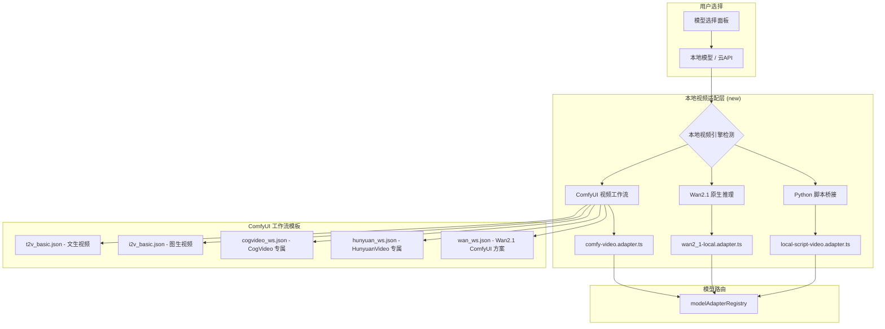

# 本地视频大模型引擎方案

## 目标
支持主流开源视频大模型的本地运行，通过统一 adapter 接入

## 支持的模型矩阵

### 第一梯队（已支持 / 适配中）
| 模型 | 类型 | 显存需求 | 接入方式 | 性能 | 状态 |
|---|---|---|---|---|---|
| **Wan2.1** (阿里) | T2V / I2V | 8.19GB+ | Python 脚本直调 + ComfyUI 节点 | SOTA, 1.3B/14B | ✅ ComfyUI 适配 |
| **CogVideo** (智谱) | T2V / I2V | 12GB+ | ComfyUI 节点 + CogVideo CogNode | 开源标杆 | ✅ ComfyUI 适配 |
| **HunyuanVideo** (腾讯) | T2V | 12GB+ | ComfyUI 节点 | 国产最强之一 | ✅ ComfyUI 适配 |
| **Open-Sora** (北大/Colossal) | T2V / I2V | 16GB+ | ComfyUI 节点 + Python 脚本 | 完全开源 | |

### 第二梯队（可通过 ComfyUI 兼容）
| 模型 | 接入方式 | 说明 |
|---|---|---|
| Mochi (Genmo) | ComfyUI 节点 | 开源视频模型 |
| LTX-Video | ComfyUI 节点 | 高效轻量 |
| AnimateDiff | ComfyUI 节点 | 图片动效化 |
| VideoCrafter | ComfyUI 节点 | 视频生成+编辑 |
| I2VGen-XL | ComfyUI 节点 | 图生视频 |
| ModelScope T2V | ComfyUI 节点 | 老牌开源 |

### 暂不原生适配（依赖外部工具）
- Sora (OpenAI) — 不开源
- Kling (快手) — 闭源 API
- Vidu (生数) — 闭源
- Pika — 闭源

## 架构设计

## 实现策略

**核心原则：ComfyUI 优先，原生脚本补充**

原因：
1. ComfyUI 已经为几乎所有开源视频模型提供了工作流节点
2. 用户通过 ComfyUI Manager 一键安装节点插件
3. 我们只需选择合适的工作流模板 + 替换 prompt
4. 无需为每种模型写独立的 Python 推理脚本

**Wan2.1 特殊处理：**
- Wan2.1 官方提供独立 Python 推理脚本（不需要 ComfyUI）
- 提供双轨支持：ComfyUI 方案（稳定）+ 直调方案（性能最优）

**工作流模板设计：**
- 预置 5 套 ComfyUI JSON 工作流模板
- 每套模板配置好 KSampler、CLIP、VAE 等节点
- 用户启动 ComfyUI 后，我们动态注入 prompt 和参数
- 输出格式统一为 mp4

## 前端面板

参照已有 `OllamaSetupModal.vue` 的模式设计：
1. **引擎检测** — 自动检测 ComfyUI / Wan2.1 环境
2. **模型下载引导** — 推荐模型和下载链接
3. **工作流选择** — 根据用户选的模型自动匹配
4. **状态监控** — ComfyUI 运行状态、生成进度

## 部署要求
- ComfyUI: 独立安装，监听 8188 端口
- Wan2.1: `git clone https://github.com/Wan-Video/Wan2.1` + `pip install -r requirements.txt`
- 推荐 GPU: RTX 4090 / A100（Wan2.1-14B）/ RTX 3060（Wan2.1-1.3B）
