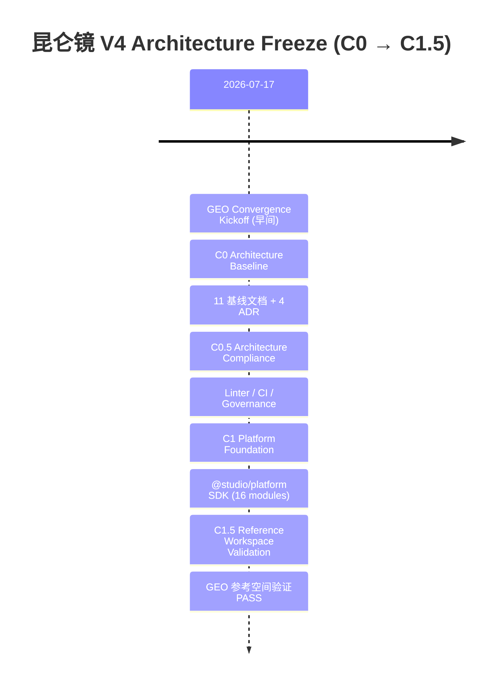

# KMKI Studio Platform V4.0 Architecture Baseline

## Architecture Freeze Complete

| | |
|---|---|
| **Date** | 2026-07-17 |
| **Version** | v4.0.0 |
| **Status** | **FREEZED** |
| **Lead Architect** | XiongDa |

---

## Architecture Overview

昆仑镜 V4 — 四层架构体系 (Four-Layer Architecture):

```
Studio Platform Layer  ← 面向应用开发者的 SaaS 平台能力
  ├── Auth / Membership / Permission
  ├── Project Center
  ├── Asset Center / Storage
  ├── Workflow Engine
  ├── Capability Engine
  ├── Platform Runtime
  ├── Event Bus / State Runtime
  ├── Repository / Data Layer
  └── Platform SDK
        │
Workspace Layer  ← 面向工作空间类型的隔离适配层
  ├── GEO (Reference ✅)
  ├── Video (pending)
  ├── Novel (pending)
  ├── PPT (pending)
  └── Music / Image (future)
        │
Domain Layer  ← 跨工作空间的通用领域模型
  ├── Knowledge
  ├── Story
  ├── Brand
  ├── Media
  └── Research
        │
Provider Layer  ← AI 模型与外部服务提供商
  ├── OpenAI
  ├── DeepSeek
  ├── Qwen
  ├── Doubao
  ├── Gemini
  └── Local Models
```

**核心理念：** 平台单一化（Single Platform Runtime），工作空间插件化（Workspace as Plugin），领域抽象化（Domain Shared Models），提供商可替换化（Provider Plug-and-Play）。

---

## Milestone Timeline



| Phase | 内容 | 状态 |
|---|---|---|
| **C0** | Architecture Baseline — 11 份基线文档 + 4 份 ADR | ✅ 10/10 |
| **C0.5** | Architecture Compliance — Linter / CI / 治理规范 | ✅ 10/10 |
| **C1** | Platform Foundation — @studio/platform SDK | ✅ 10/10 |
| **C1.5** | Reference Workspace — GEO 参考空间验证 | ✅ 10/10 |

---

## Deliverable Inventory

### 基线文档 (Baselines)

| 类别 | 文件路径 | 描述 | 行数 |
|---|---|---|---|
| Baseline | `docs/baselines/MANIFESTO.md` | V4 架构宣言与设计原则 | 309 |
| Baseline | `docs/baselines/WORKSPACE-SPEC.md` | 工作空间规范 | 382 |
| Baseline | `docs/baselines/RUNTIME-SPEC.md` | 运行时规范 | 378 |
| Baseline | `docs/baselines/DATA-SPEC.md` | 数据规范 | 685 |
| Baseline | `docs/baselines/CAPABILITY-SPEC.md` | 能力引擎规范 | 742 |
| Baseline | `docs/baselines/PLATFORM-SDK.md` | 平台 SDK 规范 | 765 |
| Baseline | `docs/baselines/API-SPEC.md` | API 规范 | 543 |
| Baseline | `docs/baselines/EVENT-SPEC.md` | 事件规范 | 551 |
| Baseline | `docs/baselines/STATE-SPEC.md` | 状态规范 | 596 |
| Baseline | `docs/baselines/EXTENSION-SPEC.md` | 扩展规范 | 578 |
| Baseline | `docs/baselines/GOVERNANCE-SPEC.md` | 治理规范 | 470 |

### ADR (Architecture Decision Records)

| 类别 | 文件路径 | 描述 | 行数 |
|---|---|---|---|
| ADR | `docs/adr/ADR-001.md` | 单平台运行时决策 | 64 |
| ADR | `docs/adr/ADR-002.md` | WorkspaceAdapter 接口决策 | 64 |
| ADR | `docs/adr/ADR-003.md` | Provider→Model→Capability→Workflow 决策 | 67 |
| ADR | `docs/adr/ADR-004.md` | Repository+ORM Adapter 决策 | 68 |

### 工具与工程化 (Tooling)

| 类别 | 文件路径 | 描述 | 行数 |
|---|---|---|---|
| Tooling | `scripts/architecture-linter.sh` | 架构合规性检查脚本 | 460 |
| Tooling | `.github/workflows/architecture-lint.yml` | CI 架构检查工作流 | 9 |
| Interface | `packages/studio-platform/src/workspace/workspace-adapter.ts` | 冻结的 WorkspaceAdapter 接口 | 68 |

### SDK 模块 (Platform SDK)

| 类别 | 文件路径 | 描述 | 行数 |
|---|---|---|---|
| SDK | `packages/studio-platform/src/index.ts` | SDK 统一导出入口 | 100 |
| SDK | `packages/studio-platform/src/api/types.ts` | API 类型定义 | 111 |
| SDK | `packages/studio-platform/src/auth/auth-service.ts` | 认证与权限服务 | 195 |
| SDK | `packages/studio-platform/src/bootstrap/platform-bootstrap.ts` | 平台引导初始化 | 120 |
| SDK | `packages/studio-platform/src/capability/capability-runtime.ts` | 能力引擎运行时 | 526 |
| SDK | `packages/studio-platform/src/capability/openai-provider.ts` | OpenAI 提供商实现 | 308 |
| SDK | `packages/studio-platform/src/event/event-bus.ts` | 事件总线 | 385 |
| SDK | `packages/studio-platform/src/project/project-service.ts` | 项目管理服务 | 200 |
| SDK | `packages/studio-platform/src/repository/base-repository.ts` | 基础仓储抽象 | 168 |
| SDK | `packages/studio-platform/src/repository/geo-project-repository.ts` | GEO 项目仓储 | 151 |
| SDK | `packages/studio-platform/src/repository/prisma-adapter.ts` | Prisma ORM 适配器 | 200 |
| SDK | `packages/studio-platform/src/runtime/platform-runtime.ts` | 平台运行时 | 411 |
| SDK | `packages/studio-platform/src/state/state-runtime.ts` | 状态运行时 | 205 |
| SDK | `packages/studio-platform/src/workspace/workspace-adapter.ts` | 工作空间适配器接口 | 68 |
| SDK | `packages/studio-platform/src/workspace/workspace-registry.ts` | 工作空间注册表 | 130 |

### 验证与文档 (Validation & Docs)

| 类别 | 文件路径 | 描述 | 行数 |
|---|---|---|---|
| Review | `docs/reviews/C1-AUDIT-REPORT.md` | C1 审计报告 | 142 |
| Review | `docs/reviews/C1-COMPLIANCE-REPORT.md` | C1 合规性报告 | 150 |
| Plan | `docs/plans/GEO-ROUTE-MIGRATION.md` | GEO 迁移路线图 | 171 |
| Validation | `docs/reviews/C1.5-VALIDATION-REPORT.md` | C1.5 参考空间验证报告 | 343 |
| Test | `packages/studio-platform/src/__tests__/reference-workspace.test.ts` | 参考工作空间集成测试 | 549 |

### GEO 参考工作空间 (Geo Pilot Workspace)

| 类别 | 文件路径 | 描述 | 行数 |
|---|---|---|---|
| Workspace | `workspace/geo/adapter/adapter.ts` | GEO 工作空间适配器 | 210 |
| Workspace | `workspace/geo/services/geo-project-service.ts` | GEO 项目服务 | 143 |
| Workspace | `workspace/geo/stores/useGeoStore.ts` | GEO 前端状态存储 | 286 |

**总计：30 files / 9,572 lines**

---

## Key Decisions Locked — 已冻结的关键架构决策

以下架构决策已完成论证并锁定，C2 及后续阶段不得违反：

1. **单平台运行时** (ADR-001) — 单一 Runtime Engine 统领所有工作空间，不允许多运行时并存
2. **WorkspaceAdapter 接口** (ADR-002) — 工作空间通过 Adapter 接入平台，平台不直接操作工作空间内部
3. **Provider→Model→Capability→Workflow 四层能力链** (ADR-003) — 能力调用路径固定，不可绕过
4. **Repository + ORM Adapter 模式** (ADR-004) — 数据访问通过 Repository 接口 + Prisma Adapter，禁止直接调用 ORM
5. **统一 Project 表 + type 枚举** — 所有项目类型共用一个 Project 表，通过 type 字段区分
6. **Knowledge\* 命名约定** — 统一使用 Knowledge\* 替代原有的 Geo\*，如 KnowledgeProject → GeoProject
7. **Platform SDK 单一路径导入** — 所有平台能力通过 `@studio/platform` 导入，禁止深层路径引用
8. **旁路禁止** — 工作空间中禁止直接使用 `prisma`、`fetch`、`axios` 等绕过平台层
9. **Event/Command/Query 边界** — Event 仅通知，Command 只写，Query 只读，三者相互独立
10. **状态源自事件** — 系统状态仅从事件流派生，不维护独立的状态快照
11. **工作空间仅持有临时 UI 状态** — 持久化状态全部由平台层管理

---

## Validation Results — C1.5 验证结果

| 检查项 | 结果 |
|---|---|
| 参考工作空间集成测试 (6 项验证) | ✅ **PASS (6/6)** |
| 架构 Linter 违规数 | **0 violations** |
| 架构健康评分 (Architecture Health Score) | **92%** |

C1.5 验证确认参考工作空间（GEO）正确实现了四层架构的边界约束：WorkspaceAdapter 接入平台、Repository 通过 Adapter 访问数据、能力通过 Capability Runtime 路由、事件通过 Event Bus 流转。

---

## Deferred to C2+ — 推迟到 C2 及后续阶段

以下架构项目已在基线中识别并记录，但未在本次 Freeze 中实现：

| 延期项 | 说明 |
|---|---|
| **Capability Router (Provider Policy Engine)** | 提供商策略路由引擎，支持多 Provider 切换与降级 |
| **Runtime Scheduler (Execution Queue)** | 运行时任务调度器，管理执行队列与并发控制 |
| **Integration Bus (Saga/Dead Letter/Outbox)** | 集成总线，支持 Saga 事务、死信队列、Outbox 模式 |
| **Repository Unit of Work** | 仓储工作单元模式，保证跨 Repository 的事务一致性 |
| **PluginRegistry (Marketplace)** | 插件注册表与市场机制 |
| **Observability / Security / Testing 规范** | 可观测性、安全合规、测试规范的正式文档 |
| **MIGRATION-SPEC.md** | V3→V4→V5 完整升级路径文档 |

这些项目已记录在基线文档的相应章节中，C2 阶段将逐步实现。

---

## Next Phase — C2: Platform Productization

| 任务 | 说明 |
|---|---|
| **Runtime Scheduler** | 实现执行队列与调度器 |
| **Capability Router** | 实现提供商策略路由引擎 |
| **Integration Bus** | 实现 Saga / Dead Letter / Outbox |
| **Auth / Project / Asset 产品化** | 将基础服务从 SDK 变为可部署的产品模块 |
| **GEO 全面迁移** | 将 GEO 工作空间从参考实现迁移为正式版本 |
| **工程化提升** | 补充测试覆盖、CI/CD、文档完善 |

---

*昆仑镜 V4 Architecture Baseline — Freeze Complete. 2026-07-17.*
