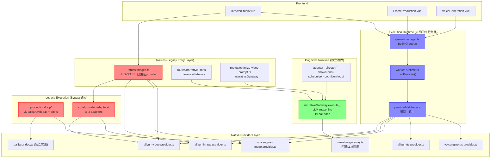

# Execution Topology — AI Runtime Governance v1

> 建立日期: 2026-05-22
> 状态: FIRST_DRAFT — 基于静态引用审计 + 真实执行路径追踪
> 目的: 定义 Cognition Runtime vs Execution Runtime 边界，标记 bypass path，指导后续迁移

---

## 1. Runtime Execution Graph — 系统真实执行拓扑

```
┌─────────────────────────────────────────────────────────────────┐
│                      FRONTEND (Nuxi)                            │
│  DirectorStudio.vue / FrameProduction.vue / VoiceGeneration.vue │
└──────────┬───────────────────┬──────────────────┬───────────────┘
           │ HTTP              │ SSE/WS            │ HTTP
           ▼                   ▼                   ▼
┌─────────────────────┐ ┌──────────────┐ ┌──────────────────────┐
│  routes/ (legacy)   │ │ queue-manager│ │ production-loop/     │
│  narrative-llm.ts   │ │ BullMQ       │ │ api.ts               │
│  images.ts          │ │ async exec   │ │ render-loop          │
│  optimize-video     │ │              │ │                      │
└────────┬────────────┘ └──────┬───────┘ └──────────┬───────────┘
         │                     │                     │
         ▼                     ▼                     ▼
┌──────────────────────────────────────────────────────────────────┐
│                   DISPATCH LAYER (分叉点)                        │
│                                                                  │
│  ╔══════════════════════════════════════════════════════════════╗ │
│  ║  Path A:  worker-runtime.callProvider() → middleware        ║ │
│  ║  Path B:  routes/images.ts getImageProviderAndModel()       ║ │
│  ║  Path C:  narrativeGateway.execute() (独立 cognitive)      ║ │
│  ║  Path D:  production-loop/ inline provider calls            ║ │
│  ║  Path E:  core/provider-adapters/ direct adapter calls      ║ │
│  ╚══════════════════════════════════════════════════════════════╝ │
└──────────────────────────────────────────────────────────────────┘
         │           │           │           │           │
         ▼           ▼           ▼           ▼           ▼
┌──────────────────────────────────────────────────────────────────┐
│                     NATIVE PROVIDER LAYER                        │
│                                                                  │
│  aliyun-video.provider.ts  (原生百炼 API － submit/poll)          │
│  aliyun-image.provider.ts  (OpenAI 兼容 / 原生百炼)              │
│  aliyun-llm.provider.ts    (OpenAI 兼容)                         │
│  aliyun-tts.provider.ts    (qwen3-tts-flash)                     │
│  volcengine-image.provider.ts                                    │
│  volcengine-tts.provider.ts                                      │
│  narrative-gateway.ts      (DeepSeek/千问/Ollama 等 LLM)         │
│  bailian.video.ts          (production-loop 独立实现)             │
└──────────────────────────────────────────────────────────────────┘
```

---

## 2. Provider Ownership Map

| provider              | owner module            | middleware managed | 备注                      |
|-----------------------|-------------------------|-------------------|---------------------------|
| aliyun/video          | worker-runtime (bailian) | ✅ yes            | 异步提交 + poll            |
| aliyun/video          | production-loop/        | ❌ no             | 独立 bailian.video.ts      |
| aliyun/video          | routes/images.ts        | ❌ no             | inline poll (line 510)     |
| aliyun/video          | core/provider-adapters/ | ❌ no             | adapter 层                 |
| aliyun/image          | worker-runtime (aliyun) | ✅ yes            |                           |
| aliyun/image          | routes/images.ts        | ❌ no             | 自主 provider selection    |
| aliyun/llm            | narrative-gateway       | ❌ (认知层, 独立)  | 19 处调用点                |
| aliyun/tts            | worker-runtime (aliyun) | ✅ yes            |                           |
| volcengine/image      | worker-runtime          | ✅ yes            |                           |
| volcengine/image      | routes/images.ts        | ❌ no             | line 87, 199              |
| volcengine/image      | production-loop/api.ts  | ❌ no             | line 371                   |
| volcengine/tts        | worker-runtime          | ✅ yes            |                           |
| deepseek/llm          | narrative-gateway       | ❌ (认知层, 独立)  |                           |
| siliconflow/tts       | worker-runtime          | ✅ yes            |                           |
| custom/local          | worker-runtime          | ✅ yes            |                           |
| kling (future)        | 未接入                  | -                 | API Key 已支持注入         |
| replicate (future)    | 未接入                  | -                 | API Key 已支持注入         |

---

## 3. Capability Boundary Map

| 层 | 模块 | 职责 | 是否允许调 provider | 备注 |
|----|------|------|---------------------|------|
| **Cognitive Runtime** | narrative-gateway.ts | LLM reasoning, agent orchestration | ✅ 是 (自己的 gateway) | 不经过 middleware |
| | agents/ | Agent task execution | ✅ 仅通过 narrativeGateway | 不直接调 provider |
| | director/ | Director intelligence | ✅ 仅通过 narrativeGateway | 不直接调 provider |
| | showrunner/ | Showrunner core | ✅ 仅通过 narrativeGateway | 不直接调 provider |
| | scheduler/ | Multi-graph scheduling | ✅ 仅通过 narrativeGateway | 不直接调 provider |
| | cognition-loop/ | Director cognition loop | ✅ 仅通过 narrativeGateway | 不直接调 provider |
| **Execution Runtime** | worker-runtime.ts | Task execution, provider dispatch | ✅ 通过 providerMiddleware | 唯一正确的执行路径 |
| | queue-manager.ts | Async job lifecycle | ❌ 不可直接调 provider | 只能调 worker-runtime |
| **Provider Middleware** | provider-middleware.ts | 模型识别, 能力路由, handler 分发 | ✅ 通过 registered handlers | 不直接调 native API |
| **Provider Adapter** | aliyun-video.provider.ts | Native API payload | ✅ 只被 middleware 调 | 纯适配层 |
| | aliyun-image.provider.ts | Native API payload | ✅ 只被 middleware 调 | 纯适配层 |
| | etc. | | | |
| **Legacy Inline** | routes/images.ts | Provider selection + execution | ❌ (bypass) | 应迁移到 middleware |
| | production-loop/api.ts | Inline provider calls | ❌ (bypass) | 应迁移到 middleware |
| | production-loop/video/ | 独立 video 实现 | ❌ (bypass) | 应迁移到 middleware |
| | core/provider-adapters/ | 独立 adapter | ❌ (bypass) | 应迁移到 middleware |

---

## 4. Migration Priority Map

### A类 — 必须统一进入 middleware（Execution bypass）

| 优先级 | 模块 | 当前问题 | 迁移方案 | 影响范围 |
|--------|------|----------|----------|----------|
| P0 | routes/images.ts | 自主选 provider + inline 调 aliyunImage/volcengineImage | 改为通过 queue-manager 提交任务或直接调 middleware | 影响 1 个页面（执行页面图片生成） |
| P0 | routes/images.ts (video poll) | line 510 直接调 aliyunVideo.poll | 改为走 middleware poll 接口 | 影响视频生成回显 |
| P1 | production-loop/video/bailian.video.ts | 独立实现 native API 调用，不经过 middleware | 合并到 aliyun-video.provider.ts，排除 middleware | production-loop 大片 |
| P1 | production-loop/api.ts | 直接调 volcengineImage.generate | 改为 middleware 调用 | production-loop |
| P1 | core/provider-adapters/ | 2 个 adapter 直接调 native provider | 废弃，由 middleware 替代 | 适配层 |

### B类 — 保留边界（Cognitive orchestration）

| 模块 | 操作 | 原因 |
|------|------|------|
| narrative-gateway.ts | **保留独立**，不合并到 middleware | 认知编排层，不是 provider router |
| agents/* | 保持 narrativeGateway 调用 | cognitive runtime 的一部分 |
| director/* | 保持 narrativeGateway 调用 | cognitive runtime 的一部分 |
| showrunner/* | 保持 narrativeGateway 调用 | cognitive runtime 的一部分 |
| scheduler/ | 保持 narrativeGateway 调用 | cognitive runtime 的一部分 |
| routes/narrative-llm.ts | 保持 narrativeGateway 调用 | cognitive runtime 入口 |

### 命名空间类 — 不是生产执行路径

| 模块 | 操作 |
|------|------|
| scripts/* | 保留（不经过生产流） |
| admin-* routes | 保留（不经过生产流） |
| system-health.ts | 保留（运维路径） |

---

## 5. 审计日志

### 2026-05-22 17:20 — 初始审计

```
静态引用审计范围: backend/src/ (排除 node_modules, .d.ts, test/mock)
审计方法: grep 分析 direct provider call / OpenAI compat call / dashscope URL

发现:
- worker-runtime 已统一 6 个 provider handler (aliyun/volcengine/deepseek/siliconflow/openai/custom)
- 存在 5 条 bypass path (见 Section 4 A类)
- narrativeGateway 有 26 处 inline 调用, 但属于认知层, 不视为 bypass
- scripts/* 和 admin/* 有大量硬编码 endpoint URL, 但属于运维路径
```

---

## 6. 执行拓扑图 (Mermaid)



---

## 7. 关键架构边界

```
Cognitive Runtime                Execution Runtime
(narrativeGateway)               (providerMiddleware)
─────────────────                ─────────────────
"what to generate"               "how to generate"
"which model/agent"              "which API/endpoint"
"prompt engineering"             "native payload"
"reasoning chain"                "retry/fallback"
"character/scene consistency"    "polling/status"

      输入                        输入
        │                          │
        ▼                          ▼
   LLM reasoning ──────→    dispatch task
        │                     │
        ▼                     ▼
   structured output      native API call
        │                     │
        ▼                     ▼
   story/scene data      video/image/audio
```

> **不可逾越的边界**:
> Cognitive Runtime 可以**调用** Execution Runtime 来执行具体任务
> Execution Runtime **不可以**侵入 Cognitive Runtime 的决策
> narrativeGateway 是认知层的 **LLM gateway**，不是 provider router

---

*文档维护: 每次修改 bypass path 后更新此文档*
*下一更新: Phase 1 (Model Registry) 完成后*
