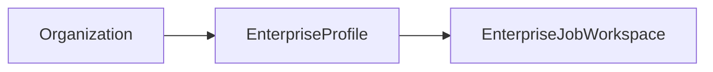
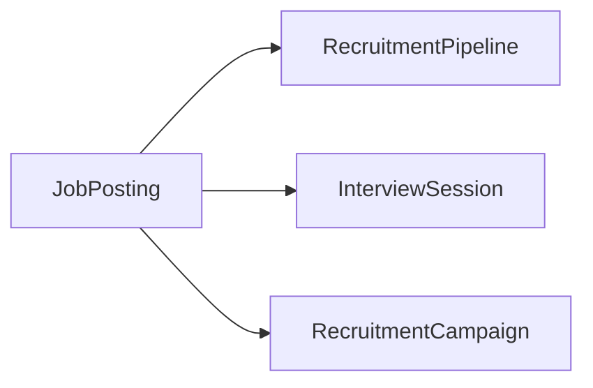
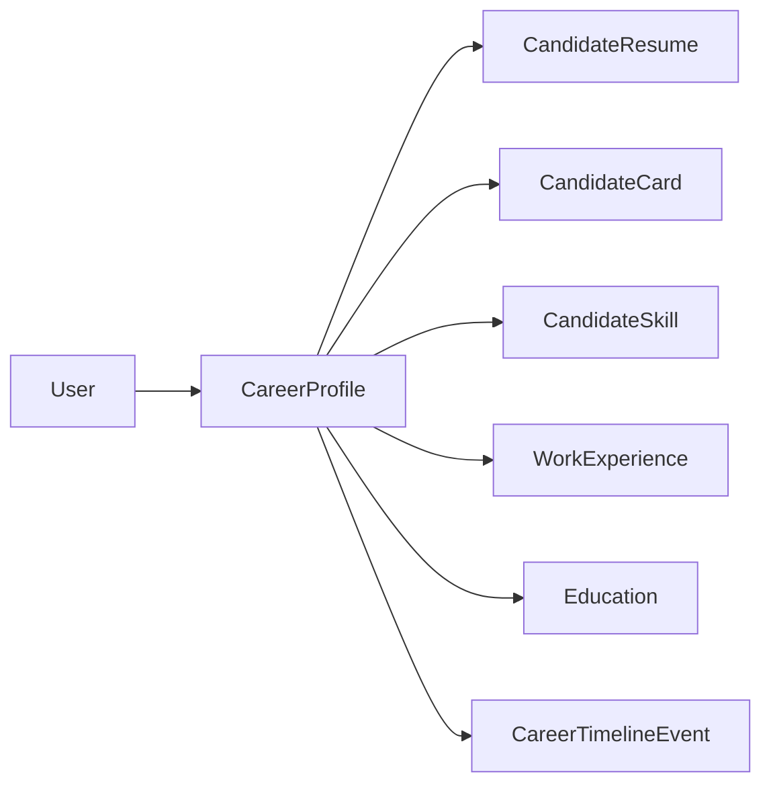
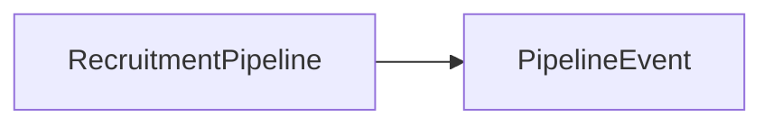
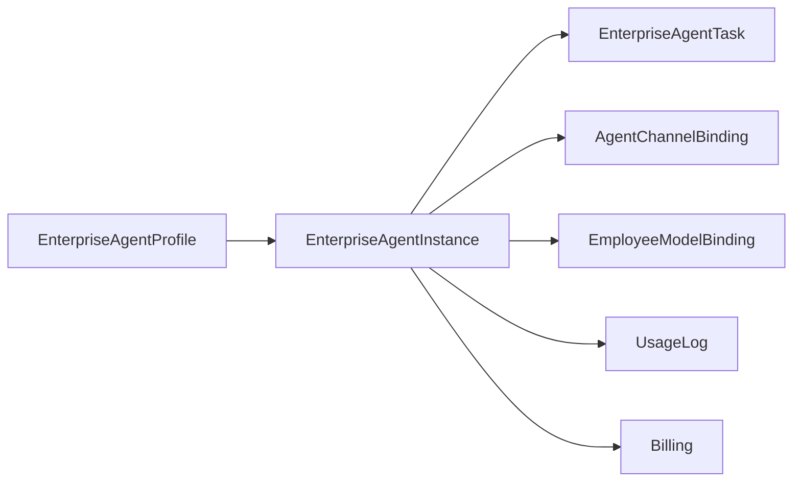
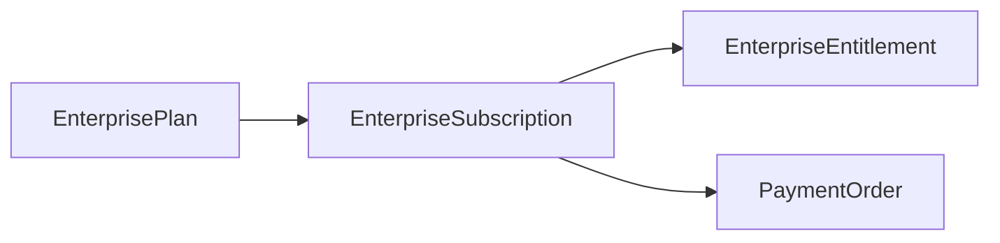

# Enterprise Recruitment — Single Source of Truth Registry

> Sprint 12.6 Governance Closure
> 生效日期：2026-07-28
> 适用范围：企业招聘工作台全链路

---

## 一、企业身份唯一源



| 保留模型 | 表名 | 说明 |
|---------|------|------|
| `Organization` | `organization` | 企业实体唯一身份 |
| `EnterpriseProfile` | `enterprise_profile` | 企业扩展资料 |
| `EnterpriseJobWorkspace` | `enterprise_job_workspace` | 招聘工作区 |

```
✅ 唯一源确立
❌ 禁止：JobCompanyProfile / Enterprise / CompanyProfile
```

---

## 二、招聘岗位唯一源



| 保留模型 | 表名 | 说明 |
|---------|------|------|
| `JobPosting` | `job_posting` | 招聘岗位唯一真相源 |

```
✅ 唯一源确立
❌ 禁止：JobTemplateJob / LegacyJob / RecruitmentJob / MockJob
```

> 注：`Job`（schema.prisma:2640，表名 `jobs`）是平台通用任务调度，非招聘岗位。此模型保留但需注释澄清。

---

## 三、候选人唯一源



| 保留模型 | 表名 | 说明 |
|---------|------|------|
| `CareerProfile` | `career_profile` | 候选人身份唯一真相源 |
| `CandidateResume` | `candidate_resume` | 简历（CareerProfile 的派生视图） |
| `CandidateCard` | `candidate_card` | 卡片投影 |
| `CandidateSkill` | `candidate_skill` | 技能子模型 |
| `WorkExperience` | `work_experience` | 工作经历 |
| `Education` | `education` | 教育经历 |
| `CareerTimelineEvent` | `career_timeline_event` | 职业时间线 |

```
✅ 唯一源确立（CareerProfile + 子模型树）
❌ 禁止写入：JobCandidate / TalentProfile / Resume / ResumeProfile
```

---

## 四、招聘流程唯一源



阶段固定常量：
```
Screening → Interview → Offer → Hired → Rejected
```

| 保留模型 | 表名 | 说明 |
|---------|------|------|
| `RecruitmentPipeline` | `recruitment_pipeline` | 招聘流程唯一源 |
| `PipelineEvent` | `pipeline_event` | 流程事件 |

```
✅ 唯一源确立
❌ 禁止新增 Pipeline Template / Stage Template 体系
```

---

## 五、AI Employee 唯一源



| 保留模型 | 表名 | 说明 |
|---------|------|------|
| `EnterpriseAgentProfile` | `enterprise_agent_profile` | AI 员工能力模板（角色定义） |
| `EnterpriseAgentInstance` | `enterprise_agent_instance` | AI 员工运行时实例 |
| `EnterpriseAgentTask` | `enterprise_agent_task` | Agent 执行任务 |
| `AgentChannelBinding` | `agent_channel_binding` | 渠道绑定 |
| `EmployeeModelBinding` | `employee_model_binding` | 模型绑定 |

```
✅ 唯一源确立（Profile + Instance 双层）
❌ 禁止写入：EnterpriseAgentWorkforce / AgentExecution / AgentLevelConfig
```

---

## 六、商业/计费唯一源



| 保留模型 | 表名 | 说明 |
|---------|------|------|
| `EnterprisePlan` | `enterprise_plan` | 企业套餐唯一源 |
| `EnterpriseSubscription` | `enterprise_subscription` | 订阅记录 |
| `EnterpriseEntitlement` | `enterprise_entitlement` | 权益分配 |
| `PaymentOrder` | `payment_order` | 支付订单 |

```
✅ 唯一源确立
❌ 禁止写入：SubscriptionPlan / Subscription / MemberPlan / AgentPlan / RecruitmentPlan / BillingRecord
```

---

## 七、面试唯一源

| 保留模型 | 表名 | 说明 |
|---------|------|------|
| `InterviewSession` | `interview_session` | 面试唯一真相源 |
| `InterviewQuestion` | `interview_question` | 面试问题（子模型） |
| `InterviewEvaluation` | `interview_evaluation` | 面试评估（子模型） |
| `InterviewDecision` | `interview_decision` | 面试决策（子模型） |

```
✅ 唯一源确立
❌ 禁止写入：InterviewRecord
```

---

## 八、路由入口规范

```
前端入口         : /workspace/enterprise/*        — 唯一入口
                 : /workspace/recruitment/*       → 301 redirect
                 : /enterprise/*                  → 301 redirect

API 前缀         : /api/enterprise/*              — 唯一前缀
                 : /api/job/*                     → 410 Deprecated
                 : /api/talent/*                  → 410 Deprecated
                 : /api/resume/*                  → 410 Deprecated
```

---

## 九、治理红线总表

```yaml
rules:
  - id: ES-SSOT-001
    title: "企业身份唯一源"
    do: Organization + EnterpriseProfile
    dont: JobCompanyProfile, Enterprise, CompanyProfile

  - id: ES-SSOT-002
    title: "招聘岗位唯一源"
    do: JobPosting
    dont: LegacyJob, RecruitmentJob, MockJob

  - id: ES-SSOT-003
    title: "候选人身份唯一源"
    do: CareerProfile
    dont: JobCandidate, TalentProfile, ResumeProfile

  - id: ES-SSOT-004
    title: "招聘流程唯一源"
    do: RecruitmentPipeline
    dont: 第二套 Pipeline/Stage 体系

  - id: ES-SSOT-005
    title: "AI Employee 唯一源"
    do: EnterpriseAgentProfile + EnterpriseAgentInstance
    dont: EnterpriseAgentWorkforce, AgentExecution

  - id: ES-SSOT-006
    title: "商业套餐唯一源"
    do: EnterprisePlan + EnterpriseSubscription + EnterpriseEntitlement
    dont: SubscriptionPlan, MemberPlan, AgentPlan, RecruitmentPlan

  - id: ES-SSOT-007
    title: "前端入口唯一源"
    do: /workspace/enterprise
    dont: /workspace/recruitment, /enterprise

  - id: ES-SSOT-008
    title: "API 前缀唯一源"
    do: /api/enterprise
    dont: /api/job, /api/talent, /api/resume
```

---

*注册登记时间：2026-07-28*  
*治理范围：Enterprise Recruitment 全链路*
