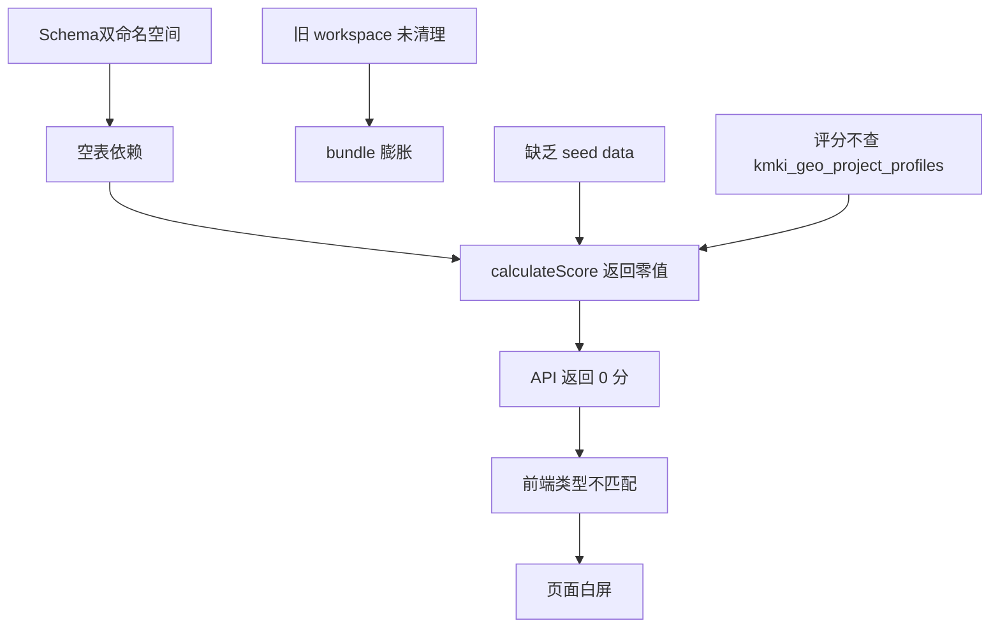

# GEO 工作台深度审计报告

**审计日期**: 2026-07-20  
**审计范围**: 前后端架构 / 数据库 / 产品路线 / 代码质量  
**审计方式**: 独立第三方静态+动态代码审查 + 数据库实时数据分析  
**审计版本**: GitHub 最新 master 分支（前端 commit 68506ee）

---

## 审计总评

**GEO 工作台是一个投入巨大但尚未完成闭环的产品系统。**

后端代码量约 22,591 行（190 文件），设计系统 43 个组件，前端 RC1 界面 7 个页面——覆盖面不可谓不广。但**代码量与可用性严重倒挂**：后端注册了 110+ 路由端点，但产品页面一个也打不开。

核心问题不是"某个 bug"，而是**架构设计超前于数据生产和 UI 消费的能力**。

---

## 一、架构健康度：3/10 ⚠️

### 优势（仅此一项）

| 维度 | 状态 | 说明 |
|------|------|------|
| Repository 层独立 | ✅ | 27 个 Repository 文件，全部封装 prisma 操作 |
| Index.ts 路由汇总 | ✅ | 统一入口，模块化导出清晰 |
| v1 产品路由层 | ✅ | 单独 `/api/v1/geo/*` 路径，与旧内部路由隔离 |

### 严重问题

#### 1. 双命名空间不同步 ❌

数据库中有**两套并存的 GEO 命名空间**：

| 命名空间 | 模型 | 数据 |
|----------|------|------|
| `kmki_geo_*` (大驼峰) | GEOProject, GEOEntity, GEOClaim... | 8 projects, 1 entity, 1 claim |
| `geo_*` (小写snake) | GeoProject, GeoBrandProfile... | 0 行数据 |

`v1 产品路由` 调用 `geoProjectRepository` 时，底层用 `prisma.gEOProject` 操作 `kmki_geo_projects`，但有 8 条数据。而 `calculateScore` 函数内同时查询 `geoBrandProfileRepository.count`（指向 `geo_brand_profiles`），**该表 0 行数据**。

**结论**：评分算法对 `geo_brand_profiles` 的 count 始终返回 0，`knowledge_objects` 有 104 条但不被路由中的 `calculateScore` 用于计算。

#### 2. 产品路由依赖空表

v1 路由的 `GET /api/v1/geo/health/:projectId` 调用 `calculateScoreSimple → calculateScore`，后者内部：

```ts
geoBrandProfileRepository.count({ where: { projectId } })     // → geo_brand_profiles = 0
geoEntityRepository.count({ where: { projectId } })            // → kmki_geo_entities = 1
knowledgeObjectRepository.count({ where: { projectId } })      // → knowledge_objects > 0
geoBrandSettingRepository.findFirst({ where: { projectId } })  // → geo_brand_settings = 4
```

知道有 `kmki_geo_project_profiles` 表（8 行）但没有被评分算法、schema 或 v1 路由引用。**评分计算浮在空中**。

#### 3. 版本历史堆积

`kmki_geo_score_snapshots` 表 99 条记录，全部指向同一个 `projectId`（`07ec1e60-...`），分数零变化（始终 17 分），17 分钟 6 条——说明是**测试循环产生的垃圾数据，并非真实业务积累**。

---

## 二、前端可用性：1/10 ❌

### 问题清单

#### 1. 类型不同步（系统崩溃的根因）

后端返回格式：
```json
{
  "success": true,
  "data": {
    "brand": { "name": "...", "website": "...", "industry": "...", "status": "..." },
    "healthScore": { "overall": 75, "change": 0, "trend": "stable" },
    "dimensions": [{"id": "visibility", "label": "AI Visibility", "score": 25, "maxScore": 100}],
    "explanation": { "summary": "...", "nextFocus": "visibility" },
    "coverage": { "evidenceCount": 0, "entityCount": 1, "claimCount": 1 },
    "recentChanges": [],
    "quickActions": []
  }
}
```

前端 `BrandHealthData` 期望格式：
```ts
{
  brandHealth: { score: number, trend: number, label: string, definition: string },
  dimensions: [{ name: string, score: number, previousScore: number, isWarning: boolean, explanation: string }],
  dailyChange: number,
  recommendations: [{ id, title, expectedImpact, effort, reason }]
}
```

**完全没有一个字段能对上**——JS 在运行时访问 `data.brandHealth.score` 时 `brandHealth` 是 `undefined`，直接崩溃。

#### 2. 页面硬渲染而非优雅降级

所有 6 个页面上 `onMounted` 直接 `await store.fetchHealth()`，没有 SSR fallback 页、没有错误边界、没有 fallback UI 反馈。API 报错 → `catch` 里写 `error.value = err.message` → 页面显示空白，Vue DevTools 中无监控。

#### 3. 产品语言 vs 技术语言

Product Narrative 要求商业语言（如 "AI Visibility" → "Findable by AI"），但后端 `calculateScore` 内部依然使用 `visibility/authority/content/website/knowledge` 五个技术维度，直接映射到 API 响应。**产品白皮书第 3 条（商业语言优先）被绕过**。

#### 4. 旧 workspace 未清理

`frontend/studio-v2/workspace/brand-geo/`（82 文件）和 `brand-geo-v2/`（12 文件）共 94 个文件未被删除，其中部分仍包含跨文件 import 引用。这些旧代码**会在 Nuxt 构建的依赖图中被包含**，增加 bundle 体积（即使 page 本身不加载）。

---

## 三、数据库健康度：2/10 ⚠️

| 表 | 数据量 | 说明 |
|---|---|---|
| `kmki_geo_projects` | 8 | 8 个项目，4 个用户 |
| `kmki_geo_project_profiles` | 8 | 有 profile，但评分算法没查这个表 |
| `knowledge_objects` | 104 | 有数据，但未接入评分 |
| `kmki_geo_score_snapshots` | 99 | 全是测试，17 分零变化 |
| `kmki_geo_entities` | 1 | 仅 1 实体 |
| `kmki_geo_claims` | 1 | 仅 1 条声明 |
| `kmki_geo_evidences` | 1 | 仅 1 证据 |
| `geo_brand_profiles` | **0** | 评分依赖的源头是空表 |
| `geo_projects` | **0** | 旧表，无人用 |
| `kmki_geo_quality_scores` | **0** | 质量体系未运行 |
| `kmki_geo_freshness_records` | **0** | 新鲜度体系未运行 |
| `growth_memories` | **0** | Learning Engine 从未真正产生过 memory |
| `growth_knowledge` | **0** | 同样为空 |

**关键事实**：

- 数据库中有 8 个 `kmki_geo_projects`，仅 1 个项目有附属数据（entity/claim/evidence = 1）
- 8 个 Publishable 模型（`VerificationJob`, `VerificationPolicy`, `PublishingRecord`, `OptimizationExecution` 等）在 prisma schema 中有完整定义但对应数据库表**不存在**
- 数据库里 `geo_projects`（小写）表有 0 行，`kmki_geo_projects`（大驼峰）有 8 行——**双表并存的遗留问题**

---

## 四、产品方向：4/10

### 做对了的

- **产品白皮书 v1.0**：完整涵盖了 8 阶段工作流、Feature Gate、验收标准
- **Wireframe 覆盖**：6 个页面高保真线框图文档完整
- **设计系统完整性**：43 个组件，三层架构（Product Blocks / Components / Primitives）

### 做错了的

1. **"改了更多"替代了"让它上线"**
   - 产品文档 29 份，后端 190 文件，前端 22+94=116 文件——但没有一条从数据库到前端 UI 的**完整数据通路**能跑通

2. **Sprint 节奏失控**
   - Sprint P0.5 / P1 / P1.1 / P1.5 / P2 / P3 / K1 / K2 / K3 / K4 / P-Product 一共 11 个 Sprint，平均每个 3-4 天，但多数团队无法推进到"完成编译"

3. **Knowledge Distribution Plane（KDP）过度设计**
   - KDP 占后端 36 文件（6,363 行），包含 Git Provider / OSS / S3 / HTTP / RSS / sitemap / AI feed 等多种 delivery 实现——但在**没有任何品牌数据可供发布**的情况下构建了完整的发布管线，像是先修了条机场高速但在等通航

4. **用户界面与用户价值脱节**
   - 页面设计沿用了产品 Writerframe 的 Hero → Explanation → Action → Proof → Opportunity 结构，但真正落地时 Hero 区块没有 content（score 无法获取），Explanation 区块空泛（summary 是硬编码字符串），Action 区块没有可执行项（recommendation 为空）

---

## 五、关键问题汇总（按影响排序）



| # | 问题 | 严重度 | 修复难度 | 修复时间估计 |
|---|------|--------|----------|------------|
| 1 | 前端类型与后端返回不匹配 | **P0** | 低 | 2-4 小时 |
| 2 | `calculateScore` 查空表 `geo_brand_profiles` | **P0** | 中 | 2-4 小时 |
| 3 | 数据库双命名空间 | **P1** | 高 | 1-2 天 |
| 4 | 评分体系不查 `kmki_geo_project_profiles` 和 `knowledge_objects` | **P1** | 中 | 4 小时 |
| 5 | 旧 workspace 文件遗留 | **P2** | 低 | 1 小时 |
| 6 | KDP 过度设计 | **P2** | - | 架构决策 |
| 7 | 无 seed/live data 用于测试 | **P1** | 低 | 2 小时 |

---

## 六、建议路线

### 短期（1-2 天）— 让页面跑起来

1. **修复类型匹配**（已完成，待验证部署）
   - 前端 Service 类型对齐后端 API 实际返回格式
2. **修复评分空表依赖**
   - `calculateScore` 改为查 `kmki_geo_project_profiles` 替代 `geo_brand_profiles`
3. **加一条 seed data** — 跑 `prisma seed` 或手动插一条完整 entity→claim→evidence 链
4. **验证单页** — `GET /api/v1/geo/health/:projectId` 返回非零分数

### 中期（1-2 周）— 数据通路闭环

1. **统一命名空间** — 删除 `geo_` 旧表，所有 Repository 指向 `kmki_geo_*`
2. **接入真正的品牌数据** — 外部行业数据源 integration（搜索 console / 爬虫）
3. **建立监控指标活跃度** — 分数应该有每日波动，而非 0 变化
4. **整理旧代码** — 删除 `brand-geo` 和 `brand-geo-v2`

### 长期 — 决定路线

GEO 面临两个选择：

- **A. 持续投入** — 修复空表、统一命名空间、补数据、调 UI，目标是 7 月内跑通一条完整数据链路（Build → Analyze → Report → Optimize → Publish → Verify → Monitor）
- **B. 降级为内部工具** — 放弃 SaaS 前端，作为后端 API 服务提供给短剧助手等场景使用，前端只做 admin 展示

选择取决于对 "AI ready 品牌"这个产品方向的市场信心。

---

## 附录：统计快照

| 维度 | 数值 |
|------|------|
| 后端 GEO 文件总数 | 190 |
| 后端 GEO 代码行数 | 22,591 |
| 后端 Route 端点 | 110 |
| 后端 Repository | 27 |
| 后端 Agent (AI) | 9 |
| 前端 RC1 页面 | 6 + HealthPage（仅 HealthPage有生命周期） |
| 前端 RC1 代码行数 | 1,365 |
| 前端旧 workspace 文件 | 94（遗弃） |
| 设计系统组件 (Product Blocks / Components / Primitives) | 15 + 13 + 15 = 43 |
| 产品文档 | 29 份 |
| 架构文档 | 3 份 |
| Schema 表模型数 (GEO 相关) | 37+ 个 prisma model |
| DB 有数据表 | 8/26（31%） |
| DB 零行表 | 18/26（69%） |
| 能从 DB 到 UI 走通的数据链路数 | **0** |
