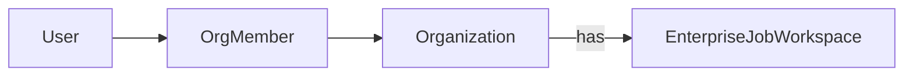
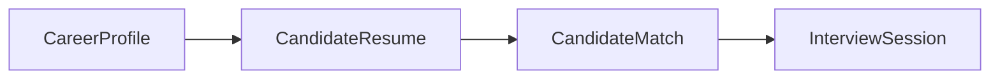
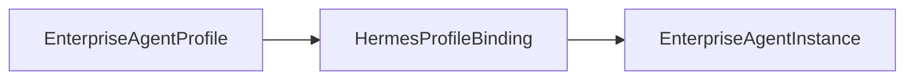
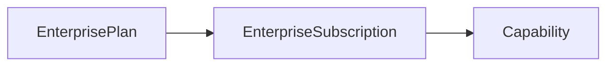

# Enterprise Recruitment SSOT Constitution v1.0

> **SSOT = Single Source of Truth**
>
> 本文档冻结企业招聘平台的核心数据模型与链路，作为所有开发、重构、审计的唯一依据。  
> 发布于 Sprint-SSOT-CLEANUP-02 之后，已验证 Identity 数据层闭环。

---

## 1. Identity — 组织成员体系

### 唯一真相源



### 规则

| 项目 | 规则 |
|------|------|
| **唯一成员模型** | `OrgMember` |
| **禁止模型** | `EnterpriseMember` ❌ |
| **写入 SSOT** | `OrgMember` 是唯一写入目标 |
| **读取 SSOT** | 所有成员查询走 `OrgMember`，不允许回退 `EnterpriseMember` |
| **Role** | `OWNER` / `ADMIN` / `MEMBER`，在 `OrgMember.role` 字段定义 |
| **Owner 判定** | `OrgMember` 中 role=`OWNER` 的记录。不允许从 `Organization.owner_id` 推断 |
| **创建者判定** | `OrgMember` 中 role=`OWNER` 且 `createdAt` 最早的记录 |
| **无成员判定** | 不存在 `OrgMember` 记录，即为无成员（允许空组织存在） |

### 验证通过的数据覆盖

```
Organization: 62
OrgMember:    60 (2026-07-28 回填完成)
去重检查:     0 duplicates
未覆盖:       2 (测试数据: Test Org, 杭州昆仑镜 → 不作为污染记录)
覆盖类型:
  governance_user → User (email/phone/id join): 46 orgs
  Onboarding owner_id:                          3 orgs
  Personal name UUID:                           1 org
  User table match (慧娟):                      1 org
  Test/seed → admin:                            9 orgs
```

---

## 2. Enterprise Workspace — 企业工作空间

### 修正后的架构

之前的错误理解：

```text
Workspace
 ↓
EnterpriseJobWorkspace
```

实际架构是 **两个独立领域并行**：

```text
Platform Workspace (Workspace)
  ├── 系统级工作空间，全平台统一
  └── 不与企业绑

EnterpriseJobWorkspace
  ├── AI 招聘任务运行环境
  ├── 隶属于 Organization
  └── 每个企业拥有自己的空间
```

### 链路验证通过

```
南波万 Organization
  └── 南波万 (ORG_OWNER)
      └── EnterpriseProfile
          └── JobCompanyProfile
              └── EnterpriseJobWorkspace (郑州骏霄数字科技有限公司 招聘空间)
```

---

## 3. Candidate — 候选人

### 唯一真相源



### 规则

| 项目 | 规则 |
|------|------|
| **唯一 Profile** | `CareerProfile` |
| **唯一 Resume** | `CandidateResume` |
| **唯一 Match** | `CandidateMatch` |
| **唯一 Session** | `InterviewSession` |
| **禁止模型** | `JobCandidate` ❌ 不再创建/读取 |
| **禁止模型** | `TalentProfile` ❌ 不再创建/读取 |
| **父级关系** | `CareerProfile.userId → User.id` |

---

## 4. Job — 岗位

### 两个概念，分开处理

| 概念 | 模型 | 用途 |
|------|------|------|
| **招聘岗位** | `JobPosting` | 企业招聘的需求描述；一个有 headcount 的坑位 |
| **AI 管线任务** | `Job` | Pipeline 中的 AI 执行任务，不是招聘岗位 |

### 规则

- `JobPosting`：招聘系统 SSOT，关联 `Organization`
- `Job`：保留，不视为招聘领域模型，视为 AI Runtime 概念
- 禁止交叉：不允许把 `Job` 当作 `JobPosting` 使用

---

## 5. AI Employee — AI 员工

### 三层生命周期



| 层 | 含义 | 唯一性 |
|------|------|--------|
| `EnterpriseAgentProfile` | AI 员工在企业的配置（角色/名字/头像） | 企业级别 |
| `HermesProfileBinding` | AI 员工与 Hermes Agent 的绑定链路 | 绑定级别 |
| `EnterpriseAgentInstance` | AI 员工的运行时实例 | 运行时 |

### 规则

- **禁止合并**：这三层不可合并为单一模型
- **禁止跳过绑定**：`EnterpriseAgentProfile` 不可直接指向 `EnterpriseAgentInstance`

---

## 6. Model Provider — 模型供应商

### 唯一真相源

```text
EnterpriseLlmConfig
```

### 规则

- 企业级 LLM 配置的 SSOT 是 `EnterpriseLlmConfig`
- 禁止使用其他模型配置路径

---

## 7. Customer Entry — 客户入口

### 唯一入口

| 入口 | 状态 |
|------|------|
| `/workspace/enterprise/*` | ✅ **SSOT 入口** |
| `/workspace/recruitment/*` | ⏳ 过渡路径，只允许 redirect，禁止新增功能 |
| `/enterprise/*` | ❌ 已废弃，禁止新增代码/路由 |

### 规则

- 所有新功能开发在 `/workspace/enterprise/*` 路径下
- `/workspace/recruitment/*` 只做 redirect 到对应的 `/workspace/enterprise/*`
- 已有 redirect 映射示例：
  - `/workspace/recruitment/jobs` → `/workspace/enterprise/jobs`
  - `/workspace/recruitment/matches` → `/workspace/enterprise/talent`

---

## 8. Commercial — 商业体系

### 唯一真相源



| 模型 | 含义 |
|------|------|
| `EnterprisePlan` | 企业套餐定义 |
| `EnterpriseSubscription` | 企业订阅记录 |
| `Capability` | 功能权限 |

### 规则

- **禁止**：`RecruitmentPlan` ❌ 不允许新增
- 商业策略统一走 Enterprise 体系，不拆分招聘专有套餐

---

## 9. 治理规则总表

| # | 规则 | 违反后果 |
|---|------|----------|
| 1 | Identity 只认 `OrgMember` | 代码审查拒绝 |
| 2 | `EnterpriseMember` 禁止写入 | CI check fail |
| 3 | `EnterpriseMember` 禁止读取 | CI check fail |
| 4 | Candidate 只认 `CareerProfile` → `CandidateResume` → `CandidateMatch` | 代码审查拒绝 |
| 5 | `Job` 不再是招聘模型 | 架构评审拒绝 |
| 6 | AI Employee 三层不可合并 | 架构评审拒绝 |
| 7 | `/workspace/enterprise/*` 是唯一入口 | 代码审查拒绝 |
| 8 | 商业走 `EnterprisePlan`，不新增 `RecruitmentPlan` | 架构评审拒绝 |

---

## 10. 当前治理阶段

### 已完成

```
✅ Candidate Cleanup
✅ Identity Cleanup (EnterpriseMember 移除)
✅ Workspace Reality Check
✅ OrgMember Data Migration (60/62)
```

### 当前

```
⬇️ SSOT Constitution Freeze (本文件)
```

### 即将执行

```
⬇️ Route Redirect Phase 1
    /enterprise/* → /workspace/enterprise/*
    /workspace/recruitment/jobs → /workspace/enterprise/jobs
    /workspace/recruitment/matches → /workspace/enterprise/talent
    (观察一个 Sprint)
```

### 后续

```
⬇️ 商业 Plan 收敛
⬇️ Prisma Schema Cleanup (最终删除 Sprint)
```

---

## 附录 A：数据验证依据

本文档中的所有代码和数据断言均基于以下审计：

- **Sprint-SSOT-CLEANUP-01**（Task 01-03）：EnterpriseMember 依赖审计
- **Sprint-SSOT-CLEANUP-02**（Task 04-10）：Identity Reality Check + OrgMember 迁移
- 审计时间：2026-07-28
- 已验证数据库：aigc_scs（postgres）

## 附录 B：Document State

- **Status**: `FROZEN`
- **Owner**: Platform Architecture Team
- **Next Review**: 架构变更发生时
