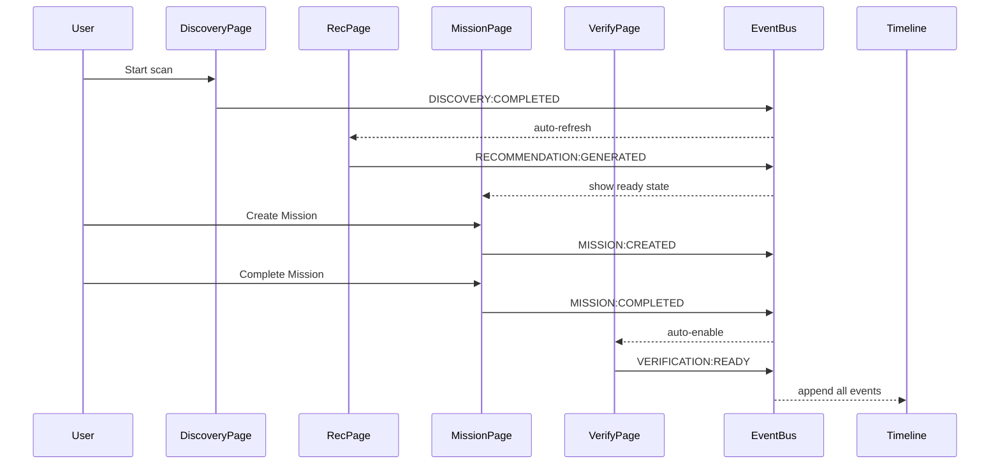
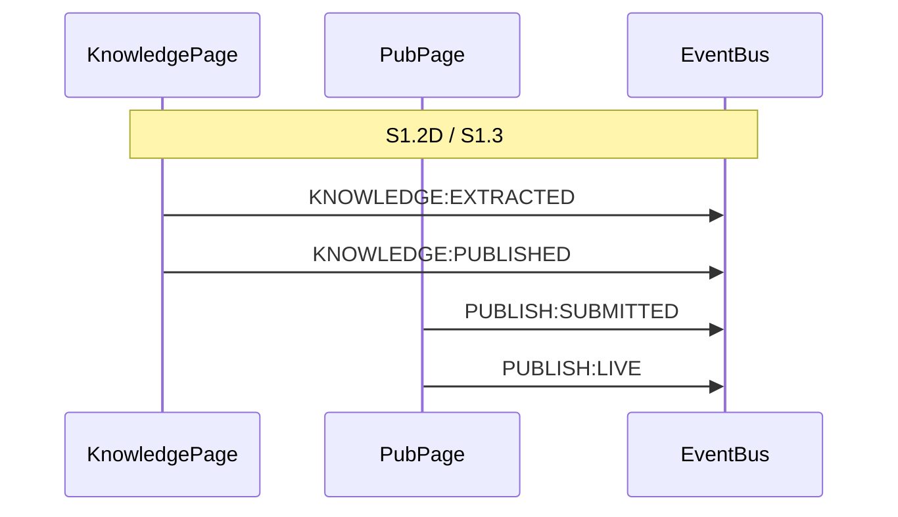

# Event Sequence Diagram — GEO Workspace

**Status**: Canonical
**Scope**: S1.2C flow events + extension points
**Format**: Mermaid sequence diagram

## S1.2C Flow (Discovery → Recommendation → Mission → Verification)



## Event Catalog

| Event | Producer Domain | Emitted By | Payload | Consumers |
|-------|----------------|------------|---------|-----------|
| `PROJECT:CREATED` | Project | ProjectRepository | `{ projectId, name }` | Dashboard |
| `DISCOVERY:COMPLETED` | Discovery | DiscoveryRepository | `{ projectId, reportId, summary }` | RecommendationRepository, Timeline |
| `RECOMMENDATION:GENERATED` | Recommendation | RecommendationRepository | `{ projectId, recommendationCount }` | MissionRepository, Timeline |
| `MISSION:CREATED` | Mission | MissionRepository | `{ missionId, title }` | Timeline |
| `MISSION:COMPLETED` | Mission | MissionRepository | `{ missionId, completedAt }` | VerificationRepository, Timeline |
| `VERIFICATION:READY` | Verification | VerificationRepository | `{ missionId, verificationId }` | Timeline |

## Extension Points (Future Sprints)



When adding new events:

1. Add to this catalog
2. Register in Producer Registry
3. Add consumer listener in target Repository
4. Verify no naming collision with existing events
5. Verify exactly one producer per event

## Event Naming Convention

```
{SOURCE_DOMAIN}:{ACTION_PERFORMED}
```

- UPPER_SNAKE_CASE
- Domain prefix mandatory
- Past tense for completed actions
- No verbs like "get", "fetch", "load" (those are not events, they are data access)

✅ `DISCOVERY:COMPLETED`
✅ `MISSION:CREATED`
❌ `getDiscoveryResults` (RPC call, not an event)
❌ `Mission_created` (wrong casing)
❌ `RECOMMENDATION:GENERATED:COMPLETED` (over-nested)

## Version History

| Date | Version | Change |
|------|---------|--------|
| 2026-07-04 | 1.0 | Initial — S1.2C scope + extension points |
