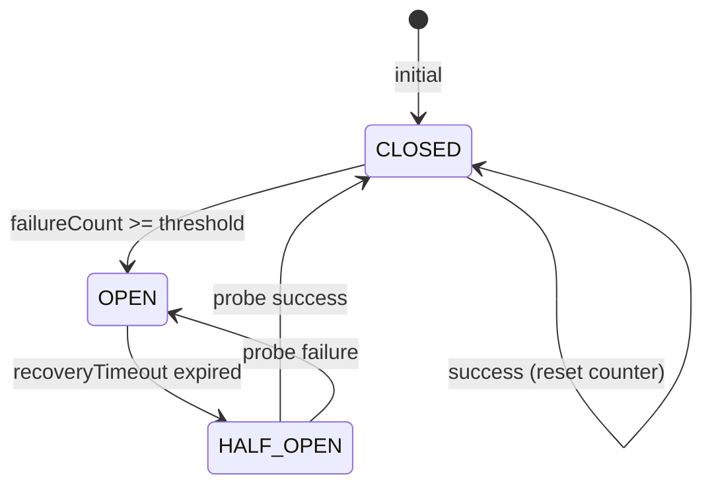

# RC2-3a — Circuit Breaker 状态机规范

**版本:** v1.0 (Pre-Implementation)
**状态:** Spec Frozen
**依赖:** RC2-1 ProviderHealthRepository (只读健康数据)
**下游:** RC2-3b Fallback Graph (只读 availability signal)
**架构约束:** Circuit Breaker MUST NOT influence routing decisions — ONLY provide availability signals

---

## 1. 状态定义

三个核心状态 + 一个过渡状态：



| 状态 | 含义 | 是否允许请求 |
|------|------|------------|
| `CLOSED` | 正常运行 | ✅ 全部放行 |
| `OPEN` | 熔断中 | ❌ 快速拒绝 |
| `HALF_OPEN` | 恢复探测 | ⚠️ 仅放行探针 |

---

## 2. 配置参数

```typescript
export interface CircuitBreakerConfig {
  /** 连续失败阈值: 超过此值进入 OPEN */
  failureThreshold: number      // 默认 5
  
  /** 熔断恢复时间 (ms): 超过此时间进入 HALF_OPEN */
  recoveryTimeoutMs: number     // 默认 30000 (30s)
  
  /** HALF_OPEN 状态下允许的最大探针请求数 */
  halfOpenMaxRequests: number   // 默认 1
  
  /** 滑动窗口 (ms): 只统计此窗口内的请求 */
  slidingWindowMs: number       // 默认 60000 (60s)
}
```

---

## 3. 状态转换逻辑

### 3.1 CLOSED → 正常

```
recordSuccess():
  - reset failureCount to 0
  - record success in window
  - stay in CLOSED
  - emit: circuit_breaker_closed (not required for new close)

recordFailure():
  - increment failureCount
  - record failure in window
  - if failureCount >= failureThreshold:
      → transition to OPEN
      - set openedAt = now()
      - emit: circuit_breaker_open { failureCount, threshold, provider }
  - else:
      → stay in CLOSED
```

### 3.2 OPEN → 熔断中

```
allowRequest():
  - if now() - openedAt >= recoveryTimeoutMs:
      → check pending half-open slots
      - if halfOpenSlots < halfOpenMaxRequests:
          → transition to HALF_OPEN
          - increment halfOpenRequests
          - return true (allow probe)
          - emit: circuit_breaker_half_open { elapsed, provider }
      - else:
          → return false (pending probe)
  - else:
      → return false (still in timeout)
      - increment rejectedCount (统计用，不触发事件)
```

### 3.3 HALF_OPEN → 探测中

```
recordSuccess():
  - reset all counters
  - reset halfOpenRequests
  - transition to CLOSED
  - emit: circuit_breaker_closed { provider, recoveryTime }

recordFailure():
  - transition to OPEN
  - set openedAt = now()
  - emit: circuit_breaker_open { probeFailed: true, provider }

allowRequest():
  - return true (probe request)
```

---

## 4. Event 定义

复用 RC1 ExecutionEvent 系统。新增 event types：

```typescript
// 新增 event 类型（在 RC1 ExecutionEventType 基础上扩展）
'circuit_breaker_open'       // CLOSED → OPEN 或 HALF_OPEN → OPEN
'circuit_breaker_half_open'  // OPEN → HALF_OPEN
'circuit_breaker_closed'     // HALF_OPEN → CLOSED
```

事件数据结构：

```typescript
// circuit_breaker_open
{
  provider: string,
  failureCount: number,
  threshold: number,
  openedAt: string,
  probeFailed?: boolean  // 从 HALF_OPEN 回退 OPEN 时 true
}

// circuit_breaker_half_open
{
  provider: string,
  elapsed: number,      // 熔断持续时间 (ms)
  recoveryTimeout: number
}

// circuit_breaker_closed
{
  provider: string,
  recoveryTime: number  // 从 OPEN → CLOSED 的总恢复时间 (ms)
}
```

---

## 5. 数据模型

```typescript
export interface CircuitBreakerState {
  provider: string
  status: 'CLOSED' | 'OPEN' | 'HALF_OPEN'
  failureCount: number
  openedAt: string | null      // OPEN 状态的开始时间
  halfOpenRequests: number     // HALF_OPEN 已发出的探针数
  rejectedCount: number        // OPEN 期间拒绝的请求数（统计用）
  lastFailureAt: string | null
  lastSuccessAt: string | null
}
```

---

## 6. 接口定义

```typescript
export interface ICircuitBreaker {
  /** 记录一次成功 */
  recordSuccess(provider: string): Promise<void>
  
  /** 记录一次失败 */
  recordFailure(provider: string): Promise<void>
  
  /** 检查是否允许请求通过 */
  allowRequest(provider: string): Promise<boolean>
  
  /** 获取当前状态 */
  getState(provider: string): Promise<CircuitBreakerState>
  
  /** 获取所有 Provider 状态 */
  getAllStates(): Promise<Map<string, CircuitBreakerState>>
  
  /** 重置某个 Provider（手动恢复） */
  reset(provider: string): Promise<void>
}
```

---

## 7. Repository 接口（复用 ProviderHealthRepository 范式）

```typescript
export interface CircuitBreakerRepository {
  save(state: CircuitBreakerState): Promise<void>
  get(provider: string): Promise<CircuitBreakerState | null>
  getAll(): Promise<Map<string, CircuitBreakerState>>
  delete(provider: string): Promise<void>
}
```

---

## 8. 架构约束

1. **Circuit Breaker MUST NOT influence routing decisions**
   - CB 只回答 "is this provider available?"
   - Router 决定 "which provider to use"
   - CB 不参与 fallback path 选择

2. **所有状态变化必须产生 ExecutionEvent**
   - 3 个事件（open / half_open / closed）必产生
   - 不产生 `circuit_breaker_rejected` 事件（防止事件风暴）

3. **状态可持久化到 Repository**
   - 内存实现可用（RC2-3a 阶段）
   - 但接口必须可替换为持久化实现

4. **不修改 RC1 / RC2-1 / RC2-2 / Explain 代码**
   - CircuitBreakerService 是独立模块
   - 只依赖 ProviderHealthRepository（只读窗口数据）

---

## 9. 测试场景

| # | 场景 | 输入 | 预期输出 |
|---|------|------|---------|
| 1 | 正常执行不熔断 | 连续 4 次成功，failureCount < 5 | CLOSED |
| 2 | 达到阈值熔断 | 连续 5 次失败 | CLOSED → OPEN, emit `circuit_breaker_open` |
| 3 | 熔断后拒绝请求 | OPEN 状态，非探针请求 | allowRequest = false |
| 4 | 恢复探测 | 超过 recoveryTimeout | OPEN → HALF_OPEN, emit `circuit_breaker_half_open` |
| 5 | 探针成功恢复 | HALF_OPEN 下成功 1 次 | HALF_OPEN → CLOSED, emit `circuit_breaker_closed` |
| 6 | 探针失败回退熔断 | HALF_OPEN 下失败 1 次 | HALF_OPEN → OPEN, emit `circuit_breaker_open` |
| 7 | 半开状态限制探针数 | HALF_OPEN 已有 probe, 又请求 | allowRequest = false (pending probe) |
| 8 | Reset | OPEN 状态调 reset | → CLOSED |
| 9 | 需持久化 | 状态可保存/读取/删除 | Repository CRUD |
| 10 | 滑动窗口过期 | 窗口内故障数不超阈值 | stay in CLOSED |

---

## 10. 文件结构

```
execution/
├── circuit-breaker/
│   ├── circuit-breaker.ts       # CircuitBreakerService
│   ├── circuit-breaker.types.ts # CircuitBreakerState, Config, Event data
│   └── circuit-breaker.ts 的测试: rc2-3a-circuit-breaker.test.ts
├── repository/
│   ├── circuit-breaker.repository.ts         # 接口
│   └── circuit-breaker.repository.impl.ts     # 内存实现
```

---

## 11. DoD

- [ ] CircuitBreakerState 类型定义完成
- [ ] CircuitBreakerConfig 类型定义完成
- [ ] ICircuitBreaker 接口定义完成
- [ ] CircuitBreakerRepository 接口 + 内存实现完成
- [ ] 三种状态转换全部通过（CLOSED↔OPEN↔HALF_OPEN）
- [ ] 三个 ExecutionEvent（open/half_open/closed）全部产生
- [ ] 10 个测试场景全部通过
- [ ] 编译零新增错误
- [ ] RC1 + RC2-1 + RC2-2 回归全绿
- [ ] 不修改 RC1 / RC2-1 / RC2-2 / Explain 代码
- [ ] Circuit Breaker 不参与 routing decision
